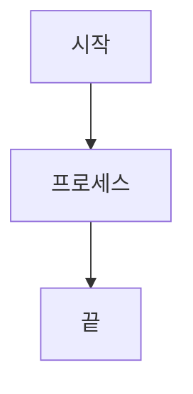

# PX4 Autopilot Documentation Viewer

PX4 Autopilot 가이드를 위한 VitePress 기반 문서 뷰어입니다. HTML 콘텐츠를 구조화된 마크다운 형식으로 변환하여 탐색과 검색이 편리한 문서 사이트를 제공합니다.

## ✨ 주요 기능

- 📚 **구조화된 문서 탐색** - 카테고리별로 정리된 사이드바 메뉴
- 🔍 **한국어 검색 지원** - 로컬 검색 프로바이더를 통한 빠른 검색
- 📊 **Mermaid 다이어그램** - 복잡한 프로세스를 시각적으로 표현
- 🎨 **커스텀 테마** - 가독성을 위한 색상 구분과 접기 기능
- 📱 **반응형 디자인** - 모든 디바이스에서 최적화된 경험

## 🏗️ 프로젝트 구조

```
docs/                          # VitePress 콘텐츠 루트
├── .vitepress/               # VitePress 설정
│   ├── config.ts            # 메인 설정 파일
│   └── theme/               # 커스텀 테마
│       ├── index.js         # 테마 엔트리 포인트
│       └── custom.css       # 커스텀 스타일링
├── public/                  # 정적 자산
├── version/                 # 버전별 문서
│   └── main/               # 메인 버전 콘텐츠
│       ├── introduction/    # 소개 페이지
│       └── concepts/        # 핵심 개념 문서
│           ├── system/      # 시스템 관련 문서
│           └── modules/     # 모듈 관련 문서
└── index.md                # 홈 페이지
```

## 🚀 빠른 시작

### 필수 요구사항

- Node.js 18.x 이상
- npm 또는 yarn

### 설치 및 실행

1. **저장소 클론**
```bash
git clone https://github.com/your-username/px4-autopilot-docs.git
cd px4-autopilot-docs
```

2. **의존성 설치**
```bash
npm install
```

3. **개발 서버 시작**
```bash
npm run dev
```

4. **브라우저에서 확인**
- 개발 서버: http://localhost:5173
- 실시간 변경사항 반영

### 빌드 및 배포

```bash
# 프로덕션 빌드
npm run build

# 로컬에서 프로덕션 빌드 미리보기
npm run serve
```

## 📝 문서 작성 가이드

### 새 문서 추가

1. 적절한 카테고리 폴더에 마크다운 파일 생성
2. `docs/.vitepress/config.ts`에서 사이드바 메뉴 업데이트
3. VitePress 컨테이너를 활용한 내용 구성

### 지원되는 컨테이너

```markdown
::: info 정보
일반적인 정보를 제공합니다.
:::

::: tip 팁
유용한 팁이나 권장사항입니다.
:::

::: warning 주의
주의해야 할 사항입니다.
:::

::: danger 위험
중요한 경고나 위험 사항입니다.
:::

::: details 세부사항
클릭해서 펼칠 수 있는 세부 내용입니다.
:::
```

### Mermaid 다이어그램

```markdown

```

## 🎨 커스텀 기능

### 헤딩 접기 기능

- `##` (h2) 헤딩 클릭 시 해당 섹션 접기/펼치기
- 부드러운 애니메이션 효과
- 시각적 인디케이터 (▼/►)

### 색상 테마

- h2 헤딩: 밝은 주황색
- h3 헤딩: 초록색
- h4 콘텐츠: 자동 들여쓰기

## 📦 주요 의존성

- **VitePress**: 정적 사이트 생성기
- **Vue.js**: 프레임워크 (VitePress 요구사항)
- **Mermaid**: 다이어그램 렌더링
- **vitepress-plugin-mermaid**: Mermaid 통합

## 🔧 설정

### 검색 설정

한국어 인터페이스로 설정된 로컬 검색:

```typescript
search: {
  provider: 'local',
  options: {
    locales: {
      root: {
        translations: {
          button: { buttonText: '검색' },
          modal: { noResultsText: '검색 결과가 없습니다' }
        }
      }
    }
  }
}
```

### 테마 커스터마이징

`docs/.vitepress/theme/custom.css`에서 스타일 수정 가능:

- 헤딩 색상
- 접기 기능 스타일
- 컨테이너 디자인
- 반응형 레이아웃

## 🤝 기여하기

1. Fork 저장소
2. 기능 브랜치 생성: `git checkout -b feature/amazing-feature`
3. 변경사항 커밋: `git commit -m 'Add amazing feature'`
4. 브랜치에 Push: `git push origin feature/amazing-feature`
5. Pull Request 생성

## 📄 라이선스

이 프로젝트는 MIT 라이선스 하에 있습니다. 자세한 내용은 [LICENSE](LICENSE) 파일을 확인하세요.

## 🙏 감사의 말

- [VitePress](https://vitepress.dev/) - 훌륭한 정적 사이트 생성기
- [Mermaid](https://mermaid.js.org/) - 다이어그램 라이브러리
- [PX4 Autopilot](https://px4.io/) - 오픈소스 비행 제어 소프트웨어

---

📧 질문이나 제안사항이 있으시면 이슈를 등록해주세요!