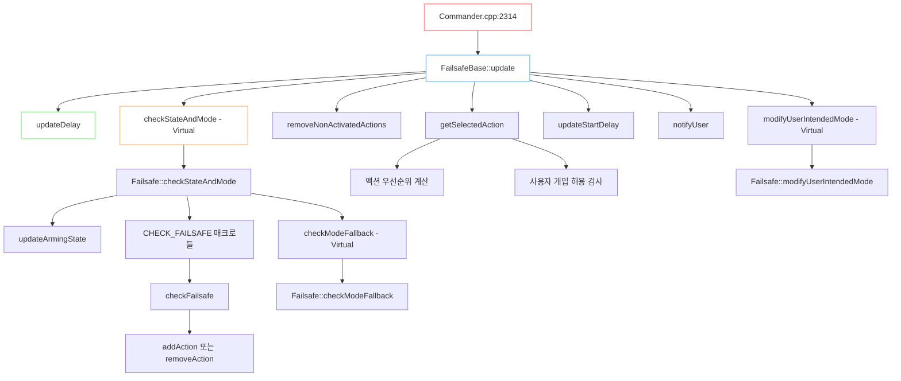
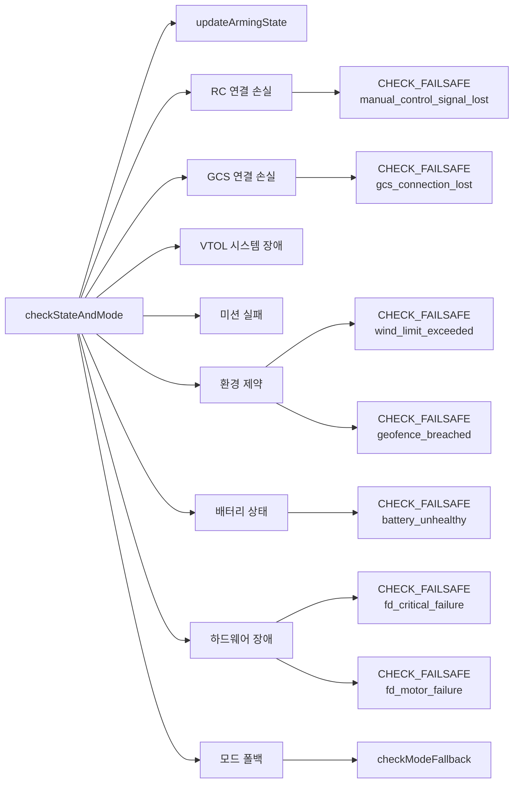
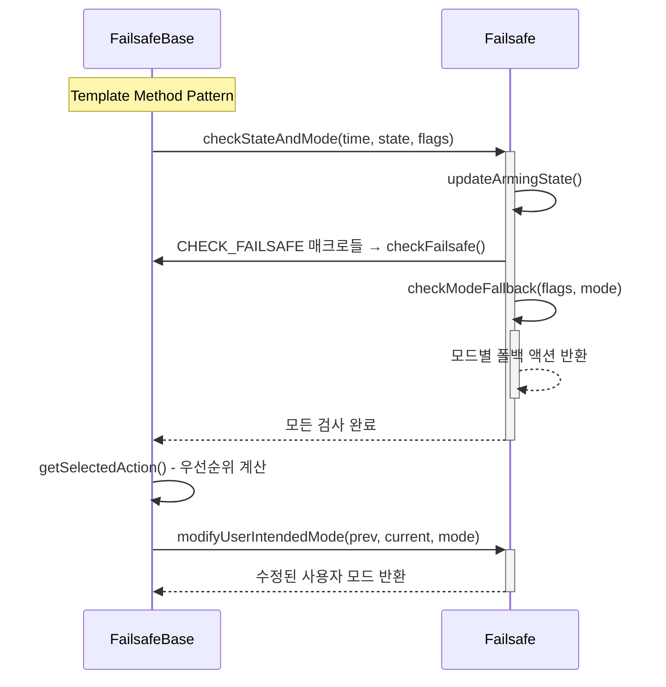

# Code Review : Failsafe 
## 1. Class

## 2. Flow

## 3. Function & Variable

### 3.1. 전체 함수 호출 그래프



### 3.2. Commander에서 Failsafe 호출 지점

**주요 호출 함수 및 목적:**

```cpp
// 1. 메인 Failsafe 업데이트 (Commander.cpp:2314)
uint8_t updated_user_intented_mode = _failsafe.update(
    hrt_absolute_time(), state, mode_change_requested,
    _failsafe_user_override_request, _failsafe_flags
);

// 2. 선택된 액션 확인 (Commander.cpp:2327, 2330)
_vehicle_status.nav_state = FailsafeBase::modeFromAction(_failsafe.selectedAction(), ...);
switch (_failsafe.selectedAction()) { ... }

// 3. Failsafe 상태 확인 (Commander.cpp:2343-2344)
_vehicle_status.failsafe = _failsafe.inFailsafe();
_vehicle_status.failsafe_and_user_took_over = _failsafe.userTakeoverActive();

// 4. Failsafe 지연 관리 (Commander.cpp:2353-2358)
_failsafe.deferFailsafes(_config_overrides.defer_failsafes, ...);
if (_failsafe.failsafeDeferred()) { ... }

// 5. 모드 관리에서 사용 (Commander.cpp:2391)
_failsafe.selectedAction() > FailsafeBase::Action::Warn
```

### 3.3. FailsafeBase::update() 내부 흐름

**Framework 레벨의 주요 단계 (framework.cpp:53-100):**

```cpp
uint8_t FailsafeBase::update(...) {
    // 1단계: 상태 정리
    if (시동_상태_변경) {
        removeActions(ClearCondition::OnDisarm);
        removeActions(ClearCondition::OnModeChangeOrDisarm);
    }

    // 2단계: 지연 처리
    updateDelay(time_us - _last_update);

    // 3단계: 상태 검사 (Virtual → Failsafe.cpp)
    checkStateAndMode(time_us, state, status_flags);

    // 4단계: 액션 정리
    removeNonActivatedActions();
    clearDelayIfNeeded(state, status_flags);

    // 5단계: 최적 액션 선택
    SelectedActionState action_state{};
    getSelectedAction(..., action_state);

    // 6단계: 지연 시작 처리
    updateStartDelay(...);

    // 7단계: 사용자 알림
    if (새로운_액션_또는_더_심각한_액션) {
        notifyUser(...);
    }

    // 8단계: 사용자 모드 수정 (Virtual → Failsafe.cpp)
    return modifyUserIntendedMode(...);
}
```

### 3.4. Failsafe::checkStateAndMode() 세부 검사

**구체적 Failsafe 조건 검사 순서 (failsafe.cpp:398-560):**



### 3.5. CHECK_FAILSAFE 매크로 동작 메커니즘

**매크로 확장과 실제 동작:**

```cpp
// 매크로 정의 (framework.h:44-45)
#define CHECK_FAILSAFE(status_flags, flag_name, options) \
    checkFailsafe((int)offsetof(failsafe_flags_s, flag_name), \
                  lastStatusFlags().flag_name, \
                  status_flags.flag_name, options)

// 실제 사용 예시
CHECK_FAILSAFE(status_flags, manual_control_signal_lost,
              fromNavDllOrRclActParam(_param_nav_rcl_act.get()));

// 확장된 결과
checkFailsafe(offsetof(failsafe_flags_s, manual_control_signal_lost),
              lastStatusFlags().manual_control_signal_lost,
              status_flags.manual_control_signal_lost,
              fromNavDllOrRclActParam(_param_nav_rcl_act.get()));
```

### 3.6. Virtual Function 인터페이스

**Framework ↔ Failsafe 간 가상함수 위임:**



### 3.7. 호출 흐름 요약

**전체 실행 흐름:**
```
1. Commander.cpp:2314
   ↓
2. FailsafeBase::update() [framework.cpp:53]
   ↓
3. Failsafe::checkStateAndMode() [failsafe.cpp:398]
   ↓
4. CHECK_FAILSAFE 매크로들 [다중 호출]
   ↓
5. FailsafeBase::checkFailsafe() [framework.cpp:285]
   ↓ (액션 등록/해제)
6. FailsafeBase::getSelectedAction() [framework.cpp:418]
   ↓ (우선순위 계산)
7. FailsafeBase::notifyUser() [framework.cpp:171]
   ↓
8. Failsafe::modifyUserIntendedMode() [failsafe.cpp]
   ↓
9. Commander에 updated_user_intended_mode 반환
```

이 구조는 **Template Method Pattern**과 **Strategy Pattern**을 조합하여, Framework에서는 공통 로직을, Failsafe에서는 구체적 정책을 담당하는 확장 가능한 설계입니다.

Commander Module
├── failsafe/
│   ├── framework.h/.cpp    ← 기본 프레임워크
│   ├── failsafe.h/.cpp     ← 구체적 구현
```

### 2. Action 우선순위 시스템
**framework.h:52-68**에서 정의된 우선순위:

```cpp
enum class Action : uint8_t {
    None,              // 0 - 최저 우선순위
    Warn,              // 1

    // Fallback Actions
    FallbackPosCtrl,   // 2 - 위치제어로 폴백
    FallbackAltCtrl,   // 3 - 고도제어로 폴백
    FallbackStab,      // 4 - 자세제어로 폴백

    // Safety Actions
    Hold,              // 5 - 호버링
    RTL,               // 6 - 복귀
    Land,              // 7 - 착륙
    Descend,           // 8 - 하강
    Disarm,            // 9 - 시동 해제
    Terminate,         // 10 - 최고 우선순위 (강제 종료)
};
```

**"낮은 번호일수록 높은 Action이 우선"** - 더 심각한 상황일수록 강력한 액션 선택

### 3. 상태 머신 동작 흐름

**framework.cpp:53-100** 기반:

```
1. update() 호출
    ↓
2. 이전 상태 정리 (시동 해제/모드 변경 시)
    ↓
3. checkStateAndMode() - 조건 검사
    ↓
4. getSelectedAction() - 최적 액션 선택
    ↓
5. 지연/보류 처리
    ↓
6. 사용자 알림
    ↓
7. 액션 실행
```

### 4. 조건 해제 메커니즘

**framework.h:72-77**에서 정의:

```cpp
enum class ClearCondition : uint8_t {
    WhenConditionClears,     // 조건이 사라지면 즉시 해제
    OnModeChangeOrDisarm,    // 모드 변경 또는 시동 해제 시
    OnDisarm,                // 시동 해제 시에만
    Never,                   // 재부팅해야 해제
};
```

### 5. 원인 분류 시스템

**framework.h:79-89**:

```cpp
enum class Cause : uint8_t {
    Generic,                 // 일반적인 원인
    ManualControlLoss,       // RC 신호 손실
    GCSConnectionLoss,       // 지상국 연결 손실
    BatteryLow,              // 배터리 부족
    BatteryCritical,         // 배터리 위험
    BatteryEmergency,        // 배터리 긴급
    RemainingFlightTimeLow,  // 비행시간 부족
};
```

## 핵심 매크로 및 설계 패턴

### 1. CHECK_FAILSAFE 매크로

**framework.h:44-45**:
```cpp
#define CHECK_FAILSAFE(status_flags, flag_name, options) \
    checkFailsafe((int)offsetof(failsafe_flags_s, flag_name), \
                  lastStatusFlags().flag_name, \
                  status_flags.flag_name, options)
```

각 failsafe 조건을 통일된 방식으로 검사하는 패턴 제공

### 2. 지연 시작 (Deferred Start)

**framework.cpp:50**:
```cpp
_current_start_delay = _param_com_fail_act_t.get() * 1_s;
```

시동 후 일정 시간 동안 failsafe 비활성화로 안정성 확보

### 3. 사용자 인터페이스

**framework.cpp:82-100**:
- 상황별 적절한 알림 제공
- 우선순위 기반 액션 선택
- 사용자 개입 허용 여부 결정

## Failsafe 안전사항 체크 항목

PX4 Failsafe는 `FailsafeFlags.msg`에 정의된 다양한 안전 조건들을 지속적으로 모니터링합니다.

### 1. 모드별 요구사항 (Mode Requirements)

**필요한 센서/상태별 분류:**
- `angular_velocity_invalid` - 각속도 센서 무효
- `attitude_invalid` - 자세 추정 무효
- `local_altitude_invalid` - 로컬 고도 무효
- `local_position_invalid` - 로컬 위치 무효
- `global_position_invalid` - 글로벌 위치 무효
- `auto_mission_missing` - 자동 미션 없음
- `offboard_control_signal_lost` - Offboard 신호 손실
- `home_position_invalid` - 홈 위치 무효

### 2. 통신 연결 상태 (Control Links)

- `manual_control_signal_lost` - RC 신호 손실
- `gcs_connection_lost` - 지상국 연결 손실

### 3. 배터리 상태 (Battery)

- `battery_warning` - 배터리 경고 레벨 (0-3)
- `battery_low_remaining_time` - 잔여 비행시간 기준 배터리 부족
- `battery_unhealthy` - 배터리 이상

### 4. 비행 제한 사항 (Flight Constraints)

- `geofence_breached` - 지오펜스 위반
- `wind_limit_exceeded` - 풍속 제한 초과
- `flight_time_limit_exceeded` - 최대 비행시간 초과
- `mission_failure` - 미션 실패

### 5. 고장 탐지 (Failure Detection)

- `fd_critical_failure` - 치명적 장애 (자세/고도 한계 초과)
- `fd_esc_arming_failure` - ESC 시동 실패
- `fd_imbalanced_prop` - 프로펠러 불균형
- `fd_motor_failure` - 모터 장애
- `vtol_fixed_wing_system_failure` - VTOL 고정익 시스템 장애

## 안전사항별 확인 방법과 조치

### 1. 통신 손실 대응

**RC 신호 손실 (`manual_control_signal_lost`)**
```cpp
// 확인 방법: RC 입력 타임아웃 검사
if (time_since_last_rc > RC_TIMEOUT) {
    status_flags.manual_control_signal_lost = true;
}

// 조치 방안 (NAV_RCL_ACT 파라미터 기반)
switch (nav_rcl_act_param) {
    case 0: // None - 아무것도 안함
    case 1: // Hold - 현재 위치 호버링
    case 2: // RTL - 이륙지점 복귀
    case 3: // Land - 즉시 착륙
    case 5: // Terminate - 강제 종료
}
```

**지상국 연결 손실 (`gcs_connection_lost`)**
- MAVLink 하트비트 타임아웃으로 감지
- `NAV_DLL_ACT` 파라미터에 따라 Hold/RTL/Land/Terminate 실행

### 2. 배터리 관리

**배터리 경고 레벨별 대응**
```cpp
// FailsafeFlags.msg:41
uint8 battery_warning;  // 0=OK, 1=Low, 2=Critical, 3=Emergency

// 대응 액션 (COM_LOW_BAT_ACT)
switch (battery_warning) {
    case 1: // Low - 경고 + RTL 권장
        return ActionOptions{Action::Warn, ClearCondition::OnModeChangeOrDisarm};
    case 2: // Critical - 강제 RTL 또는 Land
        return ActionOptions{Action::RTL, ClearCondition::Never};
    case 3: // Emergency - 즉시 착륙
        return ActionOptions{Action::Land, ClearCondition::Never};
}
```

### 3. 센서 장애 대응

**위치 추정 장애**
- GPS 신호 품질 저하 → `global_position_invalid`
- 광류/비전 장애 → `local_position_invalid`
- 기압계 장애 → `local_altitude_invalid`

**대응 방식:** 점진적 폴백 (Graceful Degradation)
```
GPS 장애 → 비전/광류 모드로 폴백
비전 장애 → 고도 제어 모드로 폴백
고도 장애 → 자세 안정화 모드로 폴백
```

### 4. 지오펜스 및 제약 조건

**지오펜스 위반 (`geofence_breached`)**
```cpp
// GF_ACTION 파라미터별 대응
enum geofence_action {
    GF_ACTION_NONE = 0,      // 경고만
    GF_ACTION_WARNING = 1,   // 경고 표시
    GF_ACTION_HOLD = 2,      // 현위치 정지
    GF_ACTION_RETURN = 3,    // 복귀 모드
    GF_ACTION_TERMINATE = 4, // 강제 종료
    GF_ACTION_LAND = 5       // 착륙
}
```

### 5. 하드웨어 고장 탐지
**모터/ESC 장애 (`fd_motor_failure`, `fd_esc_arming_failure`)**
- 실시간 ESC 텔레메트리 모니터링
- 추력 불균형 감지 알고리즘
- 대응: Hold → Land → Terminate (단계적 강화)

**프로펠러 불균형 (`fd_imbalanced_prop`)**
- IMU 진동 패턴 분석
- `COM_IMB_PROP_ACT` 파라미터에 따라 경고/RTL/착륙 선택

## 안전 철학과 설계 원칙
1. **단계적 대응 (Graduated Response)**: 경고 → 제한 → 안전모드 → 강제종료
2. **보수적 선택 (Conservative Approach)**: 불확실할 때는 더 안전한 쪽으로 결정
3. **사용자 제어권 (User Override)**: 가능한 경우 조종사 개입 허용
4. **상황 인식 (Situation Awareness)**: 명확한 경고와 상태 정보 제공

이러한 체계적 접근을 통해 PX4는 다양한 위험 상황에서 안전하고 예측 가능한 대응을 보장합니다.
