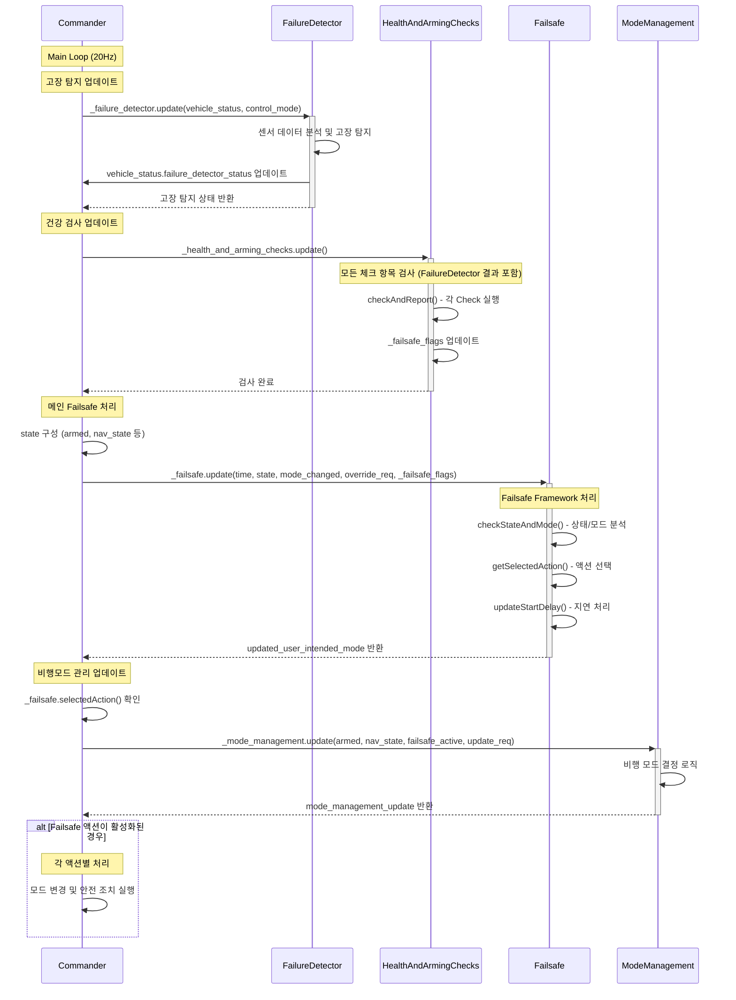

# Failsafe
:::info 개요
Failsafe 시스템은 드론 비행 중 예상치 못한 위험 상황이 발생했을 때, **자동으로 안전한 상태로 전환**할 수 있도록 대비하는 **안전 조치 시스템**입니다.

이 시스템은 **Framework 기반 아키텍처**를 통해 구현되어 있으며, 계층화된 설계로 확장성과 유지보수성을 제공합니다.
:::
## 1. Failsafe 안전조치 항목
Failsafe는 `FailsafeFlags.msg`에 정의한 다양한 안전조치 항목들을 지속적으로 모니터링하여 적절한 액션을 설정합니다.

| **구분** | **설명** | **항목(Failsafe Flags)** |
|--------------|----------|----------------------------|
| **1. 비행 모드별 요구사항 (Mode Requirements)** | 각속도 센서 무효 | `angular_velocity_invalid` |
|  | 자세 추정 무효 | `attitude_invalid` |
|  | 로컬 고도 무효 | `local_altitude_invalid` |
|  | 로컬 위치 무효 | `local_position_invalid` |
|  | 글로벌 위치 무효 | `global_position_invalid` |
|  | 자동 미션 없음 | `auto_mission_missing` |
|  | Offboard 신호 손실 | `offboard_control_signal_lost` |
|  | 홈 위치 무효 | `home_position_invalid` |
| **2. 통신 연결 상태 (Control Links)** | 수동조종 신호 손실 | `manual_control_signal_lost` |
|  | GCS 연결 손실 | `gcs_connection_lost` |
| **3. 배터리 상태 (Battery)** | 배터리 경고 레벨 (0–3) | `battery_warning` |
|  | 잔여 비행시간 기준 배터리 부족 | `battery_low_remaining_time` |
|  | 배터리 이상 | `battery_unhealthy` |
| **4. 비행 제한 사항 (Flight Constraints)** | 지오펜스 위반 | `geofence_breached` |
|  | 풍속 제한 초과 | `wind_limit_exceeded` |
|  | 최대 비행시간 초과 | `flight_time_limit_exceeded` |
|  | 미션 실패 | `mission_failure` |
| **5. 고장 탐지 (Failure Detection)** | 치명적 고장 (자세/고도 한계 초과) | `fd_critical_failure` |
|  | ESC 시동 실패 | `fd_esc_arming_failure` |
|  | 프로펠러 불균형 | `fd_imbalanced_prop` |
|  | 모터 고장 | `fd_motor_failure` |
|  | VTOL 고정익 시스템 고장 | `vtol_fixed_wing_system_failure` |

## 2. Failsafe 구성
### 2.1. Failsafe 연관 컴포넌트 구성
Failsafe는 **Commander 모듈**의 핵심 기능 중 하나로, 다음과 같은 하위 기능들과 연관되어 있습니다.

```
Commander Module (src/modules/commander/)
├── failsafe/                    ← 메인 Failsafe 로직
│   ├── framework.h/.cpp         ← 기본 프레임워크 및 상태머신
│   ├── failsafe.h/.cpp          ← 구체적인 Failsafe 구현
├── failure_detector/            ← 고장 탐지기
│   ├── FailureDetector.hpp/.cpp ← 실시간 고장 탐지
├── HealthAndArmingChecks/       ← 건강상태 및 시동 점검
│   ├── HealthAndArmingChecks.*  ← 메인 검사 로직
│   └── checks/                  ← 개별 검사 항목들
├── ModeManagement.*             ← 비행모드 관리
└── Commander.cpp/.hpp           ← 메인 컨트롤러
```

---

### 2.2. 핵심 컴포넌트 역할
**1. Commander (메인 컨트롤러)**
- Failsafe 시스템의 총괄 관리자
- 모든 하위 컴포넌트들을 통합하여 최종 결정
- 비행 모드 전환 및 액션 실행의 최종 책임자

**2. Failsafe (액션 결정 엔진)**
- 상황별 안전 액션 결정 (Hold, RTL, Land, Terminate 등)
- 액션 우선순위 관리 및 상태머신 운영
- `failsafe_flags_s`를 분석하여 적절한 대응 방안 선택
- 지연 처리 및 사용자 개입 허용 여부 결정

**3. HealthAndArmingChecks (상태 감시자)**
- `failsafe_flags_s` 생성 및 관리의 핵심 주체
- 시동 전/후 시스템 상태 검증
- 개별 검사 모듈들을 통한 종합적 상태 분석:
  - 배터리, 센서, 통신, 위치추정 등 모든 안전 요소

**4. ModeManagement (모드 관리자)**
- Failsafe 액션에 따른 실제 비행모드 결정
- 사용자 의도와 Failsafe 요구사항 간 조율
- 각 비행모드별 진입 조건 및 전환 로직 관리
- Commander의 모드 변경 요청을 실제 nav_state로 변환

**5. FailureDetector (고장 탐지기)**
- 센서 데이터 기반 실시간 하드웨어 고장 탐지
- 자세/고도 제어 한계 초과 감지 (`fd_critical_failure`)
- 모터/ESC/프로펠러 고장 탐지 (`fd_motor_failure`, `fd_esc_arming_failure`, `fd_imbalanced_prop`)
- `vehicle_status.failure_detector_status`를 통해 HealthAndArmingChecks로 정보 전달


## 3. Failsafe 동작 시퀀스

