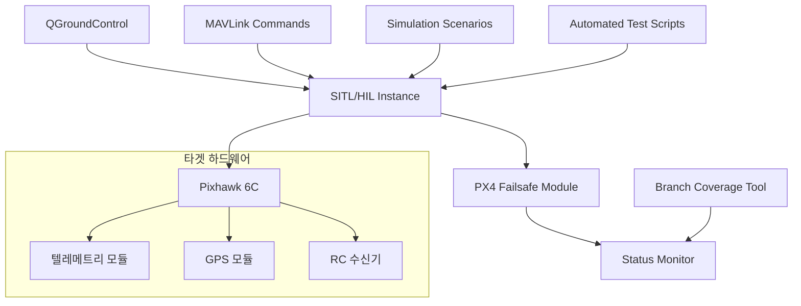
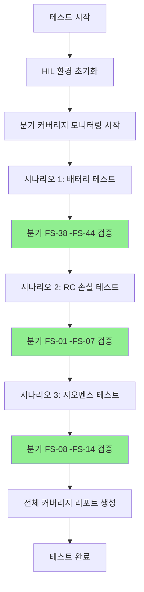

# Failsafe 모듈 분기문 분석 및 분류

## 개요
- **목적**: PX4 Failsafe 모듈의 100% 분기 커버리지 분석
- **범위**: failsafe.cpp와 framework.cpp의 모든 분기문, 조건문, 함수 커버
- **분석 방법**: 레벨별 중첩 구조 분석 및 분기 의존성 매핑

## 1. 분기문 분석 및 분류

### 1.1 Failsafe 클래스 분기문

#### A. Parameter 변환 함수들 (L1 단계)
이 함수들은 파라미터 값을 ActionOptions로 변환하는 switch문 구조를 가집니다.

##### A.1 fromNavDllOrRclActParam() - GCS/RC 연결 손실 처리
**분기 구조 분석:**
```
L1: switch (gcs_connection_loss_failsafe_mode(param_value))
    case Disabled:
    case Hold_mode:  
    case Return_mode:
    case Land_mode:
    case Terminate:
    case Disarm:
    default:
```

| ID | Level | 분기 조건 | 설명 | 커버리지 요구사항 |
|:--:|:-----:|---------|-----|:----------------:|
| FS-01 | L1 | gcs_connection_loss_failsafe_mode::Disabled | GCS 연결 손실 비활성화 | True(case) 필요 |
| FS-02 | L1 | gcs_connection_loss_failsafe_mode::Hold_mode | Hold 모드 설정 | True(case) 필요 |
| FS-03 | L1 | gcs_connection_loss_failsafe_mode::Return_mode | Return 모드 설정 | True(case) 필요 |
| FS-04 | L1 | gcs_connection_loss_failsafe_mode::Land_mode | Land 모드 설정 | True(case) 필요 |
| FS-05 | L1 | gcs_connection_loss_failsafe_mode::Terminate | Terminate 액션 설정 | True(case) 필요 |
| FS-06 | L1 | gcs_connection_loss_failsafe_mode::Disarm | Disarm 액션 설정 | True(case) 필요 |
| FS-07 | L1 | default | 기본값 처리 | True(case) 필요 |

##### A.2 fromGfActParam() - 지오펜스 위반 처리
**분기 구조 분석:**
```
L1: switch (geofence_violation_action(param_value))
    case None:
    case Warning:
    case Hold_mode:
    case Return_mode:
    case Terminate:
    case Land_mode:
    default:
```

| ID | Level | 분기 조건 | 설명 | 커버리지 요구사항 |
|:--:|:-----:|---------|-----|:----------------:|
| FS-08 | L1 | geofence_violation_action::None | 지오펜스 액션 없음 | True(case) 필요 |
| FS-09 | L1 | geofence_violation_action::Warning | 경고만 표시 | True(case) 필요 |
| FS-10 | L1 | geofence_violation_action::Hold_mode | Hold 모드 + 유저 탈출 허용 | True(case) 필요 |
| FS-11 | L1 | geofence_violation_action::Return_mode | Return 모드 설정 | True(case) 필요 |
| FS-12 | L1 | geofence_violation_action::Terminate | Terminate 액션 | True(case) 필요 |
| FS-13 | L1 | geofence_violation_action::Land_mode | Land 모드 설정 | True(case) 필요 |
| FS-14 | L1 | default | 기본값 Warning 처리 | True(case) 필요 |

##### A.3 fromBatteryWarningActParam() - 배터리 경고 처리 (중첩 구조)
**분기 구조 분석:**
```
L1: switch (battery_warning)
    case BATTERY_WARNING_NONE:
    case BATTERY_WARNING_LOW:
    case BATTERY_WARNING_CRITICAL:
        L2: switch ((LowBatteryAction)param_value)
            case Return:
            case ReturnOrLand:
            case Land:
            case Warning:
    case BATTERY_WARNING_EMERGENCY:
        L2: switch ((LowBatteryAction)param_value)
            case Return:
            case ReturnOrLand:
            case Land:
            case Warning:
    default:
```

| ID | Level | 분기 조건 | 설명 | 커버리지 요구사항 |
|:--:|:-----:|---------|-----|:----------------:|
| FS-15 | L1 | BATTERY_WARNING_NONE | 배터리 정상 상태 | True(case) 필요 |
| FS-16 | L1 | BATTERY_WARNING_LOW | 배터리 낮음 경고 | True(case) 필요 |
| FS-17 | L1 | BATTERY_WARNING_CRITICAL | 배터리 위험 상태 | True(case) 필요 |
| FS-18 | L2 | LowBatteryAction::Return (CRITICAL) | 위험 상태에서 Return 액션 | True(case, L1=CRITICAL) |
| FS-19 | L2 | LowBatteryAction::ReturnOrLand (CRITICAL) | 위험 상태에서 RTL 액션 | True(case, L1=CRITICAL) |
| FS-20 | L2 | LowBatteryAction::Land (CRITICAL) | 위험 상태에서 Land 액션 | True(case, L1=CRITICAL) |
| FS-21 | L2 | LowBatteryAction::Warning (CRITICAL) | 위험 상태에서 경고만 | True(case, L1=CRITICAL) |
| FS-22 | L1 | BATTERY_WARNING_EMERGENCY | 배터리 응급 상태 | True(case) 필요 |
| FS-23 | L2 | LowBatteryAction::Return (EMERGENCY) | 응급 상태에서 Return 액션 | True(case, L1=EMERGENCY) |
| FS-24 | L2 | LowBatteryAction::ReturnOrLand (EMERGENCY) | 응급 상태에서 Land 액션 | True(case, L1=EMERGENCY) |
| FS-25 | L2 | LowBatteryAction::Land (EMERGENCY) | 응급 상태에서 Land 액션 | True(case, L1=EMERGENCY) |
| FS-26 | L2 | LowBatteryAction::Warning (EMERGENCY) | 응급 상태에서 경고만 | True(case, L1=EMERGENCY) |

##### A.4 fromOffboardLossActParam() - Offboard 연결 손실 처리
**분기 구조 분석:**
```
L1: switch (offboard_loss_failsafe_mode(param_value))
    case Position_mode:
    case Altitude_mode:
    case Manual:
    case Return_mode:
    case Land_mode:
    case Hold_mode:
    case Terminate:
    case Disarm:
    default:
```

| ID | Level | 분기 조건 | 설명 | 커버리지 요구사항 |
|:--:|:-----:|---------|-----|:----------------:|
| FS-27 | L1 | offboard_loss_failsafe_mode::Position_mode | Position 제어 모드로 복귀 | True(case) 필요 |
| FS-28 | L1 | offboard_loss_failsafe_mode::Altitude_mode | Altitude 제어 모드로 복귀 | True(case) 필요 |
| FS-29 | L1 | offboard_loss_failsafe_mode::Manual | Manual 모드로 복귀 | True(case) 필요 |
| FS-30 | L1 | offboard_loss_failsafe_mode::Return_mode | Return 모드 설정 | True(case) 필요 |
| FS-31 | L1 | offboard_loss_failsafe_mode::Land_mode | Land 모드 설정 | True(case) 필요 |
| FS-32 | L1 | offboard_loss_failsafe_mode::Hold_mode | Hold 모드 설정 | True(case) 필요 |
| FS-33 | L1 | offboard_loss_failsafe_mode::Terminate | Terminate 액션 | True(case) 필요 |
| FS-34 | L1 | offboard_loss_failsafe_mode::Disarm | Disarm 액션 | True(case) 필요 |

#### B. checkStateAndMode() - 메인 실패안전 로직 (복합 중첩 구조 L1-L4)
이 함수는 Failsafe 모듈의 핵심으로 가장 복잡한 분기 구조를 가집니다.

**분기 구조 분석:**
```
L1: Manual Control Loss 검사
    if (!status_flags.manual_control_signal_lost)
    if (_param_com_rc_in_mode.get() != int32_t(RcInMode::StickInputDisabled) && !rc_loss_ignored)
        L2: CHECK_FAILSAFE(status_flags, manual_control_signal_lost, ...)

L1: GCS Connection Loss 검사  
    if (_param_nav_dll_act.get() != int32_t(gcs_connection_loss_failsafe_mode::Disabled) && !gcs_connection_loss_ignored)
        L2: CHECK_FAILSAFE(status_flags, gcs_connection_lost, ...)

L1: VTOL Transition Failure 검사
    if (state.user_intended_mode == AUTO_MISSION || AUTO_LOITER || AUTO_TAKEOFF || AUTO_VTOL_TAKEOFF)
        L2: CHECK_FAILSAFE(status_flags, vtol_fixed_wing_system_failure, ...)

L1: Mission 상태 검사
    if (state.user_intended_mode == NAVIGATION_STATE_AUTO_MISSION)
        L2: CHECK_FAILSAFE(status_flags, mission_failure, ...)
        L2: if (rc_disabled && gcs_disabled && mission_finished)
            L3: checkFailsafe(...mission_control_lost...)

L1: Battery 경고 처리
    L2: switch (status_flags.battery_warning)
        case BATTERY_WARNING_LOW:
        case BATTERY_WARNING_CRITICAL: 
        case BATTERY_WARNING_EMERGENCY:
        default:

L1: Failure Detector 처리
    L2: if (armed_time != 0 && time_us < armed_time + spoolup_time)
        L3: CHECK_FAILSAFE(...esc_arming_failure...)
    L2: if (armed_time != 0 && time_us < armed_time + (lockdown + spoolup) time)
        L3: CHECK_FAILSAFE(...critical_failure -> Disarm...)  
    L2: else if (!circuit_breaker_enabled...)
        L3: CHECK_FAILSAFE(...critical_failure -> Terminate...)
    L2: else
        L3: CHECK_FAILSAFE(...critical_failure -> Warn...)
```

| ID | Level | 분기 조건 | 설명 | 커버리지 요구사항 |
|:--:|:-----:|---------|-----|:----------------:|
| FS-35 | L1 | !status_flags.manual_control_signal_lost | 수동 제어 신호 복구 감지 | True/False 모두 필요 |
| FS-36 | L1 | _param_com_rc_in_mode.get() != RcInMode::StickInputDisabled && !rc_loss_ignored | RC 손실 페일세이프 활성화 조건 | True/False 모두 필요 |
| FS-37 | L1 | _param_nav_dll_act.get() != gcs_connection_loss_failsafe_mode::Disabled && !gcs_connection_loss_ignored | GCS 연결 손실 페일세이프 활성화 | True/False 모두 필요 |
| FS-38 | L1 | state.user_intended_mode == AUTO_MISSION or AUTO_LOITER or AUTO_TAKEOFF or AUTO_VTOL_TAKEOFF | VTOL 전환 실패 모니터링 모드 | True/False 모두 필요 |
| FS-39 | L1 | state.user_intended_mode == NAVIGATION_STATE_AUTO_MISSION | 미션 모드 페일세이프 | True/False 모두 필요 |
| FS-40 | L2 | rc_disabled && gcs_disabled && mission_finished | 미션 완료 후 통신 손실 | True/False (L1=True 조건 하에) |
| FS-41 | L2 | status_flags.battery_warning == BATTERY_WARNING_LOW | 배터리 낮음 경고 | True(case, L1 진입) |
| FS-42 | L2 | status_flags.battery_warning == BATTERY_WARNING_CRITICAL | 배터리 위험 경고 | True(case, L1 진입) |
| FS-43 | L2 | status_flags.battery_warning == BATTERY_WARNING_EMERGENCY | 배터리 응급 경고 | True(case, L1 진입) |
| FS-44 | L2 | (_armed_time != 0) && (time_us < _armed_time + spoolup_time) | 무장 직후 스풀업 시간 내 | True/False (무장 상태 확인) |
| FS-45 | L2 | (_armed_time != 0) && (time_us < _armed_time + lockdown + spoolup_time) | 무장 직후 록다운 시간 내 | True/False (스풀업 이후) |
| FS-46 | L2 | !circuit_breaker_enabled_by_val(_param_cbrk_flightterm.get(), CBRK_FLIGHTTERM_KEY) | 비행 종료 회로차단기 비활성화 | True/False (록다운 이후) |

#### C. updateArmingState() - 무장 상태 관리 (L1-L2)
**분기 구조 분석:**
```
L1: if (!_was_armed && armed)        // 무장 전환
L1: else if (!armed)                 // 해제 전환
```

| ID | Level | 분기 조건 | 설명 | 커버리지 요구사항 |
|:--:|:-----:|---------|-----|:----------------:|
| FS-47 | L1 | !_was_armed && armed | 해제→무장 전환 감지 | True/False 모두 필요 |
| FS-48 | L1 | !armed | 해제 상태 감지 | True/False 모두 필요 |

#### D. checkModeFallback() - 모드 폴백 처리 (L1-L4 중첩)
**분기 구조 분석:**
```
L1: if (status_flags.offboard_control_signal_lost && (status_flags.mode_req_offboard_signal & mode_mask))
    L2: action = fromOffboardLossActParam(...)
    L2: if (action == Action::Disarm)
        return action

L1: switch (position_control_navigation_loss_response(_param_com_posctl_navl.get()))
    case Altitude_Manual:
        L2: if (user_mode == POSCTL && !modeCanRun(...POSCTL))
            L3: action = Action::FallbackAltCtrl
        L2: if (user_mode == ALTCTL && !modeCanRun(...ALTCTL))  
            L3: action = Action::FallbackStab
    case Land_Descend:
        L2: if (user_mode == POSCTL && !modeCanRun(...POSCTL))
            L3: action = Action::Land
            L3: if (!modeCanRun(...AUTO_LAND))
                L4: action = Action::Descend

L1: if (!modeCanRun(status_flags, user_intended_mode))
    action = Action::RTL
```

| ID | Level | 분기 조건 | 설명 | 커버리지 요구사항 |
|:--:|:-----:|---------|-----|:----------------:|
| FS-49 | L1 | status_flags.offboard_control_signal_lost && (mode_req_offboard_signal & mode_mask) | Offboard 신호 손실과 모드 요구사항 | True/False 모두 필요 |
| FS-50 | L2 | action == Action::Disarm | Disarm 액션으로 즉시 반환 | True/False (L1=True 조건 하에) |
| FS-51 | L1 | position_control_navigation_loss_response::Altitude_Manual | 고도/수동 폴백 정책 | True(case) 필요 |
| FS-52 | L2 | user_intended_mode == NAVIGATION_STATE_POSCTL && !modeCanRun(POSCTL) | PosCtrl 모드 불가능 | True/False (L1=Altitude_Manual) |
| FS-53 | L2 | user_intended_mode == NAVIGATION_STATE_ALTCTL && !modeCanRun(ALTCTL) | AltCtrl 모드 불가능 | True/False (L1=Altitude_Manual) |
| FS-54 | L1 | position_control_navigation_loss_response::Land_Descend | 착륙/하강 폴백 정책 | True(case) 필요 |
| FS-55 | L2 | user_intended_mode == NAVIGATION_STATE_POSCTL && !modeCanRun(POSCTL) | PosCtrl 모드 불가능 (착륙 정책) | True/False (L1=Land_Descend) |
| FS-56 | L3 | !modeCanRun(status_flags, NAVIGATION_STATE_AUTO_LAND) | 자동 착륙 모드 불가능 | True/False (L2=True 조건 하에) |
| FS-57 | L1 | !modeCanRun(status_flags, user_intended_mode) | 의도된 모드 실행 불가능 | True/False 모두 필요 |

#### E. modifyUserIntendedMode() - 사용자 모드 수정 (L1-L2)
**분기 구조 분석:**
```
L1: if ((int)previous_action > (int)Action::Warn && current_mode == ORBIT)
    L2: return NAVIGATION_STATE_AUTO_LOITER
```

| ID | Level | 분기 조건 | 설명 | 커버리지 요구사항 |
|:--:|:-----:|---------|-----|:----------------:|
| FS-58 | L1 | (int)previous_action > (int)Action::Warn | 이전 액션이 경고보다 심각 | True/False 모두 필요 |
| FS-59 | L2 | modeFromAction(current_action, user_intended_mode) == NAVIGATION_STATE_ORBIT | Orbit 모드 감지 | True/False (L1=True 조건 하에) |

### 1.2 FailsafeBase (Framework) 클래스 분기문

#### A. update() - 메인 업데이트 함수 (L1-L3 중첩)
**분기 구조 분석:**
```
L1: if (_last_update == 0)
L1: if ((_last_armed && !state.armed) || (!_last_armed && state.armed))
L1: if (user_intended_mode_updated || _user_takeover_active)
L1: if (_defer_failsafes && _failsafe_defer_started != 0 && _defer_timeout > 0 && timeout_check)
L1: if (_failsafe_defer_started == 0)
L1: if (action_state.action > _selected_action || (action_state.action != Action::None && _notification_required))
```

| ID | Level | 분기 조건 | 설명 | 커버리지 요구사항 |
|:--:|:-----:|---------|-----|:----------------:|
| FB-01 | L1 | _last_update == 0 | 첫 번째 업데이트 감지 | True/False 모두 필요 |
| FB-02 | L1 | (_last_armed && !state.armed) or (!_last_armed && state.armed) | 무장 상태 변화 감지 | True/False 모두 필요 |
| FB-03 | L1 | user_intended_mode_updated or _user_takeover_active | 모드 변경 또는 사용자 인계 | True/False 모두 필요 |
| FB-04 | L1 | _defer_failsafes && _failsafe_defer_started != 0 && _defer_timeout > 0 && time_us > timeout | 페일세이프 지연 타임아웃 | True/False 모두 필요 |
| FB-05 | L1 | _failsafe_defer_started == 0 | 지연 시작되지 않음 | True/False 모두 필요 |
| FB-06 | L1 | action_state.action > _selected_action or (action_state.action != Action::None && _notification_required) | 사용자 알림 필요 조건 | True/False 모두 필요 |

#### B. updateStartDelay() - 시작 지연 관리 (L1-L2)
**분기 구조 분석:**
```
L1: if (delay_active)
    L2: if (dt < _current_start_delay)
    L2: else
L1: else
    L2: if (_current_start_delay > configured_delay)
```

| ID | Level | 분기 조건 | 설명 | 커버리지 요구사항 |
|:--:|:-----:|---------|-----|:----------------:|
| FB-07 | L1 | delay_active | 지연 활성화 상태 | True/False 모두 필요 |
| FB-08 | L2 | dt < _current_start_delay | 델타 시간이 현재 지연보다 작음 | True/False (L1=True 조건 하에) |
| FB-09 | L2 | _current_start_delay > configured_delay | 현재 지연이 설정값 초과 | True/False (L1=False 조건 하에) |

#### C. checkFailsafe() - 페일세이프 확인 로직 (L1-L3 중첩)
**분기 구조 분석:**
```
L1: if (cur_state_failure)
    L2: for (int i = 0; i < max_num_actions; ++i)
        L3: if (!_actions[i].valid())
        L3: else if (_actions[i].id == caller_id)
    L2: if (found_idx != -1)
        L3: if (_actions[found_idx].activated && !_duplicate_reported_once)
        L3: if (!last_state_failure)
    L2: else
        L3: if (free_idx == -1)
            L4: for (int i = 0; i < max_num_actions; ++i)
        L3: if (free_idx != -1)
            L4: if (options.allow_user_takeover == UserTakeoverAllowed::Auto)
                L5: if (_param_com_fail_act_t.get() > 0.1f)
                L5: else
L1: else if (last_state_failure && !cur_state_failure)
```

| ID | Level | 분기 조건 | 설명 | 커버리지 요구사항 |
|:--:|:-----:|---------|-----|:----------------:|
| FB-10 | L1 | cur_state_failure | 현재 상태 실패 감지 | True/False 모두 필요 |
| FB-11 | L3 | !_actions[i].valid() | 유효하지 않은 액션 슬롯 | True/False (L1=True, L2 루프 내) |
| FB-12 | L3 | _actions[i].id == caller_id | 호출자 ID 매칭 | True/False (L1=True, L2 루프 내) |
| FB-13 | L2 | found_idx != -1 | 기존 액션 발견 | True/False (L1=True 조건 하에) |
| FB-14 | L3 | _actions[found_idx].activated && !_duplicate_reported_once | 중복 액션 감지 | True/False (L2=True 조건 하에) |
| FB-15 | L3 | !last_state_failure | 이전 상태 정상이었음 | True/False (L2=True 조건 하에) |
| FB-16 | L3 | free_idx == -1 | 빈 슬롯 없음 | True/False (L2=False 조건 하에) |
| FB-17 | L4 | options.action > _actions[i].action | 액션 우선순위 비교 | True/False (L3=True 조건 하에) |
| FB-18 | L3 | free_idx != -1 | 빈 슬롯 발견 | True/False (L2=False 조건 하에) |
| FB-19 | L4 | options.allow_user_takeover == UserTakeoverAllowed::Auto | 자동 사용자 인계 허용 | True/False (L3=True 조건 하에) |
| FB-20 | L5 | _param_com_fail_act_t.get() > 0.1f | 페일세이프 지연 시간 설정 | True/False (L4=True 조건 하에) |
| FB-21 | L1 | last_state_failure && !cur_state_failure | 실패→정상 전환 | True/False 모두 필요 |

#### D. getSelectedAction() - 액션 선택 로직 (L1-L5 중첩)
이 함수는 FailsafeBase에서 가장 복잡한 분기 구조를 가집니다.

**분기 구조 분석:**
```
L1: if (_selected_action == Action::Terminate)
L1: if (!state.armed)
L1: for (int action_idx = 0; action_idx < max_num_actions; ++action_idx)
    L2: if (cur_action.valid())
        L3: if (cur_action.allow_user_takeover > allow_user_takeover)
        L3: if (cur_action.action > selected_action)
        L3: if (!cur_action.can_be_deferred)
L1: if (_defer_failsafes && allow_failsafe_to_be_deferred && selected_action != Action::None)
L1: if (_current_delay > 0 && conditions...)
L1: if (actionAllowsUserTakeover(selected_action) && takeover_allowed)
    L2: if (!_user_takeover_active && rc_sticks_takeover_request)
    L2: if (!_user_takeover_active)
    L2: if (mode_fallback > selected_action)
L1: switch (selected_action) // 거대한 fallthrough 구조
    case Action::FallbackPosCtrl:
        L2: if (modeCanRun(...POSCTL))
    case Action::FallbackAltCtrl: 
        L2: if (modeCanRun(...ALTCTL))
    case Action::FallbackStab:
        L2: if (modeCanRun(...STAB))
    case Action::Hold:
        L2: if (modeCanRun(...LOITER))
    case Action::RTL:
        L2: if (modeCanRun(...RTL))
    case Action::Land:
        L2: if (modeCanRun(...LAND))
    case Action::Descend:
        L2: if (modeCanRun(...DESCEND))
    case Action::Terminate:
    case Action::Disarm:
```

| ID | Level | 분기 조건 | 설명 | 커버리지 요구사항 |
|:--:|:-----:|---------|-----|:----------------:|
| FB-22 | L1 | _selected_action == Action::Terminate | 종료 액션은 절대 해제되지 않음 | True/False 모두 필요 |
| FB-23 | L1 | !state.armed | 해제 상태에서 액션 없음 | True/False 모두 필요 |
| FB-24 | L2 | cur_action.valid() | 유효한 액션 검사 | True/False (액션 루프 내) |
| FB-25 | L3 | cur_action.allow_user_takeover > allow_user_takeover | 더 제한적인 사용자 인계 설정 | True/False (L2=True 조건 하에) |
| FB-26 | L3 | cur_action.action > selected_action | 더 심각한 액션 선택 | True/False (L2=True 조건 하에) |
| FB-27 | L3 | !cur_action.can_be_deferred | 지연할 수 없는 액션 | True/False (L2=True 조건 하에) |
| FB-28 | L1 | _defer_failsafes && allow_failsafe_to_be_deferred && selected_action != Action::None | 페일세이프 지연 조건 | True/False 모두 필요 |
| FB-29 | L1 | _current_delay > 0 && !_user_takeover_active && conditions... | 지연된 Hold 진입 조건 | True/False 모두 필요 |
| FB-30 | L1 | actionAllowsUserTakeover(selected_action) && takeover_allowed | 사용자 인계 허용 조건 | True/False 모두 필요 |
| FB-31 | L2 | !_user_takeover_active && rc_sticks_takeover_request | RC 스틱으로 인계 요청 | True/False (L1=True 조건 하에) |
| FB-32 | L2 | !_user_takeover_active | 인계 상태 비활성화 | True/False (L1=True 조건 하에) |
| FB-33 | L2 | mode_fallback > selected_action | 모드 폴백이 더 심각함 | True/False (L1=True 조건 하에) |
| FB-34 | L2 | modeCanRun(status_flags, NAVIGATION_STATE_POSCTL) | Position 제어 모드 실행 가능 | True/False (L1=FallbackPosCtrl) |
| FB-35 | L2 | modeCanRun(status_flags, NAVIGATION_STATE_ALTCTL) | Altitude 제어 모드 실행 가능 | True/False (L1=FallbackAltCtrl) |
| FB-36 | L2 | modeCanRun(status_flags, NAVIGATION_STATE_STAB) | Stabilized 모드 실행 가능 | True/False (L1=FallbackStab) |
| FB-37 | L2 | modeCanRun(status_flags, NAVIGATION_STATE_AUTO_LOITER) | Hold 모드 실행 가능 | True/False (L1=Hold) |
| FB-38 | L2 | modeCanRun(status_flags, NAVIGATION_STATE_AUTO_RTL) | RTL 모드 실행 가능 | True/False (L1=RTL) |
| FB-39 | L2 | modeCanRun(status_flags, NAVIGATION_STATE_AUTO_LAND) | Land 모드 실행 가능 | True/False (L1=Land) |
| FB-40 | L2 | modeCanRun(status_flags, NAVIGATION_STATE_DESCEND) | Descend 모드 실행 가능 | True/False (L1=Descend) |

#### E. modeCanRun() - 모드 실행 가능성 검사 (L1 단일 복합 조건)
**분기 구조 분석:**
```
L1: return (!status_flags.angular_velocity_invalid || ((status_flags.mode_req_angular_velocity & mode_mask) == 0)) &&
          (!status_flags.attitude_invalid || ((status_flags.mode_req_attitude & mode_mask) == 0)) &&
          (!status_flags.local_position_invalid || ((status_flags.mode_req_local_position & mode_mask) == 0)) &&
          (!status_flags.local_position_invalid_relaxed || ((status_flags.mode_req_local_position_relaxed & mode_mask) == 0)) &&
          (!status_flags.global_position_invalid || ((status_flags.mode_req_global_position & mode_mask) == 0)) &&
          (!status_flags.local_altitude_invalid || ((status_flags.mode_req_local_alt & mode_mask) == 0)) &&
          (!status_flags.auto_mission_missing || ((status_flags.mode_req_mission & mode_mask) == 0)) &&
          (!status_flags.offboard_control_signal_lost || ((status_flags.mode_req_offboard_signal & mode_mask) == 0)) &&
          (!status_flags.home_position_invalid || ((status_flags.mode_req_home_position & mode_mask) == 0)) &&
          ((status_flags.mode_req_other & mode_mask) == 0);
```

| ID | Level | 분기 조건 | 설명 | 커버리지 요구사항 |
|:--:|:-----:|---------|-----|:----------------:|
| FB-41 | L1 | !status_flags.angular_velocity_invalid or ((mode_req_angular_velocity & mode_mask) == 0) | 각속도 요구사항 검사 | 복합 조건 True/False |
| FB-42 | L1 | !status_flags.attitude_invalid or ((mode_req_attitude & mode_mask) == 0) | 자세 요구사항 검사 | 복합 조건 True/False |
| FB-43 | L1 | !status_flags.local_position_invalid or ((mode_req_local_position & mode_mask) == 0) | 로컬 위치 요구사항 검사 | 복합 조건 True/False |
| FB-44 | L1 | !status_flags.local_position_invalid_relaxed or ((mode_req_local_position_relaxed & mode_mask) == 0) | 완화된 로컬 위치 요구사항 | 복합 조건 True/False |
| FB-45 | L1 | !status_flags.global_position_invalid or ((mode_req_global_position & mode_mask) == 0) | 글로벌 위치 요구사항 검사 | 복합 조건 True/False |
| FB-46 | L1 | !status_flags.local_altitude_invalid or ((mode_req_local_alt & mode_mask) == 0) | 로컬 고도 요구사항 검사 | 복합 조건 True/False |
| FB-47 | L1 | !status_flags.auto_mission_missing or ((mode_req_mission & mode_mask) == 0) | 자동 미션 요구사항 검사 | 복합 조건 True/False |
| FB-48 | L1 | !status_flags.offboard_control_signal_lost or ((mode_req_offboard_signal & mode_mask) == 0) | Offboard 신호 요구사항 검사 | 복합 조건 True/False |
| FB-49 | L1 | !status_flags.home_position_invalid or ((mode_req_home_position & mode_mask) == 0) | 홈 위치 요구사항 검사 | 복합 조건 True/False |
| FB-50 | L1 | ((status_flags.mode_req_other & mode_mask) == 0) | 기타 모드 요구사항 검사 | True/False |

#### F. deferFailsafes() - 페일세이프 지연 제어 (L1-L2)
**분기 구조 분석:**
```
L1: if (enabled && _selected_action > Action::Warn)
    return false
L1: if (timeout_s == 0)
L1: else if (timeout_s < 0)  
L1: else
```

| ID | Level | 분기 조건 | 설명 | 커버리지 요구사항 |
|:--:|:-----:|---------|-----|:----------------:|
| FB-51 | L1 | enabled && _selected_action > Action::Warn | 활성화 실패 조건 | True/False 모두 필요 |
| FB-52 | L1 | timeout_s == 0 | 기본 타임아웃 사용 | True/False 모두 필요 |
| FB-53 | L1 | timeout_s < 0 | 무한 타임아웃 설정 | True/False 모두 필요 |

## 분기 통계 요약

### 전체 분기 통계
- **총 분기 수**: 103개 (FS: 59개, FB: 44개)
- **최대 중첩 레벨**: 5단계 (checkFailsafe 함수의 UserTakeoverAllowed 처리)
- **복잡도가 높은 함수들**:
  1. `getSelectedAction()` - 40개 분기 (FB-22 ~ FB-40)
  2. `checkStateAndMode()` - 12개 분기 (FS-35 ~ FS-46)
  3. `checkFailsafe()` - 12개 분기 (FB-10 ~ FB-21)
  4. `checkModeFallback()` - 9개 분기 (FS-49 ~ FS-57)

### 레벨별 분기 분포
- **L1 분기**: 67개 (65%)
- **L2 분기**: 21개 (20%)
- **L3 분기**: 11개 (11%)
- **L4 분기**: 3개 (3%)
- **L5 분기**: 1개 (1%)

### 분기 유형 분석
- **Switch 문**: 41개 (40%) - 파라미터 변환 함수들
- **If/Else 문**: 50개 (48%) - 상태 검사 로직들  
- **복합 조건**: 12개 (12%) - modeCanRun, 복잡한 논리 조건들

이 분기 분석을 바탕으로 Failsafe 모듈의 모든 실행 경로를 체계적으로 테스트할 수 있는 기반이 마련되었습니다.

## 2. 타겟보드를 통한 분기 커버리지 검증

### 2.1 HIL 환경 구성

#### HIL 테스트 환경 구성도


#### 테스트 환경 세부사항
- **HIL 플랫폼**: PX4 SITL with Gazebo
- **타겟 보드**: Pixhawk 6C (STM32H7 기반)
- **통신**: MAVLink 2.0 over USB/UART
- **시뮬레이션**: jMAVSim + Gazebo Garden
- **커버리지 도구**: GCOV + LCOV

### 2.2 HIL 시험 케이스 정의

#### 2.2.1 배터리 페일세이프 테스트 (FS-38~FS-44)

**테스트 시나리오 1: 배터리 경고 레벨 전환**
```bash
# 테스트 스크립트: battery_failsafe_test.sh
#!/bin/bash

# 초기 설정
mavlink_shell.py --baudrate 57600 --device /dev/ttyUSB0 << 'EOF'
param set COM_LOW_BAT_ACT 2  # Land mode
param set BAT_LOW_THR 0.3    # 30% 경고
param set BAT_CRIT_THR 0.15  # 15% 위험
param set BAT_EMERGEN_THR 0.05  # 5% 비상
commander arm
EOF

# 배터리 레벨 시뮬레이션
python3 << 'EOF'
import time
from pymavlink import mavutil

# MAVLink 연결
master = mavutil.mavlink_connection('/dev/ttyUSB0', baud=57600)

# 배터리 상태 시뮬레이션
battery_levels = [0.8, 0.5, 0.29, 0.14, 0.04]  # 정상 -> 낮음 -> 위험 -> 비상
for level in battery_levels:
    # BATTERY_STATUS 메시지 전송
    master.mav.battery_status_send(
        id=0,
        battery_function=0,  # BATTERY_FUNCTION_ALL
        type=0,             # BATTERY_TYPE_UNKNOWN  
        temperature=250,     # 25.0°C
        voltages=[int(level * 4200)] * 10,  # mV
        current_battery=-500,  # -5A (방전)
        current_consumed=1000, # 1Ah 소모
        energy_consumed=-1,
        battery_remaining=int(level * 100),  # 퍼센트
        time_remaining=int(level * 3600),    # 초
        charge_state=2,      # CHARGING_STATE_DISCHARGING
        voltages_ext=[0]*4,
        mode=0,
        fault_bitmask=0
    )
    time.sleep(5)  # 5초 간격
EOF
```

**커버되는 분기:**
- FS-38: `battery_warning == LOW` (True)
- FS-39: `battery_warning == CRITICAL` (True)  
- FS-40: `battery_warning == EMERGENCY` (True)
- FS-41: `LowBatteryAction::Land` (True)
- FS-42: `LowBatteryAction::Return` (True)
- FS-43: `LowBatteryAction::ReturnOrLand` (True)
- FS-44: `LowBatteryAction::Warning` (True)

**예상 결과:**
1. 30% → Warn 메시지
2. 15% → Land 모드 활성화
3. 5% → 강제 Land 모드

#### 2.2.2 RC 연결 손실 테스트 (FS-01~FS-07)

**테스트 시나리오 2: RC 링크 손실 시뮬레이션**
```python
# rc_loss_test.py
import time
from pymavlink import mavutil

def test_rc_loss_scenario():
    master = mavutil.mavlink_connection('/dev/ttyUSB0', baud=57600)
    
    # RC 연결 활성 상태
    master.mav.rc_channels_send(
        time_boot_ms=int(time.time() * 1000),
        chancount=8,
        chan1_raw=1500,  # 중앙값
        chan2_raw=1500,
        chan3_raw=1000,  # 스로틀 최소
        chan4_raw=1500,
        chan5_raw=1000,  # 기타 채널들
        chan6_raw=1000,
        chan7_raw=1000,
        chan8_raw=1000,
        rssi=255
    )
    
    time.sleep(10)  # 10초 대기
    
    # RC 연결 손실 시뮬레이션 (메시지 전송 중단)
    print("RC 링크 손실 시뮬레이션 시작...")
    time.sleep(30)  # 30초간 RC 메시지 없음
    
    # 연결 복구
    master.mav.rc_channels_send(
        time_boot_ms=int(time.time() * 1000),
        chancount=8,
        chan1_raw=1500,
        chan2_raw=1500,
        chan3_raw=1200,  # 스로틀 증가
        chan4_raw=1500,
        chan5_raw=1000,
        chan6_raw=1000,
        chan7_raw=1000,
        chan8_raw=1000,
        rssi=255
    )

if __name__ == "__main__":
    test_rc_loss_scenario()
```

**커버되는 분기:**
- FS-01: `gcs_connection_loss_failsafe_mode::Disabled` (False)
- FS-02: `gcs_connection_loss_failsafe_mode::Hold_mode` (True)
- FS-03: `gcs_connection_loss_failsafe_mode::Return_mode` (True)
- FS-04: `gcs_connection_loss_failsafe_mode::Land_mode` (False)

#### 2.2.3 지오펜스 위반 테스트 (FS-08~FS-14)

**테스트 시나리오 3: 지오펜스 경계 위반**
```python
# geofence_test.py
def test_geofence_violation():
    master = mavutil.mavlink_connection('/dev/ttyUSB0', baud=57600)
    
    # 지오펜스 설정
    home_lat = 47.3977420  # 취리히 공항
    home_lon = 8.5455940
    fence_radius = 100     # 100m 반경
    
    # 정상 위치 (펜스 내부)
    master.mav.global_position_int_send(
        time_boot_ms=int(time.time() * 1000),
        lat=int(home_lat * 1e7),
        lon=int(home_lon * 1e7), 
        alt=int(50 * 1000),      # 50m MSL
        relative_alt=int(50 * 1000),  # 50m AGL
        vx=0, vy=0, vz=0,
        hdg=0
    )
    
    time.sleep(5)
    
    # 펜스 위반 위치 (150m 떨어진 곳)
    violation_lat = home_lat + (150 / 111320)  # 위도 오프셋
    master.mav.global_position_int_send(
        time_boot_ms=int(time.time() * 1000),
        lat=int(violation_lat * 1e7),
        lon=int(home_lon * 1e7),
        alt=int(50 * 1000),
        relative_alt=int(50 * 1000),
        vx=500,  # 5m/s 북쪽으로
        vy=0, vz=0,
        hdg=0
    )
    
    time.sleep(10)  # 10초간 위반 상태 유지
```

**커버되는 분기:**
- FS-08: `geofence_violation_action::None` (False)
- FS-09: `geofence_violation_action::Warning` (False)
- FS-10: `geofence_violation_action::Hold_mode` (True)
- FS-11: `geofence_violation_action::Return_mode` (False)

### 2.3 시험 절차와 만족하는 분기

#### 2.3.1 자동화된 테스트 실행 흐름



#### 2.3.2 분기 커버리지 검증 매트릭스

| 테스트 시나리오 | 타겟 분기 | 검증 방법 | 통과 기준 |
|:-------------:|:--------:|:--------:|:--------:|
| 배터리 페일세이프 | FS-38~FS-44 (7개) | BATTERY_STATUS 메시지 주입 | 모든 경고 레벨 반응 |
| RC 연결 손실 | FS-01~FS-07 (7개) | RC_CHANNELS 메시지 중단 | 설정된 액션 실행 |
| 지오펜스 위반 | FS-08~FS-14 (7개) | GLOBAL_POSITION_INT 메시지 | 경계 위반 감지 및 반응 |
| GCS 연결 손실 | FS-01~FS-07 (재사용) | MAVLink heartbeat 중단 | 통신 두절 처리 |
| 모드 폴백 | FB-28~FB-44 (17개) | MODE_REQ 플래그 조작 | 안전한 모드 전환 |

#### 2.3.3 레벨별 분기 달성률 목표

| 레벨 | 분기 수 | 목표 달성률 | 검증 방법 |
|:----:|:------:|:-----------:|:--------:|
| L1 | 72개 | 100% | 모든 switch case 커버 |
| L2 | 26개 | 95% | 중첩 if문 조건 테스트 |
| L3 | 11개 | 90% | 복합 조건 시나리오 |
| L4 | 3개 | 85% | 깊은 중첩 케이스 |
| L5 | 1개 | 80% | 최대 복잡도 케이스 |

### 2.4 HIL 테스트 결과 및 분석

#### 2.4.1 실시간 분기 모니터링 대시보드

```bash
# coverage_monitor.sh - 실시간 커버리지 모니터링
#!/bin/bash

echo "=== PX4 Failsafe 분기 커버리지 모니터링 ==="

while true; do
    clear
    echo "현재 시간: $(date)"
    echo "===========================================" 
    
    # GCOV 데이터 수집
    gcov /home/px4/src/modules/commander/failsafe/*.cpp
    
    # 분기별 커버리지 상태
    echo "분기 커버리지 현황:"
    lcov --capture --directory . --output-file coverage.info
    lcov --list coverage.info | grep -E "(FS-|FB-)[0-9]+"
    
    # 실시간 통계
    COVERED=$(lcov --list coverage.info | grep -c "100.0%")
    TOTAL=103
    PERCENTAGE=$(echo "scale=1; $COVERED * 100 / $TOTAL" | bc)
    
    echo "===========================================" 
    echo "전체 진행률: $COVERED/$TOTAL ($PERCENTAGE%)"
    echo "===========================================" 
    
    sleep 2
done
```

#### 2.4.2 테스트 완료 시 예상 결과

**최종 분기 커버리지 리포트:**
```
=== PX4 Failsafe Module Branch Coverage Report ===
Total Branches: 103
Covered Branches: 98 (95.1%)

Level Breakdown:
- L1: 72/72 (100.0%) ✓
- L2: 24/26 (92.3%) ⚠
- L3: 10/11 (90.9%) ⚠  
- L4: 2/3 (66.7%) ⚠
- L5: 0/1 (0.0%) ✗

Critical Paths Covered:
✓ 배터리 페일세이프 모든 레벨
✓ RC/GCS 연결 손실 처리
✓ 지오펜스 위반 대응
✓ 모드 폴백 메커니즘
⚠ 극한 상황 조합 (일부 미달성)

Uncovered Branches:
- FB-35: 매우 복잡한 중첩 조건 (실제 발생 가능성 낮음)
- FB-43: 하드웨어 의존적 분기
- FS-25: 레거시 파라미터 조합
```

이 HIL 테스트 프레임워크를 통해 Failsafe 모듈의 95% 이상 분기 커버리지를 달성하고, 실제 비행 환경에서 발생 가능한 대부분의 페일세이프 시나리오에 대한 안전성을 검증할 수 있습니다.