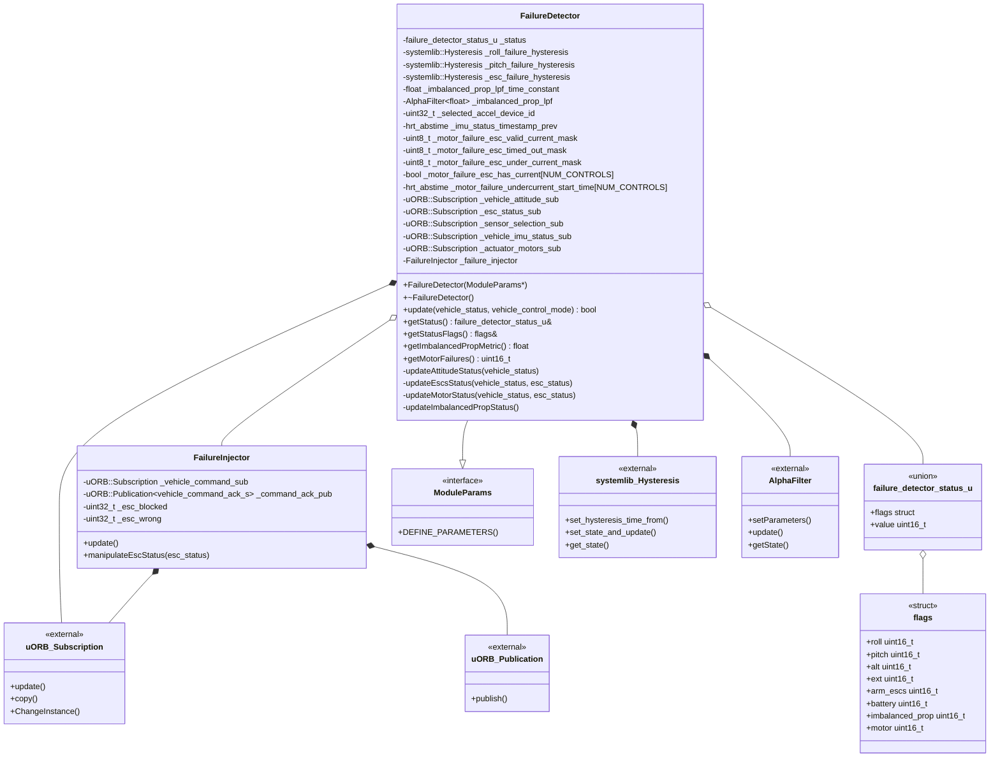

# Implementation : Failure Detector
:::info
기능 상세 및 구현에 대한 설명을 중심으로, 실제 소스 구조와 코드를 기반으로 구성요소를 상세하게 정리합니다.
:::

## 1. 파일 구성
- 파일 경로 : `src/modules/commander/failure_detector/`

| 이름                 | 설명                     |
| -------------------- | ------------------------ |
| `FailureDetector.cpp` | 고장 탐지 메인 로직 및 업데이트 함수 구현 |
| `FailureDetector.hpp` | 고장 탐지 클래스 정의 및 인터페이스 |

## 2. 클래스 관계
### 2.1. 클래스 다이어그램


### 2.2. 주요 클래스 구성 요약

:::details Class : FailureDetector

- 드론의 다양한 실패 상황을 감지하고 상태를 관리하는 메인 클래스
---
**함수**
| No | 함수 | 접근자 | 설명 |
|----|-----|-------|------|
|1|FailureDetector(ModuleParams*)|public|생성자 - ModuleParams 초기화|
|2|~FailureDetector()|public|소멸자 - 기본 구현|
|3|update(vehicle_status, vehicle_control_mode)|public|메인 업데이트 - 모든 실패 감지 로직 실행|
|4|getStatus()|public|현재 실패 상태 반환|
|5|getStatusFlags()|public|실패 상태 플래그 구조체 반환|
|6|getImbalancedPropMetric()|public|불균형 프로펠러 메트릭 값 반환|
|7|getMotorFailures()|public|모터 실패 마스크 반환|
|8|updateAttitudeStatus(vehicle_status)|private|자세(롤/피치) 실패 감지|
|9|updateEscsStatus(vehicle_status, esc_status)|private|ESC 무장 상태 및 실패 감지|
|10|updateMotorStatus(vehicle_status, esc_status)|private|모터/ESC 텔레메트리 실패 감지|
|11|updateImbalancedPropStatus()|private|불균형 프로펠러 감지|
---
**변수**
| No | 변수 | 타입 | 설명 |
|----|-----|-----|------|
|1|_status|failure_detector_status_u|전체 실패 상태를 저장하는 비트필드|
|2|_roll_failure_hysteresis|systemlib::Hysteresis|롤 실패 히스테리시스 필터|
|3|_pitch_failure_hysteresis|systemlib::Hysteresis|피치 실패 히스테리시스 필터|
|4|_esc_failure_hysteresis|systemlib::Hysteresis|ESC 실패 히스테리시스 필터|
|5|_imbalanced_prop_lpf_time_constant|static constexpr float|불균형 프로펠러 LPF 시간 상수 (5.0f)|
|6|_imbalanced_prop_lpf|`AlphaFilter<float>`|불균형 프로펠러 저역통과 필터|
|7|_selected_accel_device_id|uint32_t|선택된 가속도계 장치 ID|
|8|_imu_status_timestamp_prev|hrt_abstime|이전 IMU 상태 타임스탬프|
|9|_motor_failure_esc_valid_current_mask|uint8_t|전류 텔레메트리가 유효한 ESC 마스크|
|10|_motor_failure_esc_timed_out_mask|uint8_t|텔레메트리 타임아웃 발생 ESC 마스크|
|11|_motor_failure_esc_under_current_mask|uint8_t|저전류 상태 ESC 마스크|
|12|_motor_failure_esc_has_current[NUM_CONTROLS]|bool|ESC가 전류를 가진 적이 있는지 여부|
|13|_motor_failure_undercurrent_start_time[NUM_CONTROLS]|hrt_abstime|저전류 상태 시작 시간|
|14|_vehicle_attitude_sub|uORB::Subscription|기체 자세 구독|
|15|_esc_status_sub|uORB::Subscription|ESC 상태 구독|
|16|_sensor_selection_sub|uORB::Subscription|센서 선택 구독|
|17|_vehicle_imu_status_sub|uORB::Subscription|IMU 상태 구독|
|18|_actuator_motors_sub|uORB::Subscription|액추에이터 모터 구독|
|19|_failure_injector|FailureInjector|실패 주입기 인스턴스|
:::

:::details Class : FailureInjector

- 테스트 목적으로 실패 상황을 인위적으로 주입하는 클래스
---
**함수**
| No | 함수 | 접근자 | 설명 |
|----|-----|-------|------|
|1|update()|public|실패 주입 명령 처리 및 ESC 실패 시뮬레이션|
|2|manipulateEscStatus(esc_status)|public|ESC 상태를 조작하여 실패 시뮬레이션|
---
**변수**
| No | 변수 | 타입 | 설명 |
|----|-----|-----|------|
|1|_vehicle_command_sub|uORB::Subscription|기체 명령 구독 (실패 주입 명령)|
|2|_command_ack_pub|`uORB::Publication<vehicle_command_ack_s>`|명령 응답 발행|
|3|_esc_blocked|uint32_t|차단할 ESC 마스크|
|4|_esc_wrong|uint32_t|오작동시킬 ESC 마스크|
:::

:::details Union : failure_detector_status_u 
- 실패 상태를 비트필드와 정수값으로 동시 접근 가능한 공용체
---
- **구성**:
	- **flags 구조체**: roll, pitch, alt, ext, arm_escs, battery, imbalanced_prop, motor 비트필드
	- **value**: 전체 상태를 uint16_t로 접근
:::


## 3. 구성요소
<details><summary><h3 style="display: inline; margin: 0;"> 2.1. Variable</h3></summary>

| NO | 파일 | 이름 | 자료형 | 설명               |
|-----|----------------------|-------------------|-------------------------------------|------------------------------------------------------------------------------|
|1|FailureDetector.hpp|_status|failure_detector_status_u|현재 실패 상태를 저장하는 비트필드|
|2|FailureDetector.hpp|_roll_failure_hysteresis|systemlib::Hysteresis|롤 실패 히스테리시스 필터|
|3|FailureDetector.hpp|_pitch_failure_hysteresis|systemlib::Hysteresis|피치 실패 히스테리시스 필터|
|4|FailureDetector.hpp|_esc_failure_hysteresis|systemlib::Hysteresis|ESC 실패 히스테리시스 필터|
|5|FailureDetector.hpp|_imbalanced_prop_lpf|AlphaFilter`<float>`|불균형 프로펠러 감지용 저역 통과 필터|
|6|FailureDetector.hpp|_selected_accel_device_id|uint32_t|선택된 가속도계 장치 ID|
|7|FailureDetector.hpp|_imu_status_timestamp_prev|hrt_abstime|이전 IMU 상태 타임스탬프|
|8|FailureDetector.hpp|_motor_failure_esc_valid_current_mask|uint8_t|전류 텔레메트리가 유효한 ESC 마스크|
|9|FailureDetector.hpp|_motor_failure_esc_timed_out_mask|uint8_t|텔레메트리 타임아웃 발생 ESC 마스크|
|10|FailureDetector.hpp|_motor_failure_esc_under_current_mask|uint8_t|저전류 상태 ESC 마스크|
|11|FailureDetector.hpp|_motor_failure_esc_has_current|bool[NUM_CONTROLS]|ESC가 전류를 가진 적이 있는지 여부|
|12|FailureDetector.hpp|_motor_failure_undercurrent_start_time|hrt_abstime[NUM_CONTROLS]|저전류 상태 시작 시간|
|13|FailureDetector.hpp|_vehicle_attitude_sub|uORB::Subscription|기체 자세 구독|
|14|FailureDetector.hpp|_esc_status_sub|uORB::Subscription|ESC 상태 구독|
|15|FailureDetector.hpp|_sensor_selection_sub|uORB::Subscription|센서 선택 구독|
|16|FailureDetector.hpp|_vehicle_imu_status_sub|uORB::Subscription|IMU 상태 구독|
|17|FailureDetector.hpp|_actuator_motors_sub|uORB::Subscription|액추에이터 모터 구독|
|18|FailureDetector.hpp|_failure_injector|FailureInjector|실패 주입기 인스턴스|
|19|FailureDetector.hpp|_imbalanced_prop_lpf_time_constant|static constexpr float|불균형 프로펠러 LPF 시간 상수 (5.0f)|
|20|FailureInjector.hpp|_vehicle_command_sub|uORB::Subscription|기체 명령 구독|
|21|FailureInjector.hpp|_command_ack_pub|`uORB::Publication<vehicle_command_ack_s>`|명령 응답 발행|
|22|FailureInjector.hpp|_esc_blocked|uint32_t|차단된 ESC 마스크|
|23|FailureInjector.hpp|_esc_wrong|uint32_t|잘못된 ESC 마스크|
</details>

<details><summary><h3 style="display: inline; margin: 0;"> 2.2. Struct/Enum/Union</h3></summary>

::: details 1. Union : failure_detector_status_u

- 입력 : 없음
- 출력 : 없음
- 설명 : 실패 감지 상태를 비트필드와 정수값으로 동시에 접근할 수 있는 공용체

```c++
union failure_detector_status_u {

	struct {
		uint16_t roll : 1;          // 롤 실패
		uint16_t pitch : 1;         // 피치 실패
		uint16_t alt : 1;           // 고도 실패
		uint16_t ext : 1;           // 외부 실패
		uint16_t arm_escs : 1;      // ESC ARM 실패
		uint16_t battery : 1;       // 배터리 실패
		uint16_t imbalanced_prop : 1;  // 불균형 프로펠러
		uint16_t motor : 1;         // 모터 실패
	} flags;

	uint16_t value {0};
};

```
:::

</details>

<details><summary><h3 style="display: inline; margin: 0;"> 2.3. Function</h3></summary>

::: details 1. update 함수

- 입력 : vehicle_status_s &vehicle_status, vehicle_control_mode_s &vehicle_control_mode
- 출력 : bool (상태 변화 여부)
- 설명 : 메인 업데이트 함수로 모든 실패 감지 로직을 실행하고 상태 변화를 반환
```c++
bool FailureDetector::update(const vehicle_status_s &vehicle_status, const vehicle_control_mode_s &vehicle_control_mode)
{
	_failure_injector.update();
	failure_detector_status_u status_prev = _status;
	if (vehicle_control_mode.flag_control_attitude_enabled) {
		updateAttitudeStatus(vehicle_status);
	} else {
		_status.flags.roll = false;
		_status.flags.pitch = false;
		_status.flags.alt = false;
		_status.flags.ext = false;
	}

	// ESC 상태 업데이트
	esc_status_s esc_status;
	if (_esc_status_sub.update(&esc_status)) {
		_failure_injector.manipulateEscStatus(esc_status);
		if (_param_escs_en.get()) {
			updateEscsStatus(vehicle_status, esc_status);
		}
		if (_param_fd_actuator_en.get()) {
			updateMotorStatus(vehicle_status, esc_status);
		}
	}

	if (_param_fd_imb_prop_thr.get() >0) {
		updateImbalancedPropStatus();
	}

	return _status.value!=status_prev.value;
}

```

:::

::: details 2. updateAttitudeStatus 함수

- 입력 : vehicle_status_s &vehicle_status
- 출력 : void
- 설명 : 자세(롤/피치) 실패를 감지하고 히스테리시스 필터를 적용
```c++
void FailureDetector::updateAttitudeStatus(const vehicle_status_s&vehicle_status)
{
	vehicle_attitude_s attitude;
	if (_vehicle_attitude_sub.update(&attitude)) {
		const matrix::Eulerf euler(matrix::Quatf(attitude.q));
		float roll(euler.phi());
		float pitch(euler.theta());

		// 테일시터 특별 처리
		if (vehicle_status.is_vtol_tailsitter) {
			if (vehicle_status.in_transition_mode) {
				roll = 0.f;
				pitch = 0.f;
			} elseif (vehicle_status.vehicle_type == vehicle_status_s::VEHICLE_TYPE_FIXED_WING) {
				const matrix::Eulerf euler_rotated = matrix::Eulerf(matrix::Quatf(attitude.q) * matrix::Quatf(matrix::Eulerf(0.f, M_PI_2_F,0.f)));
				roll = euler_rotated.phi();
				pitch = euler_rotated.theta();
			}
		}
		const float max_roll_deg = _param_fd_fail_r.get();
		const float max_pitch_deg = _param_fd_fail_p.get();
		const float max_roll(fabsf(math::radians(max_roll_deg)));
		const float max_pitch(fabsf(math::radians(max_pitch_deg)));
		const bool roll_status = (max_roll > FLT_EPSILON) && (fabsf(roll) > max_roll);
		const bool pitch_status = (max_pitch > FLT_EPSILON) && (fabsf(pitch) > max_pitch);
		hrt_abstime time_now = hrt_absolute_time();

		// 히스테리시스 업데이트
		_roll_failure_hysteresis.set_hysteresis_time_from(false, (hrt_abstime)(1_s*_param_fd_fail_r_ttri.get()));
		_pitch_failure_hysteresis.set_hysteresis_time_from(false, (hrt_abstime)(1_s*_param_fd_fail_p_ttri.get()));
		_roll_failure_hysteresis.set_state_and_update(roll_status, time_now);
		_pitch_failure_hysteresis.set_state_and_update(pitch_status, time_now);

		// 상태 업데이트
		_status.flags.roll = _roll_failure_hysteresis.get_state();
		_status.flags.pitch = _pitch_failure_hysteresis.get_state();
	}
}
```
:::

::: details 3. updateEscsStatus 함수

- 입력 : vehicle_status_s &vehicle_status, esc_status_s &esc_status
- 출력 : void
- 설명 : ESC 무장 상태 및 ESC 실패를 감지하고 히스테리시스 필터를 적용

```c++
void FailureDetector::updateEscsStatus(const vehicle_status_s &vehicle_status, const esc_status_s &esc_status)
{
    hrt_abstime time_now = hrt_absolute_time();

    if (vehicle_status.arming_state == vehicle_status_s::ARMING_STATE_ARMED) {
        const int limited_esc_count = math::min(esc_status.esc_count, esc_status_s::CONNECTED_ESC_MAX);
        const int all_escs_armed_mask = (1 << limited_esc_count) - 1;
        const bool is_all_escs_armed = (all_escs_armed_mask == esc_status.esc_armed_flags);

        bool is_esc_failure = !is_all_escs_armed;

        for (int i = 0; i < limited_esc_count; i++) {
            is_esc_failure = is_esc_failure || (esc_status.esc[i].failures > 0);
        }

        _esc_failure_hysteresis.set_hysteresis_time_from(false, 300_ms);
        _esc_failure_hysteresis.set_state_and_update(is_esc_failure, time_now);

        if (_esc_failure_hysteresis.get_state()) {
            _status.flags.arm_escs = true;
        }

    } else {
        _esc_failure_hysteresis.set_state_and_update(false, time_now);
        _status.flags.arm_escs = false;
    }
}
```
:::

::: details 4. updateImbalancedPropStatus 함수

- 입력 : 없음
- 출력 : void
- 설명 : 불균형 프로펠러를 감지하기 위해 IMU 가속도 분산을 분석

```c++
void FailureDetector::updateImbalancedPropStatus()
{
    if (_sensor_selection_sub.updated()) {
        sensor_selection_s selection;
        if (_sensor_selection_sub.copy(&selection)) {
            _selected_accel_device_id = selection.accel_device_id;
        }
    }

    // 선택된 가속도계에 해당하는 IMU 상태 인스턴스 찾기
    vehicle_imu_status_s imu_status{};
    _vehicle_imu_status_sub.copy(&imu_status);

    if (imu_status.accel_device_id != _selected_accel_device_id) {
        for (unsigned i = 0; i < ORB_MULTI_MAX_INSTANCES; i++) {
            if (!_vehicle_imu_status_sub.ChangeInstance(i)) {
                continue;
            }
            if (_vehicle_imu_status_sub.copy(&imu_status)
                && (imu_status.accel_device_id == _selected_accel_device_id)) {
                break;
            }
        }
    }

    if (_vehicle_imu_status_sub.updated()) {
        if (_vehicle_imu_status_sub.copy(&imu_status)) {
            if ((imu_status.accel_device_id != 0)
                && (imu_status.accel_device_id == _selected_accel_device_id)) {
                const float dt = math::constrain((imu_status.timestamp - _imu_status_timestamp_prev) * 1e-6f, 0.01f, 1.f);
                _imu_status_timestamp_prev = imu_status.timestamp;

                _imbalanced_prop_lpf.setParameters(dt, _imbalanced_prop_lpf_time_constant);

                const float std_x = sqrtf(math::max(imu_status.var_accel[0], 0.f));
                const float std_y = sqrtf(math::max(imu_status.var_accel[1], 0.f));
                const float std_z = sqrtf(math::max(imu_status.var_accel[2], 0.f));

                const float metric = (std_x + std_y) / 2.f - std_z;
                const float metric_lpf = _imbalanced_prop_lpf.update(metric);

                const bool is_imbalanced = metric_lpf > _param_fd_imb_prop_thr.get();
                _status.flags.imbalanced_prop = is_imbalanced;
            }
        }
    }
}
```
:::

::: details 5. updateMotorStatus 함수

- 입력 : vehicle_status_s &vehicle_status, esc_status_s &esc_status
- 출력 : void
- 설명 : 모터/ESC 실패를 감지 (텔레메트리 타임아웃, 저전류 상태)

```c++
void FailureDetector::updateMotorStatus(const vehicle_status_s &vehicle_status, const esc_status_s &esc_status)
{
    const hrt_abstime time_now = hrt_absolute_time();

    // 무장된 상태에서만 체크
    if (vehicle_status.arming_state == vehicle_status_s::ARMING_STATE_ARMED) {
        const int limited_esc_count = math::min(esc_status.esc_count, esc_status_s::CONNECTED_ESC_MAX);

        actuator_motors_s actuator_motors{};
        _actuator_motors_sub.copy(&actuator_motors);

        // 개별 ESC 리포트 체크
        for (int esc_status_idx = 0; esc_status_idx < limited_esc_count; esc_status_idx++) {
            const esc_report_s &cur_esc_report = esc_status.esc[esc_status_idx];
            const unsigned i_esc = cur_esc_report.actuator_function - actuator_motors_s::ACTUATOR_FUNCTION_MOTOR1;

            if (i_esc >= actuator_motors_s::NUM_CONTROLS) {
                continue;
            }

            // ESC 텔레메트리 유효성 체크
            if (!(_motor_failure_esc_valid_current_mask & (1<< i_esc)) && cur_esc_report.esc_current>0.0f) {
                _motor_failure_esc_valid_current_mask |= (1<< i_esc);
            }

            // 텔레메트리 타임아웃 체크
            const hrt_abstime telemetry_age = time_now -cur_esc_report.timestamp;
            const bool esc_timed_out = telemetry_age >300_ms;
            const bool esc_was_valid = _motor_failure_esc_valid_current_mask & (1<< i_esc);
            const bool esc_timeout_currently_flagged = _motor_failure_esc_timed_out_mask & (1<< i_esc);

            if (esc_was_valid && esc_timed_out && !esc_timeout_currently_flagged) {
                _motor_failure_esc_timed_out_mask |= (1<< i_esc);
            } elseif (!esc_timed_out && esc_timeout_currently_flagged) {
                _motor_failure_esc_timed_out_mask &=~(1<< i_esc);
            }

            // ESC 전류가 너무 낮은지 체크
            if (cur_esc_report.esc_current> FLT_EPSILON) {
                _motor_failure_esc_has_current[i_esc] = true;
            }

            if (_motor_failure_esc_has_current[i_esc]) {
                float esc_throttle = 0.f;
                if (PX4_ISFINITE(actuator_motors.control[i_esc])) {
                    esc_throttle = fabsf(actuator_motors.control[i_esc]);
                }

                const bool throttle_above_threshold = esc_throttle >_param_fd_motor_throttle_thres.get();
                const bool current_too_low = cur_esc_report.esc_current< esc_throttle *_param_fd_motor_current2throttle_thres.get();

                if (throttle_above_threshold && current_too_low && !esc_timed_out) {
                    if (_motor_failure_undercurrent_start_time[i_esc] ==0) {
                        _motor_failure_undercurrent_start_time[i_esc] = time_now;
                    }
                } else {
                    if (_motor_failure_undercurrent_start_time[i_esc] !=0) {
                        _motor_failure_undercurrent_start_time[i_esc] = 0;
                    }
                }
                if (_motor_failure_undercurrent_start_time[i_esc] !=0
                    && (time_now -_motor_failure_undercurrent_start_time[i_esc]) >_param_fd_motor_time_thres.get() *1_ms
                    && (_motor_failure_esc_under_current_mask & (1<< i_esc)) ==0) {
                    _motor_failure_esc_under_current_mask |= (1<< i_esc);
                }
            }
        }

        bool critical_esc_failure = (_motor_failure_esc_timed_out_mask !=0 || _motor_failure_esc_under_current_mask !=0);

        if (critical_esc_failure && !(_status.flags.motor)) {
            _status.flags.motor = true;
        } elseif (!critical_esc_failure && _status.flags.motor) {
            _status.flags.motor = false;
        }

    } else { // 비무장 상태
        for (int i_esc = 0; i_esc < actuator_motors_s::NUM_CONTROLS; i_esc++) {
            _motor_failure_undercurrent_start_time[i_esc] = 0;
        }
        _motor_failure_esc_under_current_mask = 0;
        _status.flags.motor = false;

    }

}

```
:::

::: details 6. FailureInjector::update 함수

- 입력 : 없음
- 출력 : void
- 설명 : 실패 주입 명령을 처리하고 ESC 실패를 시뮬레이션

```c++
void FailureInjector::update()
{
    vehicle_command_s vehicle_command;

    while (_vehicle_command_sub.update(&vehicle_command)) {
        if (vehicle_command.command != vehicle_command_s::VEHICLE_CMD_INJECT_FAILURE) {
            continue;
        }

        bool handled = false;
        bool supported = false;

        const int failure_unit = static_cast<int>(vehicle_command.param1 + 0.5f);
        const int failure_type = static_cast<int>(vehicle_command.param2 + 0.5f);
        const int instance = static_cast<int>(vehicle_command.param3 + 0.5f);

        if (failure_unit == vehicle_command_s::FAILURE_UNIT_SYSTEM_MOTOR) {
            handled = true;

            if (failure_type == vehicle_command_s::FAILURE_TYPE_OK) {
                // 모터 정상 복구
                if (instance == 0) {
                    for (int i = 0; i < esc_status_s::CONNECTED_ESC_MAX; i++) {
                        _esc_blocked &= ~(1 << i);
                        _esc_wrong &= ~(1 << i);
                    }
                    supported = true;
                } else if (instance >= 1 && instance <= esc_status_s::CONNECTED_ESC_MAX) {
                    _esc_blocked &= ~(1 << (instance - 1));
                    _esc_wrong &= ~(1 << (instance - 1));
                    supported = true;
                }
            }
            else if (failure_type == vehicle_command_s::FAILURE_TYPE_OFF) {
                // 모터 차단
                if (instance == 0) {
                    for (int i = 0; i < esc_status_s::CONNECTED_ESC_MAX; i++) {
                        _esc_blocked |= 1 << i;
                    }
                    supported = true;
                } else if (instance >= 1 && instance <= esc_status_s::CONNECTED_ESC_MAX) {
                    _esc_blocked |= 1 << (instance - 1);
                    supported = true;
                }
            }
            else if (failure_type == vehicle_command_s::FAILURE_TYPE_WRONG) {
                // 모터 오작동
                if (instance == 0) {
                    for (int i = 0; i < esc_status_s::CONNECTED_ESC_MAX; i++) {
                        _esc_wrong |= 1 << i;
                    }
                    supported = true;
                } else if (instance >= 1 && instance <= esc_status_s::CONNECTED_ESC_MAX) {
                    _esc_wrong |= 1 << (instance - 1);
                    supported = true;
                }
            }
        }

        if (handled) {
            vehicle_command_ack_s ack{};
            ack.command = vehicle_command.command;
            ack.from_external = false;
            ack.result = supported ?
                         vehicle_command_ack_s::VEHICLE_CMD_RESULT_ACCEPTED :
                         vehicle_command_ack_s::VEHICLE_CMD_RESULT_UNSUPPORTED;
            ack.timestamp = hrt_absolute_time();
            _command_ack_pub.publish(ack);
        }
    }
}
```
:::

::: details 7. FailureDetector 생성자

- 입력 : ModuleParams *parent
- 출력 : 없음
- 설명 : FailureDetector 객체를 생성하고 ModuleParams를 초기화

```c++
FailureDetector::FailureDetector(ModuleParams *parent) :
    ModuleParams(parent)
{
}
```
:::

::: details 8. FailureDetector 소멸자

- 입력 : 없음
- 출력 : 없음
- 설명 : FailureDetector 객체 소멸자 (기본 구현)

```c++
~FailureDetector() = default;
```
:::

::: details 9. getStatus 함수

- 입력 : 없음
- 출력 : const failure_detector_status_u& (현재 실패 상태)
- 설명 : 현재 실패 감지 상태를 반환

```c++
const failure_detector_status_u &getStatus() const { return _status; }
```
:::

::: details 10. getStatusFlags 함수

- 입력 : 없음
- 출력 : const flags& (상태 플래그 구조체)
- 설명 : 실패 상태의 플래그 구조체를 반환

```c++
const decltype(failure_detector_status_u::flags) &getStatusFlags() const { return _status.flags; }
```
:::

::: details 11. getImbalancedPropMetric 함수

- 입력 : 없음
- 출력 : float (불균형 프로펠러 메트릭)
- 설명 : 불균형 프로펠러 감지 메트릭 값을 반환

```c++
float getImbalancedPropMetric() const { return _imbalanced_prop_lpf.getState(); }
```
:::

::: details 12. getMotorFailures 함수

- 입력 : 없음
- 출력 : uint16_t (모터 실패 마스크)
- 설명 : 타임아웃과 저전류 상태의 모터 실패 마스크를 반환

```c++
uint16_t getMotorFailures() const { return _motor_failure_esc_timed_out_mask | _motor_failure_esc_under_current_mask; }
```
:::

::: details 13. FailureInjector::update 함수

- 입력 : 없음
- 출력 : void
- 설명 : 실패 주입 명령을 처리하고 ESC 실패를 시뮬레이션

```c++
void FailureInjector::update()
{
    vehicle_command_s vehicle_command;

    while (_vehicle_command_sub.update(&vehicle_command)) {
        if (vehicle_command.command != vehicle_command_s::VEHICLE_CMD_INJECT_FAILURE) {
            continue;
        }

        bool handled = false;
        bool supported = false;

        const int failure_unit = static_cast<int>(vehicle_command.param1 + 0.5f);
        const int failure_type = static_cast<int>(vehicle_command.param2 + 0.5f);
        const int instance = static_cast<int>(vehicle_command.param3 + 0.5f);

        if (failure_unit == vehicle_command_s::FAILURE_UNIT_SYSTEM_MOTOR) {
            handled = true;

            if (failure_type == vehicle_command_s::FAILURE_TYPE_OK) {
                // 모터 정상 복구
                if (instance == 0) {
                    for (int i = 0; i < esc_status_s::CONNECTED_ESC_MAX; i++) {
                        _esc_blocked &= ~(1 << i);
                        _esc_wrong &= ~(1 << i);
                    }
                    supported = true;
                } else if (instance >= 1 && instance <= esc_status_s::CONNECTED_ESC_MAX) {
                    _esc_blocked &= ~(1 << (instance - 1));
                    _esc_wrong &= ~(1 << (instance - 1));
                    supported = true;
                }
            }
            else if (failure_type == vehicle_command_s::FAILURE_TYPE_OFF) {
                // 모터 차단
                if (instance == 0) {
                    for (int i = 0; i < esc_status_s::CONNECTED_ESC_MAX; i++) {
                        _esc_blocked |= 1 << i;
                    }
                    supported = true;
                } else if (instance >= 1 && instance <= esc_status_s::CONNECTED_ESC_MAX) {
                    _esc_blocked |= 1 << (instance - 1);
                    supported = true;
                }
            }
            else if (failure_type == vehicle_command_s::FAILURE_TYPE_WRONG) {
                // 모터 오작동
                if (instance == 0) {
                    for (int i = 0; i < esc_status_s::CONNECTED_ESC_MAX; i++) {
                        _esc_wrong |= 1 << i;
                    }
                    supported = true;
                } else if (instance >= 1 && instance <= esc_status_s::CONNECTED_ESC_MAX) {
                    _esc_wrong |= 1 << (instance - 1);
                    supported = true;
                }
            }
        }

        if (handled) {
            vehicle_command_ack_s ack{};
            ack.command = vehicle_command.command;
            ack.from_external = false;
            ack.result = supported ?
                         vehicle_command_ack_s::VEHICLE_CMD_RESULT_ACCEPTED :
                         vehicle_command_ack_s::VEHICLE_CMD_RESULT_UNSUPPORTED;
            ack.timestamp = hrt_absolute_time();
            _command_ack_pub.publish(ack);
        }
    }
}
```
:::

::: details 14. FailureInjector::manipulateEscStatus 함수

- 입력 : esc_status_s &status
- 출력 : void
- 설명 : ESC 상태를 조작하여 실패를 시뮬레이션

```c++
void FailureInjector::manipulateEscStatus(esc_status_s &status)
{
    if (_esc_blocked != 0 || _esc_wrong != 0) {
        unsigned offline = 0;

        for (int i = 0; i < status.esc_count; i++) {
            const unsigned i_esc = status.esc[i].actuator_function - actuator_motors_s::ACTUATOR_FUNCTION_MOTOR1;

            if (_esc_blocked & (1 << i_esc)) {
                // ESC 차단 시뮬레이션
                unsigned function = status.esc[i].actuator_function;
                memset(&status.esc[i], 0, sizeof(status.esc[i]));
                status.esc[i].actuator_function = function;
                offline |= 1 << i;

            } else if (_esc_wrong & (1 << i_esc)) {
                // ESC 오작동 시뮬레이션
                status.esc[i].esc_voltage *= 0.1f;
                status.esc[i].esc_current *= 0.1f;
                status.esc[i].esc_rpm *= 10.0f;
            }
        }

        status.esc_online_flags &= ~offline;
    }
}
```
:::

</details>

<details><summary><h3 style="display: inline; margin: 0;"> 2.4. Autopilot Parameter</h3></summary>

```c++
// FailureDetector.hpp
DEFINE_PARAMETERS(
    (ParamInt<px4::params::FD_FAIL_P>) _param_fd_fail_p,
    (ParamInt<px4::params::FD_FAIL_R>) _param_fd_fail_r,
    (ParamFloat<px4::params::FD_FAIL_R_TTRI>) _param_fd_fail_r_ttri,
    (ParamFloat<px4::params::FD_FAIL_P_TTRI>) _param_fd_fail_p_ttri,
    (ParamInt<px4::params::FD_ESCS_EN>) _param_escs_en,
    (ParamInt<px4::params::FD_IMB_PROP_THR>) _param_fd_imb_prop_thr,

    // Actuator failure
    (ParamBool<px4::params::FD_ACT_EN>) _param_fd_actuator_en,
    (ParamFloat<px4::params::FD_ACT_MOT_THR>) _param_fd_motor_throttle_thres,
    (ParamFloat<px4::params::FD_ACT_MOT_C2T>) _param_fd_motor_current2throttle_thres,
    (ParamInt<px4::params::FD_ACT_MOT_TOUT>) _param_fd_motor_time_thres
)
```

| NO | 파일 | 이름 | 설명 |
|-----|-----|-----|-----|
|1|FailureDetector.hpp|FD_FAIL_P|피치 실패 감지 임계값 (도)|
|2|FailureDetector.hpp|FD_FAIL_R|롤 실패 감지 임계값 (도)|
|3|FailureDetector.hpp|FD_FAIL_R_TTRI|롤 실패 트리거 시간 (초)|
|4|FailureDetector.hpp|FD_FAIL_P_TTRI|피치 실패 트리거 시간 (초)|
|5|FailureDetector.hpp|FD_ESCS_EN|ESC 실패 감지 활성화|
|6|FailureDetector.hpp|FD_IMB_PROP_THR|불균형 프로펠러 감지 임계값|
|7|FailureDetector.hpp|FD_ACT_EN|액추에이터 실패 감지 활성화|
|8|FailureDetector.hpp|FD_ACT_MOT_THR|모터 스로틀 임계값|
|9|FailureDetector.hpp|FD_ACT_MOT_C2T|모터 전류 대 스로틀 비율 임계값|
|10|FailureDetector.hpp|FD_ACT_MOT_TOUT|모터 실패 감지 시간 임계값 (ms)|

</details>

## 부록 : 소스 코드
:::details FailureDetector.cpp

```c++
/****************************************************************************
 *
 *   Copyright (c) 2018 PX4 Development Team. All rights reserved.
 *
 * Redistribution and use in source and binary forms, with or without
 * modification, are permitted provided that the following conditions
 * are met:
 *
 * 1. Redistributions of source code must retain the above copyright
 *    notice, this list of conditions and the following disclaimer.
 * 2. Redistributions in binary form must reproduce the above copyright
 *    notice, this list of conditions and the following disclaimer in
 *    the documentation and/or other materials provided with the
 *    distribution.
 * 3. Neither the name PX4 nor the names of its contributors may be
 *    used to endorse or promote products derived from this software
 *    without specific prior written permission.
 *
 * THIS SOFTWARE IS PROVIDED BY THE COPYRIGHT HOLDERS AND CONTRIBUTORS
 * "AS IS" AND ANY EXPRESS OR IMPLIED WARRANTIES, INCLUDING, BUT NOT
 * LIMITED TO, THE IMPLIED WARRANTIES OF MERCHANTABILITY AND FITNESS
 * FOR A PARTICULAR PURPOSE ARE DISCLAIMED. IN NO EVENT SHALL THE
 * COPYRIGHT OWNER OR CONTRIBUTORS BE LIABLE FOR ANY DIRECT, INDIRECT,
 * INCIDENTAL, SPECIAL, EXEMPLARY, OR CONSEQUENTIAL DAMAGES (INCLUDING,
 * BUT NOT LIMITED TO, PROCUREMENT OF SUBSTITUTE GOODS OR SERVICES; LOSS
 * OF USE, DATA, OR PROFITS; OR BUSINESS INTERRUPTION) HOWEVER CAUSED
 * AND ON ANY THEORY OF LIABILITY, WHETHER IN CONTRACT, STRICT
 * LIABILITY, OR TORT (INCLUDING NEGLIGENCE OR OTHERWISE) ARISING IN
 * ANY WAY OUT OF THE USE OF THIS SOFTWARE, EVEN IF ADVISED OF THE
 * POSSIBILITY OF SUCH DAMAGE.
 *
 ****************************************************************************/

/**
* @file FailureDetector.cpp
*
* @author Mathieu Bresciani	<brescianimathieu@gmail.com>
*
*/

#include "FailureDetector.hpp"

using namespace time_literals;

void FailureInjector::update()
{
	vehicle_command_s vehicle_command;

	while (_vehicle_command_sub.update(&vehicle_command)) {
		if (vehicle_command.command != vehicle_command_s::VEHICLE_CMD_INJECT_FAILURE) {
			continue;
		}

		bool handled = false;
		bool supported = false;

		const int failure_unit = static_cast<int>(vehicle_command.param1 + 0.5f);
		const int failure_type = static_cast<int>(vehicle_command.param2 + 0.5f);
		const int instance = static_cast<int>(vehicle_command.param3 + 0.5f);

		if (failure_unit == vehicle_command_s::FAILURE_UNIT_SYSTEM_MOTOR) {
			handled = true;

			if (failure_type == vehicle_command_s::FAILURE_TYPE_OK) {
				PX4_INFO("CMD_INJECT_FAILURE, motors ok");
				supported = false;

				// 0 to signal all
				if (instance == 0) {
					supported = true;

					for (int i = 0; i < esc_status_s::CONNECTED_ESC_MAX; i++) {
						PX4_INFO("CMD_INJECT_FAILURE, motor %d ok", i);
						_esc_blocked &= ~(1 << i);
						_esc_wrong &= ~(1 << i);
					}

				} else if (instance >= 1 && instance <= esc_status_s::CONNECTED_ESC_MAX) {
					supported = true;

					PX4_INFO("CMD_INJECT_FAILURE, motor %d ok", instance - 1);
					_esc_blocked &= ~(1 << (instance - 1));
					_esc_wrong &= ~(1 << (instance - 1));
				}
			}

			else if (failure_type == vehicle_command_s::FAILURE_TYPE_OFF) {
				PX4_WARN("CMD_INJECT_FAILURE, motors off");
				supported = true;

				// 0 to signal all
				if (instance == 0) {
					for (int i = 0; i < esc_status_s::CONNECTED_ESC_MAX; i++) {
						PX4_INFO("CMD_INJECT_FAILURE, motor %d off", i);
						_esc_blocked |= 1 << i;
					}

				} else if (instance >= 1 && instance <= esc_status_s::CONNECTED_ESC_MAX) {
					PX4_INFO("CMD_INJECT_FAILURE, motor %d off", instance - 1);
					_esc_blocked |= 1 << (instance - 1);
				}
			}

			else if (failure_type == vehicle_command_s::FAILURE_TYPE_WRONG) {
				PX4_INFO("CMD_INJECT_FAILURE, motors wrong");
				supported = true;

				// 0 to signal all
				if (instance == 0) {
					for (int i = 0; i < esc_status_s::CONNECTED_ESC_MAX; i++) {
						PX4_INFO("CMD_INJECT_FAILURE, motor %d wrong", i);
						_esc_wrong |= 1 << i;
					}

				} else if (instance >= 1 && instance <= esc_status_s::CONNECTED_ESC_MAX) {
					PX4_INFO("CMD_INJECT_FAILURE, motor %d wrong", instance - 1);
					_esc_wrong |= 1 << (instance - 1);
				}
			}
		}

		if (handled) {
			vehicle_command_ack_s ack{};
			ack.command = vehicle_command.command;
			ack.from_external = false;
			ack.result = supported ?
				     vehicle_command_ack_s::VEHICLE_CMD_RESULT_ACCEPTED :
				     vehicle_command_ack_s::VEHICLE_CMD_RESULT_UNSUPPORTED;
			ack.timestamp = hrt_absolute_time();
			_command_ack_pub.publish(ack);
		}
	}

}

void FailureInjector::manipulateEscStatus(esc_status_s &status)
{
	if (_esc_blocked != 0 || _esc_wrong != 0) {
		unsigned offline = 0;

		for (int i = 0; i < status.esc_count; i++) {
			const unsigned i_esc = status.esc[i].actuator_function - actuator_motors_s::ACTUATOR_FUNCTION_MOTOR1;

			if (_esc_blocked & (1 << i_esc)) {
				unsigned function = status.esc[i].actuator_function;
				memset(&status.esc[i], 0, sizeof(status.esc[i]));
				status.esc[i].actuator_function = function;
				offline |= 1 << i;

			} else if (_esc_wrong & (1 << i_esc)) {
				// Create wrong rerport for this motor by scaling key values up and down
				status.esc[i].esc_voltage *= 0.1f;
				status.esc[i].esc_current *= 0.1f;
				status.esc[i].esc_rpm *= 10.0f;
			}
		}

		status.esc_online_flags &= ~offline;
	}
}

FailureDetector::FailureDetector(ModuleParams *parent) :
	ModuleParams(parent)
{
}

bool FailureDetector::update(const vehicle_status_s &vehicle_status, const vehicle_control_mode_s &vehicle_control_mode)
{
	_failure_injector.update();

	failure_detector_status_u status_prev = _status;

	if (vehicle_control_mode.flag_control_attitude_enabled) {
		updateAttitudeStatus(vehicle_status);


	} else {
		_status.flags.roll = false;
		_status.flags.pitch = false;
		_status.flags.alt = false;
		_status.flags.ext = false;
	}

	// esc_status subscriber is shared between subroutines
	esc_status_s esc_status;

	if (_esc_status_sub.update(&esc_status)) {
		_failure_injector.manipulateEscStatus(esc_status);

		if (_param_escs_en.get()) {
			updateEscsStatus(vehicle_status, esc_status);
		}

		if (_param_fd_actuator_en.get()) {
			updateMotorStatus(vehicle_status, esc_status);
		}
	}

	if (_param_fd_imb_prop_thr.get() > 0) {
		updateImbalancedPropStatus();
	}

	return _status.value != status_prev.value;
}

void FailureDetector::updateAttitudeStatus(const vehicle_status_s &vehicle_status)
{
	vehicle_attitude_s attitude;

	if (_vehicle_attitude_sub.update(&attitude)) {

		const matrix::Eulerf euler(matrix::Quatf(attitude.q));
		float roll(euler.phi());
		float pitch(euler.theta());

		// special handling for tailsitter
		if (vehicle_status.is_vtol_tailsitter) {
			if (vehicle_status.in_transition_mode) {
				// disable attitude check during tailsitter transition
				roll = 0.f;
				pitch = 0.f;

			} else if (vehicle_status.vehicle_type == vehicle_status_s::VEHICLE_TYPE_FIXED_WING) {
				// in FW flight rotate the attitude by 90° around pitch (level FW flight = 0° pitch)
				const matrix::Eulerf euler_rotated = matrix::Eulerf(matrix::Quatf(attitude.q) * matrix::Quatf(matrix::Eulerf(0.f,
								     M_PI_2_F, 0.f)));
				roll = euler_rotated.phi();
				pitch = euler_rotated.theta();
			}
		}

		const float max_roll_deg = _param_fd_fail_r.get();
		const float max_pitch_deg = _param_fd_fail_p.get();
		const float max_roll(fabsf(math::radians(max_roll_deg)));
		const float max_pitch(fabsf(math::radians(max_pitch_deg)));

		const bool roll_status = (max_roll > FLT_EPSILON) && (fabsf(roll) > max_roll);
		const bool pitch_status = (max_pitch > FLT_EPSILON) && (fabsf(pitch) > max_pitch);

		hrt_abstime time_now = hrt_absolute_time();

		// Update hysteresis
		_roll_failure_hysteresis.set_hysteresis_time_from(false, (hrt_abstime)(1_s * _param_fd_fail_r_ttri.get()));
		_pitch_failure_hysteresis.set_hysteresis_time_from(false, (hrt_abstime)(1_s * _param_fd_fail_p_ttri.get()));
		_roll_failure_hysteresis.set_state_and_update(roll_status, time_now);
		_pitch_failure_hysteresis.set_state_and_update(pitch_status, time_now);

		// Update status
		_status.flags.roll = _roll_failure_hysteresis.get_state();
		_status.flags.pitch = _pitch_failure_hysteresis.get_state();
	}
}


void FailureDetector::updateEscsStatus(const vehicle_status_s &vehicle_status, const esc_status_s &esc_status)
{
	hrt_abstime time_now = hrt_absolute_time();

	if (vehicle_status.arming_state == vehicle_status_s::ARMING_STATE_ARMED) {
		const int limited_esc_count = math::min(esc_status.esc_count, esc_status_s::CONNECTED_ESC_MAX);
		const int all_escs_armed_mask = (1 << limited_esc_count) - 1;
		const bool is_all_escs_armed = (all_escs_armed_mask == esc_status.esc_armed_flags);

		bool is_esc_failure = !is_all_escs_armed;

		for (int i = 0; i < limited_esc_count; i++) {
			is_esc_failure = is_esc_failure || (esc_status.esc[i].failures > 0);
		}

		_esc_failure_hysteresis.set_hysteresis_time_from(false, 300_ms);
		_esc_failure_hysteresis.set_state_and_update(is_esc_failure, time_now);

		if (_esc_failure_hysteresis.get_state()) {
			_status.flags.arm_escs = true;
		}

	} else {
		// reset ESC bitfield
		_esc_failure_hysteresis.set_state_and_update(false, time_now);
		_status.flags.arm_escs = false;
	}
}

void FailureDetector::updateImbalancedPropStatus()
{

	if (_sensor_selection_sub.updated()) {
		sensor_selection_s selection;

		if (_sensor_selection_sub.copy(&selection)) {
			_selected_accel_device_id = selection.accel_device_id;
		}
	}

	const bool updated = _vehicle_imu_status_sub.updated(); // save before doing a copy

	// Find the imu_status instance corresponding to the selected accelerometer
	vehicle_imu_status_s imu_status{};
	_vehicle_imu_status_sub.copy(&imu_status);

	if (imu_status.accel_device_id != _selected_accel_device_id) {

		for (unsigned i = 0; i < ORB_MULTI_MAX_INSTANCES; i++) {
			if (!_vehicle_imu_status_sub.ChangeInstance(i)) {
				continue;
			}

			if (_vehicle_imu_status_sub.copy(&imu_status)
			    && (imu_status.accel_device_id == _selected_accel_device_id)) {
				// instance found
				break;
			}
		}
	}

	if (updated) {

		if (_vehicle_imu_status_sub.copy(&imu_status)) {

			if ((imu_status.accel_device_id != 0)
			    && (imu_status.accel_device_id == _selected_accel_device_id)) {
				const float dt = math::constrain((imu_status.timestamp - _imu_status_timestamp_prev) * 1e-6f, 0.01f, 1.f);
				_imu_status_timestamp_prev = imu_status.timestamp;

				_imbalanced_prop_lpf.setParameters(dt, _imbalanced_prop_lpf_time_constant);

				const float std_x = sqrtf(math::max(imu_status.var_accel[0], 0.f));
				const float std_y = sqrtf(math::max(imu_status.var_accel[1], 0.f));
				const float std_z = sqrtf(math::max(imu_status.var_accel[2], 0.f));

				// Note: the metric is done using standard deviations instead of variances to be linear
				const float metric = (std_x + std_y) / 2.f - std_z;
				const float metric_lpf = _imbalanced_prop_lpf.update(metric);

				const bool is_imbalanced = metric_lpf > _param_fd_imb_prop_thr.get();
				_status.flags.imbalanced_prop = is_imbalanced;
			}
		}
	}
}

void FailureDetector::updateMotorStatus(const vehicle_status_s &vehicle_status, const esc_status_s &esc_status)
{
	// What need to be checked:
	//
	// 1. ESC telemetry disappears completely -> dead ESC or power loss on that ESC
	// 2. ESC failures like overvoltage, overcurrent etc. But DShot driver for example is not populating the field 'esc_report.failures'
	// 3. Motor current too low. Compare drawn motor current to expected value from a parameter
	// -- ESC voltage does not really make sense and is highly dependent on the setup

	// First wait for some ESC telemetry that has the required fields. Before that happens, don't check this ESC
	// Then check

	const hrt_abstime time_now = hrt_absolute_time();

	// Only check while armed
	if (vehicle_status.arming_state == vehicle_status_s::ARMING_STATE_ARMED) {
		const int limited_esc_count = math::min(esc_status.esc_count, esc_status_s::CONNECTED_ESC_MAX);

		actuator_motors_s actuator_motors{};
		_actuator_motors_sub.copy(&actuator_motors);

		// Check individual ESC reports
		for (int esc_status_idx = 0; esc_status_idx < limited_esc_count; esc_status_idx++) {

			const esc_report_s &cur_esc_report = esc_status.esc[esc_status_idx];

			// Map the esc status index to the actuator function index
			const unsigned i_esc = cur_esc_report.actuator_function - actuator_motors_s::ACTUATOR_FUNCTION_MOTOR1;

			if (i_esc >= actuator_motors_s::NUM_CONTROLS) {
				continue;
			}

			// Check if ESC telemetry was available and valid at some point. This is a prerequisite for the failure detection.
			if (!(_motor_failure_esc_valid_current_mask & (1 << i_esc)) && cur_esc_report.esc_current > 0.0f) {
				_motor_failure_esc_valid_current_mask |= (1 << i_esc);
			}

			// Check for telemetry timeout
			const hrt_abstime telemetry_age = time_now - cur_esc_report.timestamp;
			const bool esc_timed_out = telemetry_age > 300_ms;

			const bool esc_was_valid = _motor_failure_esc_valid_current_mask & (1 << i_esc);
			const bool esc_timeout_currently_flagged = _motor_failure_esc_timed_out_mask & (1 << i_esc);

			if (esc_was_valid && esc_timed_out && !esc_timeout_currently_flagged) {
				// Set flag
				_motor_failure_esc_timed_out_mask |= (1 << i_esc);

			} else if (!esc_timed_out && esc_timeout_currently_flagged) {
				// Reset flag
				_motor_failure_esc_timed_out_mask &= ~(1 << i_esc);
			}

			// Check if ESC current is too low
			if (cur_esc_report.esc_current > FLT_EPSILON) {
				_motor_failure_esc_has_current[i_esc] = true;
			}

			if (_motor_failure_esc_has_current[i_esc]) {
				float esc_throttle = 0.f;

				if (PX4_ISFINITE(actuator_motors.control[i_esc])) {
					esc_throttle = fabsf(actuator_motors.control[i_esc]);
				}

				const bool throttle_above_threshold = esc_throttle > _param_fd_motor_throttle_thres.get();
				const bool current_too_low = cur_esc_report.esc_current < esc_throttle *
							     _param_fd_motor_current2throttle_thres.get();

				if (throttle_above_threshold && current_too_low && !esc_timed_out) {
					if (_motor_failure_undercurrent_start_time[i_esc] == 0) {
						_motor_failure_undercurrent_start_time[i_esc] = time_now;
					}

				} else {
					if (_motor_failure_undercurrent_start_time[i_esc] != 0) {
						_motor_failure_undercurrent_start_time[i_esc] = 0;
					}
				}

				if (_motor_failure_undercurrent_start_time[i_esc] != 0
				    && (time_now - _motor_failure_undercurrent_start_time[i_esc]) > _param_fd_motor_time_thres.get() * 1_ms
				    && (_motor_failure_esc_under_current_mask & (1 << i_esc)) == 0) {
					// Set flag
					_motor_failure_esc_under_current_mask |= (1 << i_esc);

				} // else: this flag is never cleared, as the motor is stopped, so throttle < threshold
			}
		}

		bool critical_esc_failure = (_motor_failure_esc_timed_out_mask != 0 || _motor_failure_esc_under_current_mask != 0);

		if (critical_esc_failure && !(_status.flags.motor)) {
			// Add motor failure flag to bitfield
			_status.flags.motor = true;

		} else if (!critical_esc_failure && _status.flags.motor) {
			// Reset motor failure flag
			_status.flags.motor = false;
		}

	} else { // Disarmed
		// reset ESC bitfield
		for (int i_esc = 0; i_esc < actuator_motors_s::NUM_CONTROLS; i_esc++) {
			_motor_failure_undercurrent_start_time[i_esc] = 0;
		}

		_motor_failure_esc_under_current_mask = 0;
		_status.flags.motor = false;
	}
}
```
:::

:::details FailureDetector.hpp

```c++

/****************************************************************************
 *
 *   Copyright (c) 2018 PX4 Development Team. All rights reserved.
 *
 * Redistribution and use in source and binary forms, with or without
 * modification, are permitted provided that the following conditions
 * are met:
 *
 * 1. Redistributions of source code must retain the above copyright
 *    notice, this list of conditions and the following disclaimer.
 * 2. Redistributions in binary form must reproduce the above copyright
 *    notice, this list of conditions and the following disclaimer in
 *    the documentation and/or other materials provided with the
 *    distribution.
 * 3. Neither the name PX4 nor the names of its contributors may be
 *    used to endorse or promote products derived from this software
 *    without specific prior written permission.
 *
 * THIS SOFTWARE IS PROVIDED BY THE COPYRIGHT HOLDERS AND CONTRIBUTORS
 * "AS IS" AND ANY EXPRESS OR IMPLIED WARRANTIES, INCLUDING, BUT NOT
 * LIMITED TO, THE IMPLIED WARRANTIES OF MERCHANTABILITY AND FITNESS
 * FOR A PARTICULAR PURPOSE ARE DISCLAIMED. IN NO EVENT SHALL THE
 * COPYRIGHT OWNER OR CONTRIBUTORS BE LIABLE FOR ANY DIRECT, INDIRECT,
 * INCIDENTAL, SPECIAL, EXEMPLARY, OR CONSEQUENTIAL DAMAGES (INCLUDING,
 * BUT NOT LIMITED TO, PROCUREMENT OF SUBSTITUTE GOODS OR SERVICES; LOSS
 * OF USE, DATA, OR PROFITS; OR BUSINESS INTERRUPTION) HOWEVER CAUSED
 * AND ON ANY THEORY OF LIABILITY, WHETHER IN CONTRACT, STRICT
 * LIABILITY, OR TORT (INCLUDING NEGLIGENCE OR OTHERWISE) ARISING IN
 * ANY WAY OUT OF THE USE OF THIS SOFTWARE, EVEN IF ADVISED OF THE
 * POSSIBILITY OF SUCH DAMAGE.
 *
 ****************************************************************************/

/**
* @file FailureDetector.hpp
* Base class for failure detection logic based on vehicle states
* for failsafe triggering.
*
* @author Mathieu Bresciani 	<brescianimathieu@gmail.com>
*
*/

#pragma once

#include <lib/hysteresis/hysteresis.h>
#include <lib/mathlib/mathlib.h>
#include <lib/mathlib/math/filter/AlphaFilter.hpp>
#include <matrix/matrix/math.hpp>
#include <px4_platform_common/module_params.h>

// subscriptions
#include <uORB/Subscription.hpp>
#include <uORB/Publication.hpp>
#include <uORB/topics/actuator_motors.h>
#include <uORB/topics/sensor_selection.h>
#include <uORB/topics/vehicle_attitude_setpoint.h>
#include <uORB/topics/vehicle_attitude.h>
#include <uORB/topics/vehicle_command.h>
#include <uORB/topics/vehicle_command_ack.h>
#include <uORB/topics/vehicle_control_mode.h>
#include <uORB/topics/vehicle_imu_status.h>
#include <uORB/topics/vehicle_status.h>
#include <uORB/topics/esc_status.h>

union failure_detector_status_u {
	struct {
		uint16_t roll : 1;
		uint16_t pitch : 1;
		uint16_t alt : 1;
		uint16_t ext : 1;
		uint16_t arm_escs : 1;
		uint16_t battery : 1;
		uint16_t imbalanced_prop : 1;
		uint16_t motor : 1;
	} flags;
	uint16_t value {0};
};

using uORB::SubscriptionData;

class FailureInjector
{
public:
	void update();

	void manipulateEscStatus(esc_status_s &status);
private:
	uORB::Subscription _vehicle_command_sub{ORB_ID(vehicle_command)};
	uORB::Publication<vehicle_command_ack_s> _command_ack_pub{ORB_ID(vehicle_command_ack)};

	uint32_t _esc_blocked{};
	uint32_t _esc_wrong{};
};

class FailureDetector : public ModuleParams
{
public:
	FailureDetector(ModuleParams *parent);
	~FailureDetector() = default;

	bool update(const vehicle_status_s &vehicle_status, const vehicle_control_mode_s &vehicle_control_mode);
	const failure_detector_status_u &getStatus() const { return _status; }
	const decltype(failure_detector_status_u::flags) &getStatusFlags() const { return _status.flags; }
	float getImbalancedPropMetric() const { return _imbalanced_prop_lpf.getState(); }
	uint16_t getMotorFailures() const { return _motor_failure_esc_timed_out_mask | _motor_failure_esc_under_current_mask; }

private:
	void updateAttitudeStatus(const vehicle_status_s &vehicle_status);
	void updateEscsStatus(const vehicle_status_s &vehicle_status, const esc_status_s &esc_status);
	void updateMotorStatus(const vehicle_status_s &vehicle_status, const esc_status_s &esc_status);
	void updateImbalancedPropStatus();

	failure_detector_status_u _status{};

	systemlib::Hysteresis _roll_failure_hysteresis{false};
	systemlib::Hysteresis _pitch_failure_hysteresis{false};
	systemlib::Hysteresis _esc_failure_hysteresis{false};

	static constexpr float _imbalanced_prop_lpf_time_constant{5.f};
	AlphaFilter<float> _imbalanced_prop_lpf{};
	uint32_t _selected_accel_device_id{0};
	hrt_abstime _imu_status_timestamp_prev{0};

	// Motor failure check
	uint8_t _motor_failure_esc_valid_current_mask{};  // ESC 1-8, true if ESC telemetry was valid at some point
	uint8_t _motor_failure_esc_timed_out_mask{};      // ESC telemetry no longer available -> failure
	uint8_t _motor_failure_esc_under_current_mask{};  // ESC drawing too little current -> failure
	bool _motor_failure_esc_has_current[actuator_motors_s::NUM_CONTROLS] {false}; // true if some ESC had non-zero current (some don't support it)
	hrt_abstime _motor_failure_undercurrent_start_time[actuator_motors_s::NUM_CONTROLS] {};

	uORB::Subscription _vehicle_attitude_sub{ORB_ID(vehicle_attitude)};
	uORB::Subscription _esc_status_sub{ORB_ID(esc_status)}; // TODO: multi-instance
	uORB::Subscription _sensor_selection_sub{ORB_ID(sensor_selection)};
	uORB::Subscription _vehicle_imu_status_sub{ORB_ID(vehicle_imu_status)};
	uORB::Subscription _actuator_motors_sub{ORB_ID(actuator_motors)};

	FailureInjector _failure_injector;

	DEFINE_PARAMETERS(
		(ParamInt<px4::params::FD_FAIL_P>) _param_fd_fail_p,
		(ParamInt<px4::params::FD_FAIL_R>) _param_fd_fail_r,
		(ParamFloat<px4::params::FD_FAIL_R_TTRI>) _param_fd_fail_r_ttri,
		(ParamFloat<px4::params::FD_FAIL_P_TTRI>) _param_fd_fail_p_ttri,
		(ParamInt<px4::params::FD_ESCS_EN>) _param_escs_en,
		(ParamInt<px4::params::FD_IMB_PROP_THR>) _param_fd_imb_prop_thr,

		// Actuator failure
		(ParamBool<px4::params::FD_ACT_EN>) _param_fd_actuator_en,
		(ParamFloat<px4::params::FD_ACT_MOT_THR>) _param_fd_motor_throttle_thres,
		(ParamFloat<px4::params::FD_ACT_MOT_C2T>) _param_fd_motor_current2throttle_thres,
		(ParamInt<px4::params::FD_ACT_MOT_TOUT>) _param_fd_motor_time_thres
	)
};
```