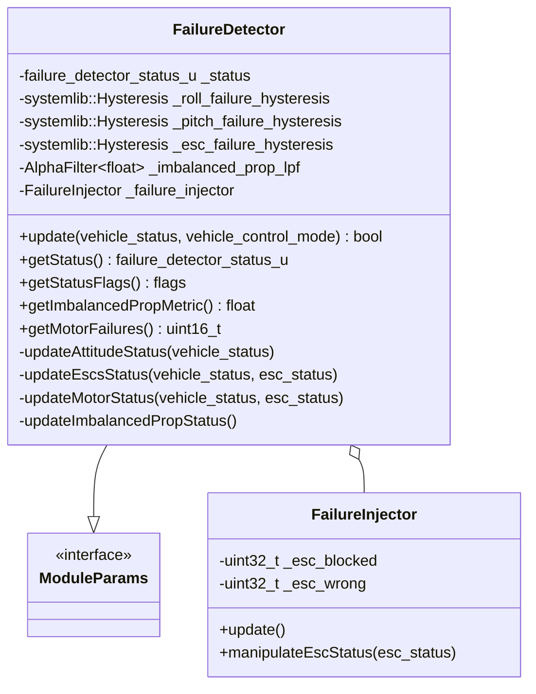

# Implementation : Failure Detector

:::info

기능 상세 및 구현에 대한 설명을 중심으로, 실제 소스 구조와 코드를 기반으로 구성요소를 상세하게 정리합니다.

:::

## 1. 파일 구성

- 파일 경로 : `src/modules/commander/failure_detector/`

| 이름                 | 설명                     |

| -------------------- | ------------------------ |

| `FailureDetector.cpp` | 실패 감지 메인 로직 및 업데이트 함수 구현 |

| `FailureDetector.hpp` | 실패 감지 클래스 정의 및 인터페이스 |

## 2. 클래스 관계



## 3. 구성요소

<details><summary><h3style="display: inline; margin: 0;"> 2.1. Variable</h3></summary>

| NO | 파일 | 이름 | 자료형 | 설명 |

|-----|-----|-----|-----|-----|

|1|FailureDetector.hpp|_status|failure_detector_status_u|현재 실패 상태를 저장하는 비트필드|

|2|FailureDetector.hpp|_roll_failure_hysteresis|systemlib::Hysteresis|롤 실패 히스테리시스 필터|

|3|FailureDetector.hpp|_pitch_failure_hysteresis|systemlib::Hysteresis|피치 실패 히스테리시스 필터|

|4|FailureDetector.hpp|_esc_failure_hysteresis|systemlib::Hysteresis|ESC 실패 히스테리시스 필터|

|5|FailureDetector.hpp|_imbalanced_prop_lpf|AlphaFilter`<float>`|불균형 프로펠러 감지용 저역 통과 필터|

|6|FailureDetector.hpp|_selected_accel_device_id|uint32_t|선택된 가속도계 장치 ID|

|7|FailureDetector.hpp|_motor_failure_esc_valid_current_mask|uint8_t|전류 텔레메트리가 유효한 ESC 마스크|

|8|FailureDetector.hpp|_motor_failure_esc_timed_out_mask|uint8_t|텔레메트리 타임아웃 발생 ESC 마스크|

|9|FailureDetector.hpp|_motor_failure_esc_under_current_mask|uint8_t|저전류 상태 ESC 마스크|

</details>

<details><summary><h3style="display: inline; margin: 0;"> 2.2. Struct/Enum/Union</h3></summary>

::: details 1. failure_detector_status_u Union

    - 입력 : 없음

    - 출력 : 없음

    - 설명 : 실패 감지 상태를 비트필드와 정수값으로 동시에 접근할 수 있는 공용체

    ```c++

    unionfailure_detector_status_u {

    struct {

    uint16_t roll : 1;          // 롤 실패

    uint16_t pitch : 1;         // 피치 실패

    uint16_t alt : 1;           // 고도 실패

    uint16_t ext : 1;           // 외부 실패

    uint16_t arm_escs : 1;      // ESC ARM 실패

    uint16_t battery : 1;       // 배터리 실패

    uint16_t imbalanced_prop : 1;  // 불균형 프로펠러

    uint16_t motor : 1;         // 모터 실패

    } flags;

    uint16_t value {0};

    };

    ```

:::

</details>

<details><summary><h3style="display: inline; margin: 0;"> 2.3. Function</h3></summary>

::: details 1. update 함수

    - 입력 : vehicle_status_s &vehicle_status, vehicle_control_mode_s &vehicle_control_mode

    - 출력 : bool (상태 변화 여부)

    - 설명 : 메인 업데이트 함수로 모든 실패 감지 로직을 실행하고 상태 변화를 반환

    ```c++

    bool FailureDetector::update(constvehicle_status_s&vehicle_status,constvehicle_control_mode_s&vehicle_control_mode)

    {

    _failure_injector.update();

    failure_detector_status_u status_prev = _status;

    if (vehicle_control_mode.flag_control_attitude_enabled) {

    updateAttitudeStatus(vehicle_status);

    } else {

    _status.flags.roll = false;

    _status.flags.pitch = false;

    _status.flags.alt = false;

    _status.flags.ext = false;

    }

    // ESC 상태 업데이트

    esc_status_s esc_status;

    if (_esc_status_sub.update(&esc_status)) {

    _failure_injector.manipulateEscStatus(esc_status);

    if (_param_escs_en.get()) {

    updateEscsStatus(vehicle_status, esc_status);

    }

    if (_param_fd_actuator_en.get()) {

    updateMotorStatus(vehicle_status, esc_status);

    }

    }

    if (_param_fd_imb_prop_thr.get() >0) {

    updateImbalancedPropStatus();

    }

    return_status.value!=status_prev.value;

    }

    ```

:::

::: details 2. updateAttitudeStatus 함수

    - 입력 : vehicle_status_s &vehicle_status

    - 출력 : void

    - 설명 : 자세(롤/피치) 실패를 감지하고 히스테리시스 필터를 적용

    ```c++

    void FailureDetector::updateAttitudeStatus(constvehicle_status_s&vehicle_status)

    {

    vehicle_attitude_s attitude;

    if (_vehicle_attitude_sub.update(&attitude)) {

    const matrix::Eulerf euler(matrix::Quatf(attitude.q));

    floatroll(euler.phi());

    floatpitch(euler.theta());

    // 테일시터 특별 처리

    if (vehicle_status.is_vtol_tailsitter) {

    if (vehicle_status.in_transition_mode) {

    roll = 0.f;

    pitch = 0.f;

    } elseif (vehicle_status.vehicle_type== vehicle_status_s::VEHICLE_TYPE_FIXED_WING) {

    const matrix::Eulerf euler_rotated = matrix::Eulerf(matrix::Quatf(attitude.q) * matrix::Quatf(matrix::Eulerf(0.f, M_PI_2_F,0.f)));

    roll = euler_rotated.phi();

    pitch = euler_rotated.theta();

    }

    }

    constfloat max_roll_deg = _param_fd_fail_r.get();

    constfloat max_pitch_deg = _param_fd_fail_p.get();

    constfloatmax_roll(fabsf(math::radians(max_roll_deg)));

    constfloatmax_pitch(fabsf(math::radians(max_pitch_deg)));

    constbool roll_status = (max_roll > FLT_EPSILON) && (fabsf(roll) > max_roll);

    constbool pitch_status = (max_pitch > FLT_EPSILON) && (fabsf(pitch) > max_pitch);

    hrt_abstime time_now = hrt_absolute_time();

    // 히스테리시스 업데이트

    _roll_failure_hysteresis.set_hysteresis_time_from(false, (hrt_abstime)(1_s*_param_fd_fail_r_ttri.get()));

    _pitch_failure_hysteresis.set_hysteresis_time_from(false, (hrt_abstime)(1_s*_param_fd_fail_p_ttri.get()));

    _roll_failure_hysteresis.set_state_and_update(roll_status, time_now);

    _pitch_failure_hysteresis.set_state_and_update(pitch_status, time_now);

    // 상태 업데이트

    _status.flags.roll = _roll_failure_hysteresis.get_state();

    _status.flags.pitch = _pitch_failure_hysteresis.get_state();

    }

    }

    ```

:::

::: details 3. updateMotorStatus 함수

- 입력 : vehicle_status_s &vehicle_status, esc_status_s &esc_status
- 출력 : void
- 설명 : 모터/ESC 실패를 감지 (텔레메트리 타임아웃, 저전류 상태)

```c++

void FailureDetector::updateMotorStatus(constvehicle_status_s&vehicle_status,constesc_status_s&esc_status)

{

    const hrt_abstime time_now = hrt_absolute_time();


    // 무장된 상태에서만 체크

    if (vehicle_status.arming_state== vehicle_status_s::ARMING_STATE_ARMED) {

        constint limited_esc_count = math::min(esc_status.esc_count, esc_status_s::CONNECTED_ESC_MAX);


        actuator_motors_s actuator_motors{};

        _actuator_motors_sub.copy(&actuator_motors);


        // 개별 ESC 리포트 체크

        for (int esc_status_idx = 0; esc_status_idx < limited_esc_count; esc_status_idx++) {

            const esc_report_s &cur_esc_report = esc_status.esc[esc_status_idx];

            constunsigned i_esc = cur_esc_report.actuator_function- actuator_motors_s::ACTUATOR_FUNCTION_MOTOR1;


            if (i_esc >= actuator_motors_s::NUM_CONTROLS) {

                continue;

            }


            // ESC 텔레메트리 유효성 체크

            if (!(_motor_failure_esc_valid_current_mask & (1<< i_esc)) && cur_esc_report.esc_current>0.0f) {

                _motor_failure_esc_valid_current_mask |= (1<< i_esc);

            }


            // 텔레메트리 타임아웃 체크

            const hrt_abstime telemetry_age = time_now -cur_esc_report.timestamp;

            constbool esc_timed_out = telemetry_age >300_ms;

            constbool esc_was_valid = _motor_failure_esc_valid_current_mask & (1<< i_esc);

            constbool esc_timeout_currently_flagged = _motor_failure_esc_timed_out_mask & (1<< i_esc);


            if (esc_was_valid && esc_timed_out && !esc_timeout_currently_flagged) {

                _motor_failure_esc_timed_out_mask |= (1<< i_esc);

            } elseif (!esc_timed_out && esc_timeout_currently_flagged) {

                _motor_failure_esc_timed_out_mask &=~(1<< i_esc);

            }


            // ESC 전류가 너무 낮은지 체크

            if (cur_esc_report.esc_current> FLT_EPSILON) {

                _motor_failure_esc_has_current[i_esc] = true;

            }


            if (_motor_failure_esc_has_current[i_esc]) {

                float esc_throttle = 0.f;

                if (PX4_ISFINITE(actuator_motors.control[i_esc])) {

                    esc_throttle = fabsf(actuator_motors.control[i_esc]);

                }


                constbool throttle_above_threshold = esc_throttle >_param_fd_motor_throttle_thres.get();

                constbool current_too_low = cur_esc_report.esc_current< esc_throttle *_param_fd_motor_current2throttle_thres.get();


                if (throttle_above_threshold && current_too_low && !esc_timed_out) {

                    if (_motor_failure_undercurrent_start_time[i_esc] ==0) {

                        _motor_failure_undercurrent_start_time[i_esc] = time_now;

                    }

                } else {

                    if (_motor_failure_undercurrent_start_time[i_esc] !=0) {

                        _motor_failure_undercurrent_start_time[i_esc] = 0;

                    }

                }


                if (_motor_failure_undercurrent_start_time[i_esc] !=0

                    && (time_now -_motor_failure_undercurrent_start_time[i_esc]) >_param_fd_motor_time_thres.get() *1_ms

                    && (_motor_failure_esc_under_current_mask & (1<< i_esc)) ==0) {

                    _motor_failure_esc_under_current_mask |= (1<< i_esc);

                }

            }

        }


        bool critical_esc_failure = (_motor_failure_esc_timed_out_mask !=0 || _motor_failure_esc_under_current_mask !=0);


        if (critical_esc_failure && !(_status.flags.motor)) {

            _status.flags.motor = true;

        } elseif (!critical_esc_failure && _status.flags.motor) {

            _status.flags.motor = false;

        }


    } else { // 비무장 상태

        for (int i_esc = 0; i_esc < actuator_motors_s::NUM_CONTROLS; i_esc++) {

            _motor_failure_undercurrent_start_time[i_esc] = 0;

        }

        _motor_failure_esc_under_current_mask = 0;

        _status.flags.motor = false;

    }

}

```
:::

</details>

<details><summary><h3style="display: inline; margin: 0;"> 2.4. Autopilot Parameter</h3></summary>

```c++

// FailureDetector.hpp

DEFINE_PARAMETERS(

    (ParamInt<px4::params::FD_FAIL_P>) _param_fd_fail_p,

    (ParamInt<px4::params::FD_FAIL_R>) _param_fd_fail_r,

    (ParamFloat<px4::params::FD_FAIL_R_TTRI>) _param_fd_fail_r_ttri,

    (ParamFloat<px4::params::FD_FAIL_P_TTRI>) _param_fd_fail_p_ttri,

    (ParamInt<px4::params::FD_ESCS_EN>) _param_escs_en,

    (ParamInt<px4::params::FD_IMB_PROP_THR>) _param_fd_imb_prop_thr,


    // Actuator failure

    (ParamBool<px4::params::FD_ACT_EN>) _param_fd_actuator_en,

    (ParamFloat<px4::params::FD_ACT_MOT_THR>) _param_fd_motor_throttle_thres,

    (ParamFloat<px4::params::FD_ACT_MOT_C2T>) _param_fd_motor_current2throttle_thres,

    (ParamInt<px4::params::FD_ACT_MOT_TOUT>) _param_fd_motor_time_thres

)

```

| NO | 파일 | 이름 | 자료형 | 설명 |

|-----|-----|-----|-----|-----|

|1|FailureDetector.hpp|FD_FAIL_P|ParamInt|피치 실패 감지 임계값 (도)|

|2|FailureDetector.hpp|FD_FAIL_R|ParamInt|롤 실패 감지 임계값 (도)|

|3|FailureDetector.hpp|FD_FAIL_R_TTRI|ParamFloat|롤 실패 트리거 시간 (초)|

|4|FailureDetector.hpp|FD_FAIL_P_TTRI|ParamFloat|피치 실패 트리거 시간 (초)|

|5|FailureDetector.hpp|FD_ESCS_EN|ParamInt|ESC 실패 감지 활성화|

|6|FailureDetector.hpp|FD_IMB_PROP_THR|ParamInt|불균형 프로펠러 감지 임계값|

|7|FailureDetector.hpp|FD_ACT_EN|ParamBool|액추에이터 실패 감지 활성화|

|8|FailureDetector.hpp|FD_ACT_MOT_THR|ParamFloat|모터 스로틀 임계값|

|9|FailureDetector.hpp|FD_ACT_MOT_C2T|ParamFloat|모터 전류 대 스로틀 비율 임계값|

|10|FailureDetector.hpp|FD_ACT_MOT_TOUT|ParamInt|모터 실패 감지 시간 임계값 (ms)|

</details>
