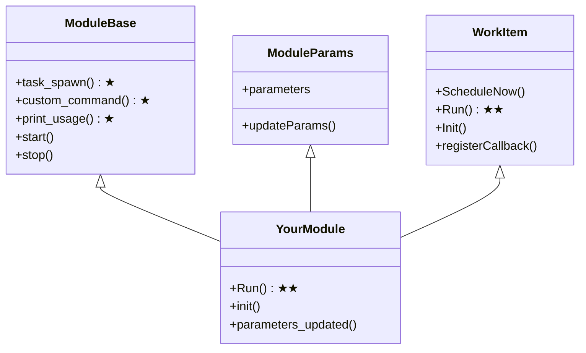
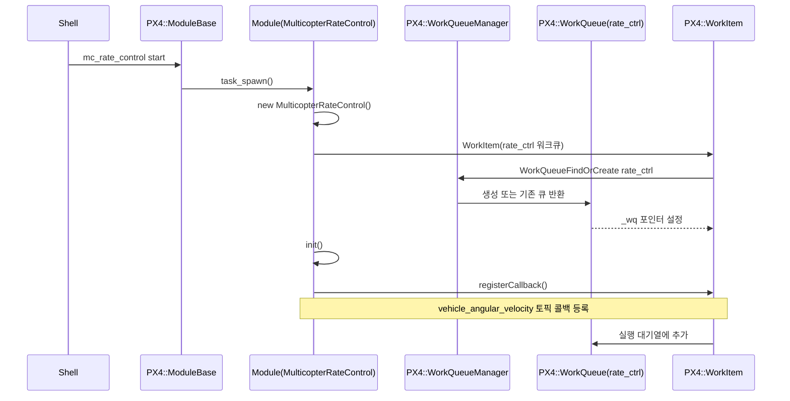
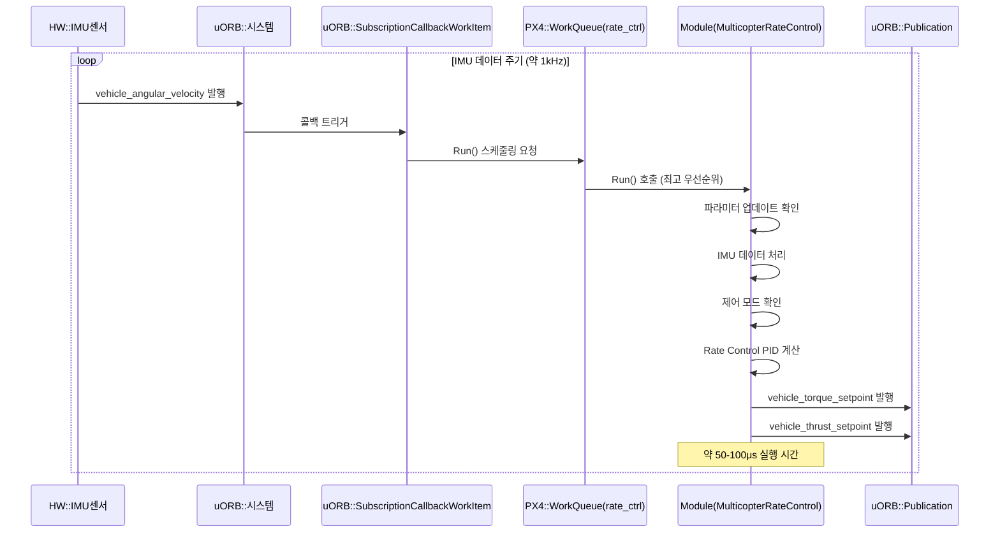
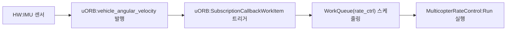

# WorkQueue Module
::: info 문서 개요
WorkQueue 방식을 사용하는 모듈을 추가하는 방법을 단계별로 설명합니다. 소스 코드 작성부터 빌드 시스템 통합, 런타임 시작까지 전체 과정을 다룹니다.
:::

## 1. 사용자 모듈 추가: WorkItem

### 1.1 기본 요구사항

> 모듈 개발 시 필요한 기본 구조와 체크리스트를 제공합니다. 소스 코드 위치, 필수 파일들, 실행 방식 선택 가이드를 다룹니다.

#### 1.1.1 소스 코드 위치

```
src/
├── modules/
│   └── your_module_name/          # 표준 모듈 위치
│       ├── CMakeLists.txt
│       ├── Kconfig                # 모듈 설정 옵션 정의
│       ├── your_module.cpp
│       └── your_module.hpp
├── examples/
│   └── your_example/              # 예제/테스트용 모듈
└── drivers/
    └── your_driver/               # 하드웨어 드라이버 모듈

```

#### 1.1.2 모듈 추가 체크리스트
    1.**CMakeLists.txt**: 빌드 시스템에 모듈 등록
    2.**Kconfig**: 설정 옵션 추가 (모듈 활성화용)
    3.**모듈 클래스**: ModuleBase, ModuleParams, WorkItem 상속
    4.**워크큐 설정**: 적절한 우선순위와 실행 방식 선택
    5.**uORB 토픽**: 필요시 새로운 메시지 타입 정의
    6.**초기화 스크립트**: 자동 시작 설정

#### 1.1.3 모듈 실행 방식 선택 가이드

모듈의 특성에 따라 적절한 실행 방식을 선택:

-**실시간 제어 모듈**: `rate_ctrl` 워크큐 + 이벤트 기반 (IMU 토픽 구독)

-**일반 제어 모듈**: `att_pos_ctrl` 워크큐 + 이벤트 기반

-**항법/미션 모듈**: `nav_and_controllers` 워크큐 + 주기적 또는 이벤트 기반

-**센서 드라이버**: `lp_default` 워크큐 + 주기적 실행

-**통신/로깅**: `lp_default` 워크큐 + 저빈도 주기적 실행

자세한 WorkQueue 시스템과 실행 방식은 **3.2 WorkQueue 시스템 구조**를 참조하세요.

### 2.2 모듈 활성화 방법

> 작성한 모듈을 실제로 PX4 펌웨어에 포함시키고 실행하는 방법을 설명합니다. Kconfig를 통한 빌드 시 포함과 초기화 스크립트를 통한 런타임 시작을 다룹니다.

#### 2.2.1 Kconfig 시스템을 통한 빌드 시 활성화

**Kconfig 시스템 개요**

PX4는 Linux 커널과 동일한 Kconfig 시스템을 사용하여 빌드 시 모듈을 선택적으로 포함합니다.

`src/modules/Kconfig`에서 `rsource "*/Kconfig"`로 모든 모듈의 설정을 자동 포함하여 통합 관리합니다.

**모듈 활성화 두 단계 (둘 다 필요):**

1.**모듈별 Kconfig 파일 생성**

   **파일 위치**: `src/modules/your_module/Kconfig`

   모듈 폴더에 Kconfig 파일을 생성하여 설정 옵션 정의:

```bash
# src/modules/your_module/Kconfig

menuconfig MODULES_YOUR_MODULE
    bool "your_module"
    default n
    ---help---
        Enable support for your_module
```

   -**default n**: 보드 설정 파일에서 `CONFIG_MODULES_YOUR_MODULE=y`로 명시적 활성화 필요

   -**default y**: 보드 설정 파일에 명시하지 않아도 빌드 시 자동 포함

2.**보드별 설정 파일에서 활성화**

   **파일 위치 예시**:

-`boards/px4/fmu-v6x/default.px4board` (일반용)

-`boards/px4/fmu-v6x/multicopter.px4board` (멀티콥터 전용)

-`boards/px4/sitl/default.px4board` (시뮬레이션용)

-`boards/holybro/durandal-v1/default.px4board` (Holybro Durandal)

-`boards/cuav/x7pro/default.px4board` (CUAV X7Pro)

  보드 설정 파일에서 모듈을 활성화:

```bash

  # boards/px4/fmu-v6x/default.px4board

  CONFIG_MODULES_YOUR_MODULE=y        # 사용자 모듈 포함

  CONFIG_MODULES_MC_RATE_CONTROL=y    # mc_rate_control 모듈 포함

  CONFIG_MODULES_COMMANDER=y          # commander 모듈 포함

  CONFIG_MODULES_SENSORS=y            # sensors 모듈 포함

```

#### 2.2.2 초기화 스크립트를 통한 런타임 시작

빌드에 포함된 모듈을 런타임에 시작하려면 다음 스크립트에 추가:

-**`ROMFS/px4fmu_common/init.d/rc.mc_apps`** (멀티콥터용)

-**`ROMFS/px4fmu_common/init.d/rc.fw_apps`** (고정익용)

-**`ROMFS/px4fmu_common/init.d/rc.vtol_apps`** (VTOL용)

-**`ROMFS/px4fmu_common/init.d/rcS`** (모든 차량에 공통)

**예시:**`rc.mc_apps`에 사용자 모듈 추가

```bash

# 기존 모듈들

mc_rate_controlstart

mc_att_controlstart


# 사용자 모듈 추가

your_modulestart

```

---

## 3. PX4 모듈 실행 구조 및 상세 과정

> PX4 모듈의 내부 구조와 실행 메커니즘을 상세히 설명합니다. 모듈 클래스 상속 구조, WorkQueue 시스템, 생명주기 등 모듈 개발에 필요한 핵심 개념들을 다룹니다.

### 3.1 PX4 모듈 기본 구조

> 모든 PX4 모듈이 따라야 하는 기본 클래스 구조와 필수 구현 요소들을 설명합니다. ModuleBase, ModuleParams, WorkItem 상속과 필수 메소드들을 다룹니다.

#### 3.1.1 모듈 클래스 상속 구조

PX4의 모든 모듈은 다음과 같은 기본 클래스들을 상속받습니다:



**필수 구현 요소 (★: 정적 메소드 필수, ★★: 순수 가상 함수)**

**A. ModuleBase 필수 정적 메소드**

-**파일 참조**: `platforms/common/include/px4_platform_common/module.h:75-112`

```cpp

// 1. 모듈 생성 및 시작 (필수)

staticinttask_spawn(intargc, char*argv[]);


// 2. 사용자 명령 처리 (필수)

staticintcustom_command(intargc, char*argv[]);


// 3. 사용법 출력 (필수)

staticintprint_usage(constchar*reason = nullptr);

```

-**이유**: ModuleBase는 CRTP(Curiously Recurring Template Pattern)를 사용하여 정적 다형성을 제공합니다. `ModuleBase::main()`에서 이 메소드들을 호출하므로 반드시 구현해야 합니다.

**B. WorkItem 필수 순수 가상 함수**

-**파일 참조**: `platforms/common/include/px4_platform_common/px4_work_queue/WorkItem.hpp:112`

```cpp

// Run() 함수 - 순수 가상 함수 (필수)

virtualvoidRun() = 0;

```

-**이유**: WorkItem의 핵심 실행 로직입니다. WorkQueue에서 모듈이 스케줄될 때 호출되는 메인 함수로, 구현하지 않으면 컴파일 에러가 발생합니다.

-**컴파일 에러 예시**:

```cpp

// Run() 미구현 시 컴파일 에러

error: cannot declare variable 'obj' to be of abstract type 'YourModule'

note: virtualvoidpx4::WorkItem::Run() [pure virtual]

```

#### 3.1.2 기본 모듈 템플릿 구조

```cpp

classYourModule : publicModuleBase<YourModule>,

                   publicModuleParams,

                   publicpx4::WorkItem

{

public:

    YourModule();

    ~YourModule() override;


    staticinttask_spawn(intargc, char*argv[]);

    staticintcustom_command(intargc, char*argv[]);

    staticintprint_usage(constchar*reason = nullptr);


    boolinit();

    voidRun() override;


private:

    voidparameters_updated();


    // uORB 구독자들

    uORB::Subscription _param_sub{ORB_ID(parameter_update)};

    uORB::SubscriptionCallbackWorkItem _input_sub{this, ORB_ID(input_topic)};


    // uORB 발행자들

    uORB::Publication<output_topic_s> _output_pub{ORB_ID(output_topic)};

};

```

### 3.2 WorkQueue 시스템 구조

> PX4의 핵심인 WorkQueue 시스템을 설명합니다. 우선순위 체계, 실행 방식(이벤트/주기적), 모듈 특성별 WorkQueue 선택 가이드를 다룹니다.

#### 3.2.1 WorkQueue 우선순위 체계

**파일 참조**: `platforms/common/include/px4_platform_common/px4_work_queue/WorkQueueManager.hpp:51-78`

PX4는 다양한 우선순위의 워크큐를 제공합니다:

```cpp

// 최고 우선순위 (실시간 제어)

staticconstexprwq_config_t rate_ctrl{"wq:rate_ctrl", 3150, 0};


// 고 우선순위 (센서, 자세 제어)

staticconstexprwq_config_t att_pos_ctrl{"wq:att_pos_ctrl", 1344, -1};


// 일반 우선순위 (항법, 미션)

staticconstexprwq_config_t nav_and_controllers{"wq:nav_and_controllers", 1728, -2};


// 저 우선순위 (로깅, 통신)

staticconstexprwq_config_t lp_default{"wq:lp_default", 1344, -50};

```

#### 3.2.2 WorkItem 실행 방식

**A. px4::WorkItem (이벤트 기반 - 권장)**

- uORB 토픽 수신 시 자동 실행

-`SubscriptionCallbackWorkItem`으로 특정 토픽 구독

- 대부분의 제어 모듈이 사용 (mc_rate_control, fw_att_control 등)

```cpp

classYourModule : publicModuleBase<YourModule>, publicModuleParams, publicpx4::WorkItem

{

private:

    // 특정 토픽이 업데이트될 때마다 Run() 자동 실행

    uORB::SubscriptionCallbackWorkItem _input_sub{this, ORB_ID(sensor_topic)};


public:

    boolinit() {

        if (!_input_sub.registerCallback()) {

            returnfalse;

        }

        returntrue;

    }


    voidRun() override {

        // 토픽 데이터 처리

    }

};

```

**B. px4::ScheduledWorkItem (주기적 실행)**

- 고정 주기로 실행
- 센서 드라이버, 상태 모니터링 등에 사용

```cpp

classYourModule : publicModuleBase<YourModule>, publicModuleParams, publicpx4::ScheduledWorkItem

{

public:

    boolinit() {

        ScheduleOnInterval(10_ms); // 100Hz로 주기적 실행

        returntrue;

    }


    voidRun() override {

        // 주기적 작업 수행

    }

};

```

**실행 제어 메소드들:**

```cpp

ScheduleOnInterval(10_ms);    // 주기적 실행 (10ms마다)

ScheduleNow();               // 즉시 실행

ScheduleDelayed(100_ms);     // 100ms 후 실행

ScheduleClear();             // 스케줄링 취소

```

#### 3.2.3 실행 방식 선택 가이드

**모듈 특성별 권장 방식:**

| 모듈 유형      | WorkQueue                    | 실행 방식     | 예시                            |

| -------------- | ---------------------------- | ------------- | ------------------------------- |

| 실시간 제어    | `rate_ctrl` (0)            | 이벤트 기반   | mc_rate_control, fw_att_control |

| 자세/위치 제어 | `att_pos_ctrl` (-1)        | 이벤트 기반   | mc_pos_control, fw_pos_control  |

| 항법/미션      | `nav_and_controllers` (-2) | 이벤트/주기적 | navigator, commander            |

| 센서 드라이버  | `lp_default` (-50)         | 주기적        | sensors, battery_status         |

| 통신/로깅      | `lp_default` (-50)         | 저빈도 주기적 | mavlink, logger                 |

### 3.3 모듈 생명주기

> 모듈이 시작되어 실행되고 종료되기까지의 전체 생명주기를 설명합니다. shell 명령부터 WorkQueue 스케줄링까지의 과정을 다룹니다.

#### 3.3.1 모듈 시작 과정

1.**Shell 명령**: `your_module start`

2.**ModuleBase::task_spawn()** 호출

3.**모듈 객체 생성** 및 WorkItem 등록

4.**init() 메소드** 호출 - 콜백 등록

5.**실행 대기열** 추가

#### 3.3.2 실행 과정

1.**트리거 발생** (타이머 또는 토픽 업데이트)

2.**WorkQueue 스케줄링**

3.**Run() 메소드 실행**

4.**작업 완료 후 대기**

---

---

## 4. mc_rate_control 모듈 예시

> 실제 PX4의 mc_rate_control 모듈을 통해 앞서 설명한 모든 개념들이 어떻게 구현되는지 구체적인 예시를 제공합니다. 초기화부터 반복 실행까지의 전체 과정을 실제 코드와 함께 설명합니다.

이제 위에서 설명한 구조를 바탕으로 실제 mc_rate_control 모듈이 어떻게 구현되었는지 살펴보겠습니다.

### 4.1 모듈 초기화 과정



### 4.2 반복 실행 과정 (Run 함수)



### 4.3 워크큐 및 우선순위 설정

**파일 참조**: `src/modules/mc_rate_control/MulticopterRateControl.cpp:48`

```cpp

WorkItem(MODULE_NAME, px4::wq_configurations::rate_ctrl)

```

**파일 참조**: `platforms/common/include/px4_platform_common/px4_work_queue/WorkQueueManager.hpp:51`

```cpp

staticconstexprwq_config_t rate_ctrl{"wq:rate_ctrl", 3150, 0}; // PX4 inner loop highest priority

```

-**우선순위**: 0 (최고 우선순위)

-**스택 크기**: 3150 바이트

-**실행 방식**: 이벤트 기반 (vehicle_angular_velocity 토픽 수신 시)

### 4.4 실행 트리거 메커니즘



**파일 참조**: `src/modules/mc_rate_control/MulticopterRateControl.hpp:104`

```cpp

uORB::SubscriptionCallbackWorkItem _vehicle_angular_velocity_sub{this, ORB_ID(vehicle_angular_velocity)};

```

**파일 참조**: `src/modules/mc_rate_control/MulticopterRateControl.cpp:67-70`

```cpp

if (!_vehicle_angular_velocity_sub.registerCallback()) {

    PX4_ERR("callback registration failed");

    returnfalse;

}

```

### 4.5 상세 코드 구조

**클래스 정의**

**파일 참조**: `MulticopterRateControl.hpp:65`

```cpp

classMulticopterRateControl : publicModuleBase<MulticopterRateControl>,

                               publicModuleParams,

                               publicpx4::WorkItem

```

**생성자 구현**

**파일 참조**: `MulticopterRateControl.cpp:46-57`

```cpp

MulticopterRateControl::MulticopterRateControl(bool vtol) :

    ModuleParams(nullptr),

    WorkItem(MODULE_NAME, px4::wq_configurations::rate_ctrl),

    _vehicle_torque_setpoint_pub(vtol ? ORB_ID(vehicle_torque_setpoint_virtual_mc) : ORB_ID(vehicle_torque_setpoint)),

    _vehicle_thrust_setpoint_pub(vtol ? ORB_ID(vehicle_thrust_setpoint_virtual_mc) : ORB_ID(vehicle_thrust_setpoint)),

    _loop_perf(perf_alloc(PC_ELAPSED, MODULE_NAME": cycle"))

```

**Run() 메소드 실행 흐름**

**파일 참조**: `MulticopterRateControl.cpp:101-267`

1.**파라미터 업데이트 확인** (라인 112-119)

2.**IMU 데이터 처리** (라인 124-134)

3.**제어 모드 확인** (라인 136-147)

4.**Rate Control 계산** (라인 150-250)

5.**출력 발행** (라인 250-267)

### 4.6 WorkQueueManager와의 연결 관계

#### 4.6.1 WorkQueue 설정 구조

**파일 참조**: `platforms/common/include/px4_platform_common/px4_work_queue/WorkQueueManager.hpp:43-51`

```cpp

structwq_config_t {

    constchar *name;

    uint16_t stacksize;

    int8_t relative_priority; // relative to max

};


staticconstexprwq_config_t rate_ctrl{"wq:rate_ctrl", 3150, 0};

```

#### 4.6.2 WorkItem 초기화 과정

1.**WorkItem 생성자 호출** (`WorkItem.hpp:88`)

2.**Init() 메소드로 WorkQueue 연결** (`WorkItem.hpp:122`)

3.**WorkQueueFindOrCreate()로 큐 생성/검색** (`WorkQueueManager.hpp:120`)

### 4.7 실행 흐름 요약

#### 4.7.1 초기화 단계

1.**ModuleBase::task_spawn()** 호출 (`MulticopterRateControl.cpp:292`)

2.**MulticopterRateControl 객체 생성** (라인 302)

3.**WorkItem 초기화** - rate_ctrl 워크큐에 등록 (최고 우선순위)

4.**init() 호출** - 콜백 등록 (라인 308)

#### 4.7.2 실행 단계

1.**IMU 센서**에서 새로운 데이터 생성

2.**vehicle_angular_velocity 토픽** 발행

3.**SubscriptionCallbackWorkItem**이 콜백 트리거

4.**WorkQueue**에 실행 스케줄링

5.**MulticopterRateControl::Run()** 실행

6.**PID 제어** 계산 수행

7.**vehicle_torque_setpoint**, **vehicle_thrust_setpoint** 토픽 발행

### 4.8 주요 특징

-**최고 우선순위 실행**: rate_ctrl 워크큐 (우선순위 0)

-**이벤트 기반 실행**: IMU 데이터 도착 시 자동 실행

-**실시간 성능**: 워크 아이템 아키텍처로 지연 최소화

-**다중 상속 구조**: ModuleBase, ModuleParams, WorkItem 통합

-**콜백 메커니즘**: uORB 토픽 구독을 통한 효율적인 실행 관리

이 구조를 통해 mc_rate_control 모듈은 IMU 데이터가 도착하는 즉시 최고 우선순위로 실행되어 실시간 자세 제어를 수행합니다.
