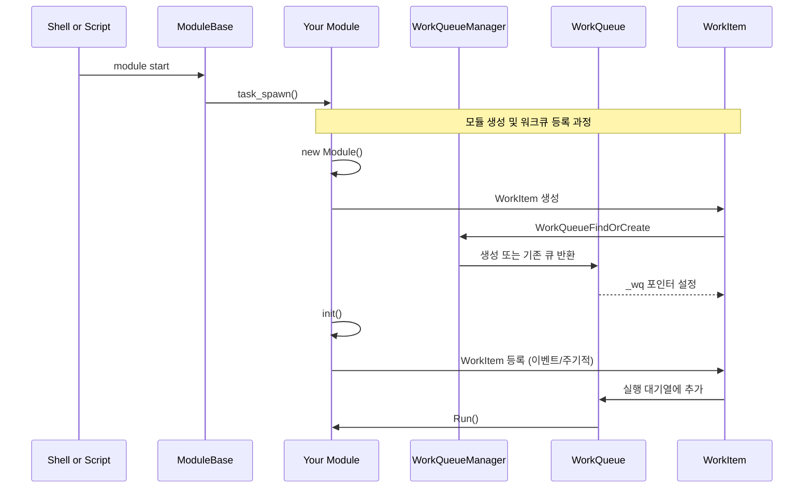
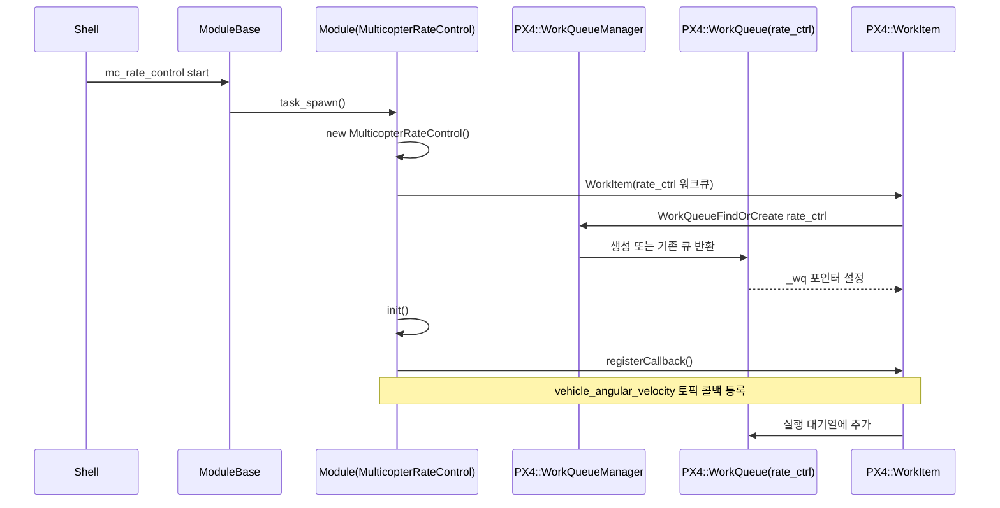
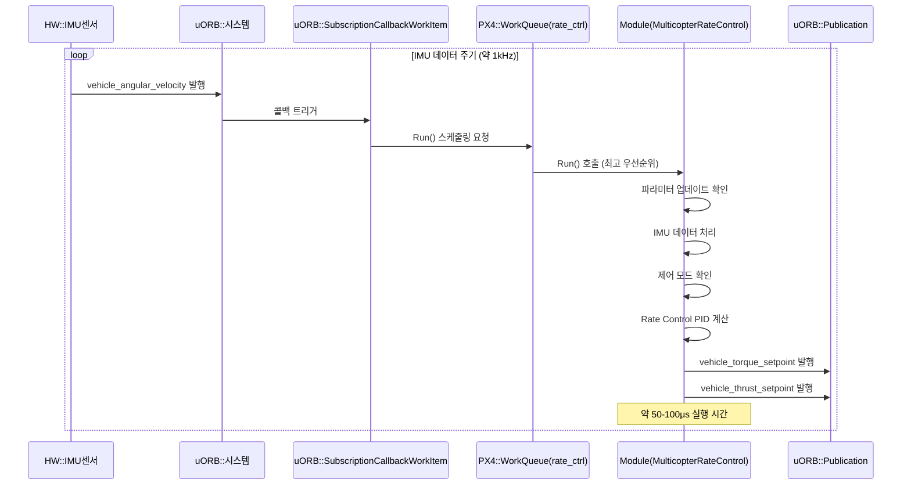
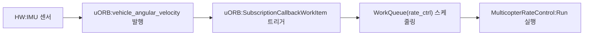

# about WorkQueue

:::info
WorkQueue의 구조, 우선순위 체계, 작업 등록 방식(이벤트/스케줄) 등의 WorkQueue에 대해 알 수 있습니다. 
- WorkQueue : 해당 워크큐를 사용하는 모듈의 작업을 등록 순서대로 수행하는 공통 스레드입니다.
- WorkQueueMnanger : 각 WorkQueue의 설정, 생성 등의 관리를 수행합니다.
- WorkItem : 모듈의 작업 단위로 `run()` 함수가 실제 작업 내용에 해당됩니다.
:::

## 1. WorkQueue System
### 1.1. WorkQueueManager 
Startup Sequence의 **WorkQueue 시작** 단계에서 `px4::WorkQueueManagerStart()` 함수가 호출되면, 
"wq:manager" 라는 이름의 최우선 순위의 독립 스레드가 생성되어 미리 설정된 워크큐들을 관리합니다.

::: details  wq:manager 설정
- **파일 참조**: `platforms/common/px4_work_queue/WorkQueueManager.cpp`

``` c++
//WorkQueueManagerStart()
int task_id = px4_task_spawn_cmd("wq:manager",
                    SCHED_DEFAULT,
                    SCHED_PRIORITY_MAX,
                    PX4_STACK_ADJUSTED(1280),
                    (px4_main_t)&WorkQueueManagerRun,
                    nullptr);
```
:::

각 설정된 워크큐의 우선순위 체계는 아래에서 확인 할 수 있습니다.

::: details  WorkQueue 및 우선순위 
- **파일 참조**: `platforms/common/include/px4_platform_common/px4_work_queue/WorkQueueManager.hpp`
```cpp
namespace px4
{
    class WorkQueue; // forward declaration

    struct wq_config_t {
        const char *name;
        uint16_t stacksize;
        int8_t relative_priority;
    };

    namespace wq_configurations
    {
        // 최고 우선순위 (실시간 제어, rate controllers)
        static constexpr wq_config_t rate_ctrl{"wq:rate_ctrl", 3150, 0};
        // 센서 우선순위 (드라이버)
        static constexpr wq_config_t SPI0{"wq:SPI0", 2392, -1}; ...
        static constexpr wq_config_t I2C0{"wq:I2C0", 2336, -8}; ...
        // 센서 이후 우선순위 (att/pos controllers)
        static constexpr wq_config_t nav_and_controllers{"wq:nav_and_controllers", 2240, -13}; ...
        // 고 우선순위
        static constexpr wq_config_t hp_default{"wq:hp_default", 2800, -18};
        // 저 우선순위
        static constexpr wq_config_t lp_default{"wq:lp_default", 1920, -50};
        ...
    }
    ...
}
```
:::tip 워크큐 구조체는 큐의 이름, 스택 크기, 우선 순위로 설정 됩니다.
여기서 우선 순위(relative_priority)는 wq:manager의 우선순위(SCHED_PRIORITY_MAX)를 기준으로 상대적으로 설정 됩니다.

예를 들어, 워크큐 wq:hp_default의 스레드는 wq:manager 스레드 대비 -18의 우선순위를 가지게 됩니다.
:::

---

### 1.2. WorkItem 등록 방식
#### 1.2.1. 이벤트 등록(px4::WorkItem)
:::details 이벤트 등록
- 모듈에서 `px4::WorkItem`을 상속받아 사용
- 특정 uORB 토픽 수신 시 모듈의 작업을 해당 워크큐에 등록하여 수행 요청
- `SubscriptionCallbackWorkItem`으로 특정 토픽 지정 및 구독
- 모듈 상속 관계
    ```mermaid
    classDiagram
        class ModuleBase {
            +task_spawn()★
            +custom_command()★
            +print_usage()★
            +start()
            +stop()
        }
        class WorkItem {
            +ScheduleNow()
            +Run()★★
        }
        class YourModule {
            +Run()★★ 실제 모듈의 기능
            +task_spawn()★
            +custom_command()★
            +print_usage()★
            +init()
        }
        ModuleBase <|-- YourModule
        WorkItem <|-- YourModule
    ```
:::warning 대다수의 모듈에서 WorkItem을 등록하는 방식
*필수 구현 요소 (★: 정적 메소드 필수, ★★: 순수 가상 함수)*
:::

#### 1.2.2. 스케줄 등록(px4::ScheduledWorkItem)
:::details 스케줄 등록
- 모듈에서 `px4::ScheduledWorkItem`을 상속 받아 사용
- 모듈의 작업을 일정 주기, 시간 지연 등의 스케줄을 설정하여 해당 워크큐에 등록
- 센서 드라이버, 상태 모니터링 등에 사용
- `px4::ScheduledWorkItem`에서 `px4::WorkItem`을 상속 받아 이벤트 기반 작업 등록 가능
- 모듈 상속 관계
    ```mermaid
    classDiagram
        class ModuleBase {
            +task_spawn()★
            +custom_command()★
            +print_usage()★
            +start()
            +stop()
        }
        class WorkItem {
            +ScheduleNow()
            +Run()★★
        }
        class ScheduledWorkItem {
            +ScheduleDelayed()
            +ScheduleOnInterval()
            +ScheduleAt()
            +ScheduleClear()
        }
        class YourModule {
            +Run()★★ 실제 모듈의 기능
            +task_spawn()★
            +custom_command()★
            +print_usage()★
            +init()
        }
        ModuleBase <|-- YourModule
        WorkItem <|-- ScheduledWorkItem
        ScheduledWorkItem <|-- YourModule
    ```

:::warning 주로 이벤트 등록을 통해 WorkItem을 등록하며, 보조적인 수단으로 스케줄 등록을 사용.
*필수 구현 요소 (★: 정적 메소드 필수, ★★: 순수 가상 함수)*
:::


## 2. WorkQueue Scheduling
:::info
모듈이 시작되고 WorkQueue에 WorkItem이 등록되어 실행되기까지의 전체 생명주기를 설명합니다. WorkQueue 스케줄링 과정을 다룹니다.
:::

### 2.1 모듈 초기화 과정


## 예시 : mc_rate_control (수정 중)
::: info
실제 Autopilot의 멀티콥터형 비행체의 각속도 제어기(mc_rate_control) 모듈을 통해 앞서 설명한 모든 개념들이 어떻게 구현되는지 구체적인 예시를 제공합니다. 초기화부터 반복 실행까지의 전체 과정을 실제 코드와 함께 설명합니다.
:::

### 모듈 초기화 과정


---

### 반복 실행 과정 (Run 함수)


---

### 워크큐 및 우선순위 설정
- **파일 참조**: `src/modules/mc_rate_control/MulticopterRateControl.cpp:48`
```cpp
WorkItem(MODULE_NAME, px4::wq_configurations::rate_ctrl)
```

- **파일 참조**: `platforms/common/include/px4_platform_common/px4_work_queue/WorkQueueManager.hpp:51`
```cpp
static constexpr wq_config_t rate_ctrl{"wq:rate_ctrl", 3150, 0}; // PX4 inner loop highest priority
```

- **우선순위**: 0 (최고 우선순위)
- **스택 크기**: 3150 바이트
- **실행 방식**: 이벤트 기반 (vehicle_angular_velocity 토픽 수신 시)

---

### 실행 트리거 메커니즘


- **파일 참조**: `src/modules/mc_rate_control/MulticopterRateControl.hpp:104`
```cpp
uORB::SubscriptionCallbackWorkItem _vehicle_angular_velocity_sub{this, ORB_ID(vehicle_angular_velocity)};
```

- **파일 참조**: `src/modules/mc_rate_control/MulticopterRateControl.cpp:67-70`
```cpp
if (!_vehicle_angular_velocity_sub.registerCallback()) {
    PX4_ERR("callback registration failed");
    return false;
}
```

---

### 상세 코드 구조
#### **클래스 정의**
- **파일 참조**: `MulticopterRateControl.hpp:65`
```cpp
class MulticopterRateControl : public ModuleBase<MulticopterRateControl>,
                               public ModuleParams,
                               public px4::WorkItem
```

#### **생성자 구현**
- **파일 참조**: `MulticopterRateControl.cpp:46-57`
```cpp
MulticopterRateControl::MulticopterRateControl(bool vtol) :
    ModuleParams(nullptr),
    WorkItem(MODULE_NAME, px4::wq_configurations::rate_ctrl),
    _vehicle_torque_setpoint_pub(vtol ? ORB_ID(vehicle_torque_setpoint_virtual_mc) : ORB_ID(vehicle_torque_setpoint)),
    _vehicle_thrust_setpoint_pub(vtol ? ORB_ID(vehicle_thrust_setpoint_virtual_mc) : ORB_ID(vehicle_thrust_setpoint)),
    _loop_perf(perf_alloc(PC_ELAPSED, MODULE_NAME": cycle"))
```

#### WorkItem 초기화 과정
1. WorkItem 생성자
2. Init() 메소드로 WorkQueue 연결 (`WorkItem.hpp:122`)
3. WorkQueueFindOrCreate()로 큐 생성/검색 (`WorkQueueManager.hpp:120`)


#### **Run() 메소드 실행 흐름**
- **파일 참조**: `MulticopterRateControl.cpp:101-267`
1. **파라미터 업데이트 확인** (라인 112-119)
2. **IMU 데이터 처리** (라인 124-134)
3. **제어 모드 확인** (라인 136-147)
4. **Rate Control 계산** (라인 150-250)
5. **출력 발행** (라인 250-267)

---

### 실행 흐름 요약
#### 모듈 초기화 단계
1. **ModuleBase::task_spawn()** 호출 (`MulticopterRateControl.cpp:292`)
2. **MulticopterRateControl 객체 생성** (라인 302)
3. **WorkItem 초기화** - rate_ctrl 워크큐에 등록 (최고 우선순위)
4. **init() 호출** - 콜백 등록 (라인 308)

#### 모듈 실행 단계
1. **IMU 센서**에서 새로운 데이터 생성
2. **vehicle_angular_velocity 토픽** 발행
3. **SubscriptionCallbackWorkItem**이 콜백 트리거
4. **WorkQueue**에 실행 스케줄링
5. **MulticopterRateControl::Run()** 실행
6. **PID 제어** 계산 수행
7. **vehicle_torque_setpoint**, **vehicle_thrust_setpoint** 토픽 발행
