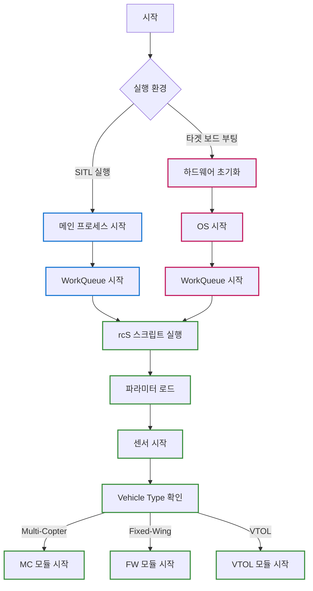

# Startup Sequence

::: info 문서 개요
Autopilot이 시작되어 각 애플리케이션 모듈이 실행되기까지의 과정을 설명합니다. SITL(시뮬레이션)과 실제 타겟 보드 환경에서의 차이점을 포함하여 메인 프로세스 시작부터 비행체 타입별 제어 모듈 시작까지의 순서를 이해할 수 있습니다.
:::

## 1. 전체 시작 흐름

::: tip 시작 과정 개요
SITL(시뮬레이션) 또는 실제 타겟 보드의 실행 환경에 따라 초기의 별도 과정을 수행합니다. rcS 스크립트 이후부터는 공통된 과정을 따릅니다.
:::



## 2. 실행 환경별 시작 과정

### 2.1. SITL (시뮬레이션) 환경


#### Step 01 : SITL 실행
   - `make px4_sitl XXXX(대상)` 명령어 실행

---

#### Step 02 :  메인 프로세스 시작
  - 파일: `platforms/posix/src/px4/common/main.cpp`
  - 핵심 함수: `main(int argc, char **argv)`
  - 아키텍처: 데몬/서버 구조 (하나의 서버, 다수의 클라이언트)
  - 주요 동작:
    - **클라이언트 모드**: 실행파일 이름이 `px4-`로 시작하면 클라이언트로 동작하여 서버에 연결
    - **서버 모드**: 일반 `px4` 이름으로 실행되면 서버로 동작
  - SITL 실행 관점:
    - `make px4_sitl_default` 빌드 후 `./build/px4_sitl_default/bin/px4` 실행
    - POSIX 호환 OS(Linux/macOS) 환경에서 일반적인 C 프로그램 진입점 역할
    - 실제 하드웨어 없이 시뮬레이션 환경에서 PX4 펌웨어 동작 재현

---

#### Step 03 : WorkQueue 시작
   - 호출 경로: `main()` → `px4::init_once()` → `px4_platform_init()` → `px4::WorkQueueManagerStart()`
   - 설명: SITL 환경에서 백그라운드 작업 처리를 위한 WorkQueue 시스템 시작

---

#### Step 04 : rcS 스크립트 실행
   - `main()` 함수에서 `run_startup_script()` 호출로 rcS 스크립트 실행
   - 파일: `ROMFS/px4fmu_common/init.d-posix/rcS`

---

### 2.2. 타겟 보드 환경


#### Step 01 : 타겟 보드 부팅
  - 타겟 보드에 전원 인가

---

#### Step 02 : 하드웨어 초기화

1. **벡터 테이블 초기화**
  - 파일: `platforms/nuttx/NuttX/nuttx/arch/arm/src/armv7-m/arm_vectors.c`
  - 과정: ARM 코어가 벡터 테이블을 읽어 리셋 핸들러인 `__start`로 점프
  - 연결: 하드웨어가 자동으로 `__start` 함수를 호출하여 시스템 초기화 시작

2. **시스템 초기화**
  - 파일: `platforms/nuttx/NuttX/nuttx/arch/arm/src/stm32h7/stm32_start.c`
  - 핵심 함수: `__start(void)`
  - 주요 작업:
    - 메모리 초기화: .data/.bss 섹션 설정
    - 코어 및 클럭 설정: FPU 활성화, 시스템 클럭 설정
    - 주변장치 활성화: UART, SPI, I2C 등 초기화
    - 보드별 하드웨어 초기화
  - 연결: `nx_start()` 함수 호출하여 OS 초기화로 진행

---

#### Step 03 : OS 시작
1. **OS 커널 시작**
  - 파일: `platforms/nuttx/NuttX/nuttx/sched/init/nx_start.c`
  - 핵심 함수: `nx_start(void)`
  - 주요 작업:
    - OS 자료구조 초기화 (태스크 리스트, 세마포어, 메시지 큐 등)
    - IDLE 태스크 생성
    - `nx_bringup()` 함수 호출
  - 연결: 보드별 애플리케이션 초기화 준비

2. **NSH(NuttShell) 시작 및 ROMFS 마운트**
  - 파일: `platforms/nuttx/NuttX/apps/nshlib/nsh_consolemain.c`
  - 과정:
    - `nx_bringup()` 함수 내에서 NSH 콘솔 애플리케이션 시작
    - `CONFIG_NSH_ROMFSETC` 설정에 의해 ROMFS 파일시스템을 `/etc` 경로에 마운트
    - ROMFS에는 Autopilot의 rcS 스크립트가 포함되어 있음
  - 핵심: NSH가 시작되면서 자동으로 `/etc/init.d/rcS` 스크립트 존재 확인 후 실행
  - 관련 함수: `nsh_initscript()` → `nsh_script_redirect()` → rcS 스크립트 실행

---

#### Step 04 : WorkQueue 시작
- 파일: `boards/px4/fmu-v6x/src/init.c` + `platforms/nuttx/src/px4/common/px4_init.cpp`
- 호출 경로: `nx_bringup()` → `board_app_initialize()` → `px4_platform_init()` → `px4::WorkQueueManagerStart()`
- 설명: PX4 플랫폼별 초기화 및 WorkQueue 시스템 시작. rcS 스크립트 실행 전에 필요한 백그라운드 작업 처리 시스템을 준비

---

#### Step 05 : rcS 스크립트 실행
- 파일: `ROMFS/px4fmu_common/init.d/rcS`
- 실행 과정:
  1. NSH가 시작되면서 `/etc/init.d/rcS` 파일 존재 확인
  2. 파일이 존재하면 `nsh_initscript()` 함수가 스크립트 내용을 한 줄씩 실행
  3. 스크립트 완료 후 `nsh>` 프롬프트 대기 상태로 전환
- 중요: 이 단계에서 Autopilot의 모든 모듈과 애플리케이션이 순서대로 시작됨


## 3. 공통 시작 과정 (rcS 스크립트)

### 3.1. rcS 스크립트 실행

::: warning rcS 스크립트 중요성
Autopilot 애플리케이션을 구성하는 모든 모듈과 드라이버를 시작시키는 핵심 초기화 스크립트입니다.
:::

- 실행 과정
  1. 스크립트 내용을 한 줄씩 순차 실행
  2. 파라미터 확인, 센서 시작 및 공통 모듈 실행

### 3.2. 비행체 타입별 모듈 시작

#### 비행체 타입 감지 및 모듈 시작
- 파일: `ROMFS/px4fmu_common/init.d/rcS:414`
- 실행 과정
  1. `rc.vehicle_setup` 스크립트 호출
  2. 파라미터 기반 멀티콥터/고정익/VTOL 구분
  3. 해당 비행체 타입에 맞는 스크립트 실행을 통한 제어 모듈 시작
    - Multi-Copter: `rc.mc_apps` - `mc_rate_control` 등
    - Fixed-Wing: `rc.fw_apps` - `fw_att_control`, `fw_pos_control` 등
    - VTOL: `rc.vtol_apps` - `vtol_att_control` 등

### 3.3. Commander 모듈

::: tip Commander 모듈의 역할
rcS 스크립트에 의해 시작되는 모듈 중 비행체의 비행 모드, 상태 관리 등 가장 핵심적인 역할을 담당합니다.
:::

- 실행: rcS 스크립트 내의 `commander start` 명령
- 의미: Autopilot 애플리케이션의 실질적인 시작점으로 볼 수 있음


## 4. 환경별 비교

### 4.1. 엔트리 포인트 비교

| 구분 | SITL | 타겟 보드 |
|------|------------------|------------------|
| **빌드 명령** | `make px4_sitl_default` | `make px4_fmu-v6x_default` |
| **실행 환경** | PC (POSIX 호환 OS) | 타겟 보드 |
| **엔트리 포인트** | `main()` 함수 | `__start()` 함수 (리셋 핸들러) |
| **파일** | `platforms/posix/src/px4/common/main.cpp` | `platforms/nuttx/NuttX/nuttx/arch/arm/src/stm32h7/stm32_start.c` |

### 4.2. WorkQueue 초기화 비교

::: warning WorkQueue 중요성
백그라운드 작업을 처리하는 핵심 서비스로, rcS 스크립트 실행 전에 반드시 초기화되어야 합니다.
:::

| 구분 | SITL | 타겟 보드 |
|------|------|----------|
| **초기화 주체** | 애플리케이션 (`main` 함수) | 보드 초기화 코드 |
| **호출 시점** | `main()` 함수 시작 직후 | `board_app_initialize()` 내부 |
| **호출 경로** | `main()` → `px4::init_once()` → `px4::WorkQueueManagerStart()` | `board_app_initialize()` → `px4_platform_init()` → `px4::WorkQueueManagerStart()` |


## 부록

### 부록 A: ARM Cortex-M 하드웨어 부팅 시퀀스

::: details ARM Cortex-M 프로세서 부팅 메커니즘 (타겟 보드만 해당)

#### 1. 전원 인가 또는 리셋
- 타겟 보드에 전원이 인가되거나 리셋 신호가 발생하면, ARM Cortex-M CPU 코어는 미리 정해진 하드웨어 부팅 시퀀스를 시작합니다.

#### 2. 벡터 테이블 주소 로드
- CPU는 가장 먼저 메모리의 특정 주소(일반적으로 0x00000000)에서 스택 포인터(Stack Pointer)의 초기값을 가져와 MSP (Main Stack Pointer) 레지스터에 로드합니다.
- 그 직후, 바로 다음 주소(0x00000004)에서 리셋 벡터(Reset Vector) 값을 읽어옵니다. 이 리셋 벡터가 바로 실행을 시작할 코드의 주소입니다.

#### 3. `arm_vectors.c`의 역할
- **파일**: `platforms/nuttx/NuttX/nuttx/arch/arm/src/armv7-m/arm_vectors.c`
- `arm_vectors.c` 파일은 C 코드로 보이지만, 실제로는 컴파일되고 링커에 의해 처리될 때 메모리의 가장 앞부분(Flash 메모리의 시작 주소, 즉 0x00000000에 매핑될 영역)에 벡터 테이블 그 자체를 생성하는 역할을 합니다.
- `_vectors[]` 배열의 첫 번째 값은 스택 주소(`IDLE_STACK`)이고, 두 번째 값이 바로 리셋 핸들러인 `__start` 함수의 주소(`(unsigned)&__start`)입니다.

```c
// arm_vectors.c 핵심 부분
unsigned _vectors[] locate_data(".vectors") =
{
  /* Initial stack */
  IDLE_STACK,                // 0x00000000 주소에 위치할 값

  /* Reset exception handler */
  (unsigned)&__start,        // 0x00000004 주소에 위치할 값

  // ... 다른 예외 핸들러들
};
```

#### 4. `__start()` 함수로 점프
- CPU는 2단계에서 읽어온 리셋 벡터 값(즉, `__start` 함수의 메모리 주소)을 프로그램 카운터(Program Counter, PC) 레지스터에 로드합니다.
- PC 레지스터는 CPU가 다음에 실행할 명령어의 주소를 가리키므로, 이 순간부터 CPU는 `stm32_start.c`에 구현된 `__start` 함수의 첫 번째 기계어 코드를 가져와 실행하기 시작합니다.

#### 요약
`arm_vectors.c`는 설계도 또는 지도와 같습니다. 이 지도는 "리셋이 발생하면 `__start`라는 곳으로 가시오"라고 적어둔 것입니다. 이 지도를 읽고 실제로 `__start`로 찾아가서 일을 시작하는 것은 ARM Cortex-M 프로세서라는 하드웨어입니다. 소프트웨어적인 함수 호출(call)이 아니라, 하드웨어의 정해진 부팅 시퀀스에 의해 자연스럽게 실행 흐름이 이어지는 것입니다.
:::

### 부록 B: 인터럽트 처리

::: details 인터럽트 처리 흐름 (타겟 보드만 해당)
리셋 이외의 모든 인터럽트와 예외 처리 과정:

#### 1. **exception_common** (`platforms/nuttx/NuttX/nuttx/arch/arm/src/armv7-m/arm_exception.S`)
- **역할**: ARM Cortex-M 인터럽트/예외의 공통 진입점
- **주요 작업**:
  - CPU 레지스터 컨텍스트 저장 (R0-R11, R14, 스택 포인터 등)
  - FPU 레지스터 저장 (CONFIG_ARCH_FPU 설정 시)
  - 인터럽트 번호(IPSR 레지스터에서) 추출하여 R0에 저장
  - 저장된 컨텍스트 주소를 R1에 설정
- **연결**: `bl arm_doirq` 호출하여 C 코드로 제어 이양

#### 2. **arm_doirq** (`platforms/nuttx/NuttX/nuttx/arch/arm/src/armv7-m/arm_doirq.c`)
- **함수 시그니처**: `uint32_t *arm_doirq(int irq, uint32_t *regs)`
- **주요 작업**:
  - 인터럽트 LED 표시 (`board_autoled_on(LED_INIRQ)`)
  - 중첩 인터럽트 방지 처리
  - 인터럽트 확인 및 승인 (`arm_ack_irq(irq)`)
- **연결**: `irq_dispatch(irq, (uint32_t *)CURRENT_REGS)` 호출

#### 3. **irq_dispatch** (`platforms/nuttx/NuttX/nuttx/sched/irq/irq_dispatch.c`)
- **함수 시그니처**: `void irq_dispatch(int irq, FAR void *context)`
- **주요 작업**:
  - IRQ 번호 유효성 검사 (`irq < NR_IRQS`)
  - `g_irqvector[ndx].handler`에서 등록된 핸들러 함수 검색
  - 인터럽트 통계 업데이트 (카운터, 실행 시간 등)
  - 랜덤 엔트로피 수집 (`add_irq_randomness`)
- **최종 실행**: 실제 디바이스 드라이버의 인터럽트 핸들러 호출

#### 벡터 테이블 연결
- `arm_vectors.c`의 `_vectors[]` 배열에서 리셋(인덱스 1) 이외의 모든 인터럽트는 `exception_common`을 가리킴
- 이를 통해 모든 인터럽트가 동일한 처리 경로를 따르도록 설계됨

```c
// arm_vectors.c에서
[2 ... (15 + ARMV7M_PERIPHERAL_INTERRUPTS)] = (unsigned)&exception_common
```
:::
