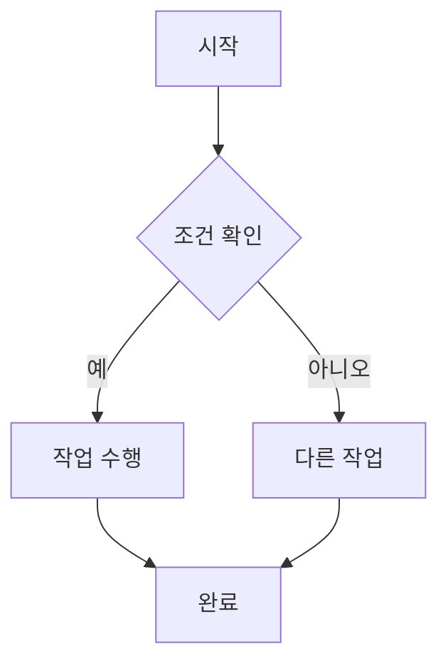

# VitePress 스타일 가이드

VitePress에서 사용할 수 있는 다양한 마크다운 스타일과 기능들을 소개합니다.

## 1. 기본 텍스트 스타일

### 결과:
**굵은 글씨** 또는 __굵은 글씨__

*기울임* 또는 _기울임_

***굵은 기울임*** 또는 ___굵은 기울임___

~~취소선~~

`인라인 코드`

### 마크다운 문법:
```markdown
**굵은 글씨** 또는 __굵은 글씨__
*기울임* 또는 _기울임_
***굵은 기울임*** 또는 ___굵은 기울임___
~~취소선~~
`인라인 코드`
```

## 2. 제목 레벨

# H1 제목
## H2 제목
### H3 제목
#### H4 제목
##### H5 제목
###### H6 제목

## 3. 목록

### 순서 없는 목록
- 첫 번째 항목
- 두 번째 항목
  - 중첩된 항목
  - 또 다른 중첩 항목
- 세 번째 항목

### 순서 있는 목록
1. 첫 번째 항목
2. 두 번째 항목
   1. 중첩된 순서 항목
   2. 또 다른 중첩 순서 항목
3. 세 번째 항목

### 작업 목록
- [x] 완료된 작업
- [ ] 미완료 작업
- [ ] 또 다른 미완료 작업

## 4. 링크와 이미지

[VitePress 공식 사이트](https://vitepress.dev)

[내부 링크](./px4_guide.md)


## 5. 인용문

> 이것은 인용문입니다.
> 
> 여러 줄의 인용문도 가능합니다.

> 중첩된 인용문
> > 이것은 중첩된 인용문입니다.

## 6. 코드 블록

### 기본 코드 블록
```
기본 코드 블록
여러 줄 가능
```

### 언어별 하이라이팅
```javascript
function hello() {
  console.log("Hello, VitePress!")
}
```

```python
def hello():
    print("Hello, VitePress!")
```

```bash
npm install vitepress
npm run dev
```

### 라인 하이라이팅
```javascript{2,4-6}
function example() {
  const highlighted = true  // 이 줄이 하이라이트됨
  const normal = false
  const start = true        // 이 줄부터
  const middle = true       // 이 줄과
  const end = true          // 이 줄까지 하이라이트됨
}
```

## 7. 표

| 제목 1 | 제목 2 | 제목 3 |
|--------|--------|--------|
| 행 1   | 데이터 | 데이터 |
| 행 2   | 데이터 | 데이터 |

| 왼쪽 정렬 | 가운데 정렬 | 오른쪽 정렬 |
|:----------|:-----------:|------------:|
| 왼쪽      | 가운데      | 오른쪽      |
| 정렬      | 정렬        | 정렬        |

## 8. VitePress 특수 컨테이너

### 결과:

::: info 정보
유용한 정보를 담을 수 있습니다.
:::

::: tip 팁
도움이 되는 팁을 제공합니다.
:::

::: warning 주의
주의해야 할 내용입니다.
:::

::: danger 위험
중요한 경고 사항입니다.
:::

::: details 클릭해서 보기
이 내용은 펼쳐서 볼 수 있습니다.

- 상세 내용 1
- 상세 내용 2
- 상세 내용 3
:::

::: warning 커스텀 경고 제목
사용자 정의 제목을 가진 경고입니다.
:::

### 마크다운 문법:
```markdown
::: info 정보
유용한 정보를 담을 수 있습니다.
:::

::: tip 팁
도움이 되는 팁을 제공합니다.
:::

::: warning 주의
주의해야 할 내용입니다.
:::

::: danger 위험
중요한 경고 사항입니다.
:::

::: details 클릭해서 보기
이 내용은 펼쳐서 볼 수 있습니다.
:::

::: warning 커스텀 경고 제목
사용자 정의 제목을 가진 경고입니다.
:::
```

## 9. 수학 공식 (LaTeX)

인라인 수학: $E = mc^2$

블록 수학:
$$
\frac{n!}{k!(n-k)!} = \binom{n}{k}
$$

## 10. Mermaid 다이어그램



```mermaid
sequenceDiagram
    참가자 A as 사용자
    참가자 B as 시스템
    A->>B: 요청
    B->>A: 응답
```

## 11. 이모지

:smile: :heart: :thumbsup: :rocket: :fire: :star:

## 12. 각주

이것은 각주가 있는 텍스트입니다[^1].

또 다른 각주[^2]도 가능합니다.

[^1]: 이것은 첫 번째 각주입니다.
[^2]: 이것은 두 번째 각주입니다.

## 13. 구분선

---

또는

***

## 14. HTML 태그 사용

<div style="color: red; font-weight: bold;">
HTML 태그를 직접 사용할 수 있습니다.
</div>

<details>
<summary>HTML details 태그</summary>
HTML details와 summary 태그도 사용 가능합니다.
</details>

## 15. 키보드 단축키

<kbd>Ctrl</kbd> + <kbd>C</kbd>로 복사

<kbd>Ctrl</kbd> + <kbd>V</kbd>로 붙여넣기

## 16. 배지 (Badge)

<Badge type="info" text="정보" />
<Badge type="tip" text="팁" />
<Badge type="warning" text="주의" />
<Badge type="danger" text="위험" />

## 17. 코드 그룹

### 결과:
::: code-group

```js [config.js]
export default {
  name: 'MyProject'
}
```

```ts [config.ts]
export default {
  name: 'MyProject'
} as const
```

:::

### 마크다운 문법:
```markdown
::: code-group

```js [config.js]
export default {
  name: 'MyProject'
}
```

```ts [config.ts]
export default {
  name: 'MyProject'
} as const
```

:::
```

## 18. 외부 링크

[GitHub](https://github.com){target="_blank"}

## 19. 라인 넘버가 있는 코드

```javascript
function example() {
  console.log('라인 넘버는 config에서 설정 가능')
  return true
}
```

## 20. 하이라이트된 텍스트

==하이라이트된 텍스트==

이상으로 VitePress에서 사용할 수 있는 다양한 스타일들을 소개했습니다!