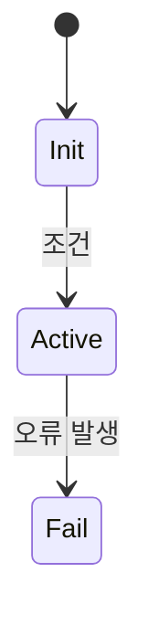

# Concept
:::info
기능 또는 모듈의 개념적 구조와 동작 원리를 설명합니다.
:::

## 1. 설계 개요
- 왜 이 기능이 필요한가?
- 어떤 문제를 해결하는가?
- 어떤 조건에서 작동하는가?

## 2. 상태 전이 또는 로직 구조

## 3. 입력 소스

- 입력 항목 1
- 입력 항목 2

## 4. 출력 대상

- 출력 항목 1
- 출력 항목 2
