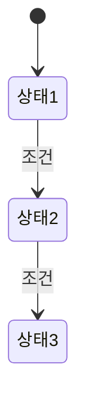

# Overview : xxx

:::info
xxx 모듈 또는 기능의 전체적인 역할과 책임을 요약합니다.
:::

## 1. 주요 기능

- 기능 1
- 기능 2
- 기능 3

## 2. 상호작용 요소

- 입력: 센서, 사용자 입력, uORB 메시지 등
- 출력: 상태 전이, 제어 명령, uORB 게시 등

## 3. 상태 흐름 요약 (선택)

## 4. 관련 하위 기능

- [기능 A](./기능A/)
- [기능 B](./기능B/)
